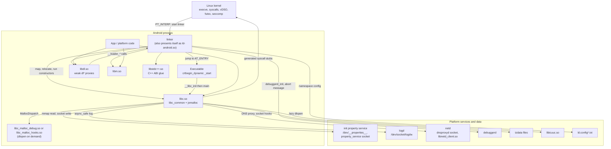
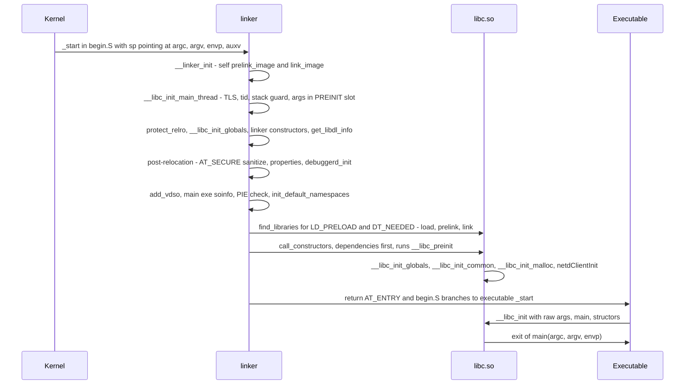
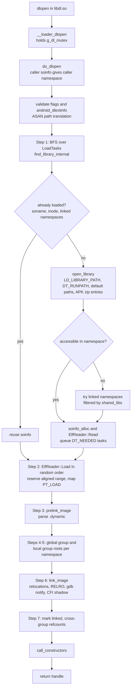
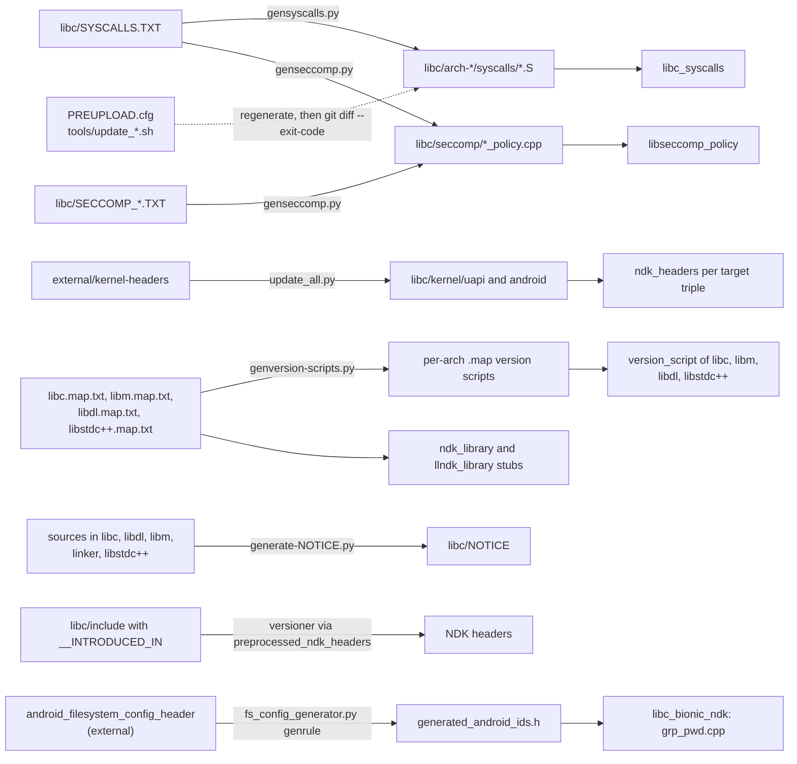
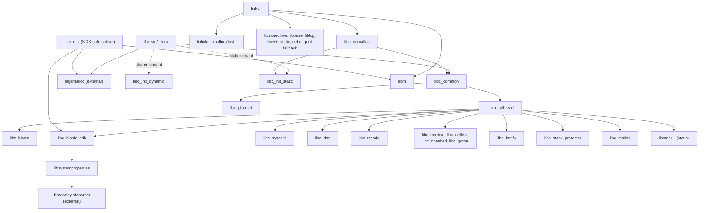

# bionic — Android C library, math library, and dynamic linker

| | |
|---|---|
| Repository | `bionic/` submodule of ProjectGero (`https://github.com/ProjectGero/platform_bionic.git`) |
| Snapshot analyzed | `196632fb3` — "Snap for 4810559 from 03cb53a17… to pi-release" (the commit pinned by the superproject gitlink) |
| Platform era | Android 9 (Pie), API level 28 |
| Path convention | Paths are relative to the bionic repository root. Paths prefixed `superproject:` are relative to the ProjectGero top-level checkout. |
| Method | Derived from the source and build files of this repository. Where something could not be established from source it is marked **UNKNOWN**. A few ProjectGero-specific facts were checked against the superproject's existing DB410c build output; they are labeled as such. |
| Revision | Second analysis pass (2026-10-02). This pass re-verified the first pass's claims and added depth on linker namespaces, relocation and unloading, signals, Android IDs, system-property storage, malloc_debug, the tools, and the tests. |

## Purpose

bionic is Android's native system runtime. It is the lowest user-space layer that every native process (apps, ART, system daemons) runs on. It provides:

- **`libc`** — the C library: POSIX plus many Linux/GNU/BSD extensions, plus Android-specific APIs such as system properties, `android_set_abort_message`, FORTIFY runtime checks, netd socket hooks, and malloc debugging hooks.
- **`libm`** — the math library, mostly FreeBSD `msun` plus per-architecture assembly.
- **`libdl`** — the `dlopen`/`dlsym` API. It is only a proxy: the implementation lives in the dynamic linker.
- **`libstdc++`** — *not* a C++ standard library. It holds only the compiler ABI support (`__cxa_guard_*`, `__cxa_pure_virtual`, `operator new`/`delete`).
- **The dynamic linker** (`/system/bin/linker`, `/system/bin/linker64`) — maps an executable's shared-library dependencies, applies relocations, enforces *linker namespaces* (isolation domains that restrict which libraries code may load), and implements `dlopen`.
- **C runtime objects** (`crtbegin_*.o`, `crtend_*.o`, `crtbrand.o`) — linked into every Android executable and shared library.
- **The platform/NDK ABI contract** — public headers with API-level availability annotations, scrubbed Linux UAPI headers, and symbol version maps that freeze which symbols exist at which API level.
- **Supporting pieces** — a seccomp-BPF policy library, the malloc debug and malloc hooks plugins, host tools (`versioner`, `relocation_packer`), code generators, a large gtest suite, and benchmarks.

## Architecture Overview

1. **One repository, several cooperating binaries.** A dynamic process contains the linker plus `libc.so`, `libdl.so`, `libm.so`, and usually `libstdc++.so`, all built from this repository. The kernel starts the linker, because it is the executable's `PT_INTERP`; the linker then loads everything else (Diagrams A and B).

2. **The linker is self-contained.** It is a `static_executable` that is really a shared object (`-shared -Wl,-Bsymbolic`). It is statically linked with its own private copy of libc (`libc_nomalloc`) and its own allocator (`liblinker_malloc`). It relocates itself before touching any global, then sets up the main thread's TLS. As a result, a dynamic process has **two copies of libc's globals**, one in the linker and one in `libc.so`. Early-startup data passes from the linker to `libc.so` through a TLS slot (`TLS_SLOT_BIONIC_PREINIT`).

3. **`libdl.so` and `ld-android.so` are link-time façades.** `libdl.so` forwards each `dl*` call to a weak `__loader_*` symbol and passes along the caller's address. `ld-android.so` is a stub library in which every `__loader_*` symbol is aliased to a trap (`__internal_linker_error`). The linker is linked with `-soname,ld-android.so` and registers a `soinfo` (its per-library record) for its own symbol table at the head of the loaded-library list (`get_libdl_info`). So when `libdl.so`/`libc.so` resolve their `DT_NEEDED` entry for `ld-android.so`, they find the linker already loaded, and their `__loader_*` references bind to the linker's real code. The stub file exists only to satisfy the static linker.

4. **libc is a composition of static component libraries.** `libc/Android.bp` defines about 20 `cc_library_static` components: Android-owned code, generated syscall stubs, BSD imports, DNS, tzcode, gdtoa, FORTIFY, pthreads, and startup code. `whole_static_libs` folds them into `libc.a`/`libc.so`, plus two specialized variants: `libc_nomalloc` for the linker, and `libc_ndk` for static linking into NDK code (Diagram E).

5. **Reuse upstream BSD code unmodified.** Where possible, BSD code is used unmodified from `libc/upstream-{freebsd,netbsd,openbsd}` and is adapted only through force-included `*-compat.h` headers. Android-specific code lives in `libc/bionic` (mostly C++).

6. **Single sources of truth plus generators.** These are maintained as inputs:
   - system calls (`libc/SYSCALLS.TXT`)
   - exported symbols per API level (`*.map.txt`)
   - seccomp allow/deny lists (`libc/SECCOMP_*.TXT`)
   - kernel headers (from `external/kernel-headers`)

   Python generators turn them into **checked-in** outputs: assembly stubs, per-arch version scripts, BPF tables, and scrubbed headers. `PREUPLOAD.cfg` hooks check that those outputs are current (Diagram D).

7. **Indirection tables for late binding.**
   - A page-aligned, normally read-only `WriteProtected<libc_globals>` holds vDSO function pointers, the setjmp cookie, and the `MallocDispatch` table. That table lets `libc_malloc_debug.so` or `libc_malloc_hooks.so` be `dlopen`ed at startup and interpose every allocation call.
   - `NetdClientDispatch` does the same for `socket`/`connect`/`accept4`, using `libnetd_client.so`.

8. **Compatibility is versioned.**
   - The ABI is frozen per API level through version nodes (`LIBC`, `LIBC_N`, `LIBC_O`, `LIBC_P`, `LIBC_PRIVATE`, `LIBC_PLATFORM`) and `__INTRODUCED_IN(N)` header annotations.
   - Behavior changes are gated on the app's target SDK version, for example text relocations, writable+executable segments, invalid `pthread_t`, access to private libraries, and interruptible `sem_wait`.

9. **Multi-architecture by construction.** The tree targets arm, arm64, x86, x86_64, mips, and mips64, plus host bionic (`linux_bionic`). Arch- and CPU-variant-specific sources are selected in the build files.

## Directory Map

| Path | Responsibility |
|---|---|
| `libc/bionic/` | Android-owned libc implementation, mostly C++: process/thread startup, pthreads and synchronization, syscall wrappers that need logic, signals, `fork`/`exec`/`posix_spawn`, locale/wchar, the system-property API, malloc dispatch, FORTIFY runtime (`fortify.cpp`), netd hooks, the ICU bridge, and NDK compatibility shims (`ndk_cruft.cpp`). The README calls the remaining `.c` files here "legacy mess". |
| `libc/arch-{arm,arm64,x86,x86_64,mips,mips64}/` | Per-arch assembly: generated syscall stubs (`syscalls/`), `__bionic_clone`, `vfork`, `setjmp`, `syscall`, `_exit_with_stack_teardown`, signal-return trampolines, `__set_tls`, and CPU-tuned string routines (for example `arch-arm/{cortex-a7,cortex-a9,cortex-a15,cortex-a53,krait,kryo,denver}`). |
| `libc/arch-common/bionic/` | Sources of the crt objects: `crtbegin.c` (the executable `_start`), `crtbegin_so.c`, `crtend*.S`, `crtbrand.S` (`.note.android.ident` with the platform SDK version), and the `__dso_handle`/`atexit` glue. |
| `libc/include/` | Public headers (NDK and platform) annotated with `__INTRODUCED_IN(...)`. FORTIFY wrappers live in `bits/fortify/`; `android/` holds dlext, api-level, versioning, set_abort_message, and legacy inline headers. |
| `libc/kernel/` | Scrubbed Linux UAPI headers (`uapi/`, `android/`), generated from `external/kernel-headers` by `kernel/tools/update_all.py`. Never edit by hand. |
| `libc/private/` | Internal headers shared by libc, the linker, and libdl: TLS layout (`bionic_tls.h`), `KernelArgumentBlock.h`, `WriteProtected.h`, `bionic_globals.h`, `bionic_malloc_dispatch.h`, `CFIShadow.h`, `bionic_asm*.h`, and futex/lock helpers. |
| `libc/upstream-{freebsd,netbsd,openbsd}/` | Unmodified BSD sources (string, stdlib, stdio internals, regex, gdtoa, arc4random, glob, …), plus `android/include/*-compat.h` shims that are force-included at compile time. |
| `libc/stdio/`, `libc/stdlib/` | Core `FILE` implementation (`stdio.cpp`), the printf/scanf engines, and `exit`/`atexit`. The README calls `stdio/` "legacy files of dubious provenance". |
| `libc/dns/` | NetBSD-derived resolver modified for Android (`-DANDROID_CHANGES`): netd proxying, per-network (`netid`) resolution, a resolver cache, and statistics. |
| `libc/tzcode/` | IANA tzcode plus `bionic.cpp`, which reads Android's single-file `tzdata` format. |
| `libc/system_properties/` | `libsystemproperties`: maps property areas (`prop_area`), selects the area by SELinux context (`contexts_*`), and performs lock-free reads. |
| `libc/malloc_debug/`, `libc/malloc_hooks/` | Optional allocator interposers that are `dlopen`ed when enabled, each with its own docs and unit tests. |
| `libc/seccomp/` | Generated per-arch BPF syscall filters (`*_policy.cpp`) and the installer (`seccomp_policy.cpp`). |
| `libc/async_safe/` | `libasync_safe`: async-signal-safe formatting and logging to stderr/logd, used wherever `printf`/liblog would be unsafe. |
| `libc/tools/` | Generators and checkers: `gensyscalls.py`, `genseccomp.py`, `genversion-scripts.py`, `generate-NOTICE.py`, `check-symbols*.py`, `ndk_missing_symbols.py`. |
| `libc/versioner-dependencies/` | Symlink farm that gives `versioner` its per-arch include paths (kernel UAPI, clang builtins). |
| `libc/*.map.txt`, `libc/*.<arch>.map` | Annotated symbol lists (the source) and the generated per-arch linker version scripts. |
| `libm/` | FreeBSD `msun` (`upstream-freebsd/`), some NetBSD code, and arch-optimized routines (`arm/`, `arm64/`, `x86/`, `x86_64/`, `i387/`, `amd64/`). |
| `libdl/` | Weak proxies to `__loader_*`, the CFI slow path (`libdl_cfi.cpp`), and NULL-returning stubs for static binaries (`libdl_static.c`). |
| `libstdc++/` | Only `include/new`. The C++ ABI sources (`__cxa_guard.cpp`, `__cxa_pure_virtual.cpp`, `new.cpp`) live in `libc/bionic/` and are built by `libc/Android.bp`. |
| `linker/` | The dynamic linker and the `ld-android` stub; `arch/<arch>/begin.S` entry points; `ld.config.format.md`; unit tests in `linker/tests/`. |
| `tests/` | gtest suites (about one file per public header), the custom gtest runner, loader fixtures (`tests/libs/`), malformed-ELF fixtures (`tests/prebuilt-elf-files/`), POSIX header conformance checks (`tests/headers/posix/`), and math test vectors (`tests/math_data/`). |
| `benchmarks/` | Google Benchmark–based microbenchmarks with XML suites (`suites/`). |
| `tools/` | `versioner` (clang-based header-availability checker and preprocessor), `relocation_packer` (host tool for packed relocations), `bionicbb` (upstream Gerrit/Jenkins/Gmail bot), and the `update_*.sh` pre-upload hooks. |
| `docs/`, `android-changes-for-ndk-developers.md` | Function status per API level, 32-bit ABI limitations, and loader behavior changes per API level (the linker's warnings link here). |
| `build/run-on-host.sh` | Host test/benchmark environment setup, sourced by `tests/run-on-host.sh` and `benchmarks/run-on-host.sh`. |

## Build System

### Build definitions

- **Soong (`Android.bp`) is the main build system.** The root `Android.bp` contains only `subdirs = ["*"]`.
- **Make (`Android.mk`) remains for a few pieces:**
  - the root include (`all-makefiles-under`)
  - `tests/Android.mk`: compile-time FORTIFY diagnostic tests, which run `FileCheck` through `tests/file-check-cxx`, and installation of malformed prebuilt ELF fixtures
  - `tests/libs/Android.build.*.mk`: loader-test library fragments
  - `linker/tests/Android.mk`: `linker-unit-tests`
  - `tools/relocation_packer/Android.mk`: test data
- `CleanSpec.mk` holds incremental-build clean steps.

### Shared compiler policy (`libc_defaults` in `libc/Android.bp`)

The baseline for all libc components:
- `-D_LIBC=1 -D__BIONIC_LP32_USE_STAT64 -Wall -Wextra -Werror -Wframe-larger-than=2048`, and `-Werror` on pointer/int casts and type limits
- `stl: "none"`, `system_shared_libs: []`, `sanitize: { never: true }`, `native_coverage: false`
- include paths for `bionic/libc/async_safe/include` and `external/jemalloc/include`

Deliberate per-component deviations:

| Flag | Applied to | Why (from source comments) |
|---|---|---|
| `-fno-stack-protector` | `libc_stack_protector` (`__libc_init_main_thread.cpp`, `__stack_chk_fail.cpp`, `__set_tls`), `libc_init_static`, `libc_init_dynamic`, linker, malloc libraries | This code runs before or while the TLS stack-guard slot is initialized. |
| `-U_FORTIFY_SOURCE -D__BIONIC_DECLARE_FORTIFY_HELPERS` | `libc_fortify` | Keeps FORTIFY helpers from calling themselves. |
| `-fno-builtin` | `libc_aeabi` (ARM only) | Avoids infinite recursion in the ARM EABI `__aeabi_memcpy`/`memmove`/`memset` helpers. |
| `-include {freebsd,netbsd,openbsd}-compat.h` | BSD components, `libm` | Adapts upstream code without editing it. |
| `-Wframe-larger-than=66000` / `=5000` | `libc_dns`, `libc_freebsd_large_stack` / `libc_openbsd_large_stack` | These files have known large stack frames. |
| `-fvisibility=hidden` | `libc_ndk`, `libc_malloc`, linker | Keeps internal symbols out of the dynamic symbol table. |

### Important build targets

- **`libc`** (`cc_library` → `libc.so` + `libc.a`)
  - Content: `whole_static_libs: ["libc_common", "libjemalloc"]`.
  - The shared variant adds `crtbegin_so.c`, `crtbrand.S`, `crtend_so.S`, `icu.cpp`, `malloc_common.cpp`, `NetdClient.cpp`, and `libc_init_dynamic`.
  - The static variant adds `dl_iterate_phdr_static.cpp`, `malloc_common.cpp` (with `-DLIBC_STATIC`), and `libc_init_static`.
  - Properties: `nocrt: true`, `shared_libs: ["ld-android", "libdl"]`, `keep_symbols` (for unwinders), `pack_relocations: false` (b/20645321), `required: ["tzdata"]`, and a per-arch `version_script: libc.<arch>.map`.
- **`libc_common`** = `libc_nopthread` + `libc_pthread`. `libc_pthread` is kept separate because `pthread_t` layout changed across releases.
- **`libc_nopthread`** = common sources plus `libc_bionic`, `libc_bionic_ndk` (which pulls in `libsystemproperties`), `libc_dns`, `libc_fortify`, `libc_freebsd`(`_large_stack`), `libc_gdtoa`, `libc_malloc`, `libc_netbsd`, `libc_openbsd`(`_ndk`, `_large_stack`), `libc_stack_protector`, `libc_syscalls`, `libc_tzcode`, `libstdc++`, and `libc_aeabi` on arm.
- **`libc_nomalloc`** = `libc_common` + `libc_init_static` (with `-DLIBC_STATIC`). The linker's private libc.
- **`libc_ndk`** — the parts that are safe to link statically into NDK code on any OS version.
  - It excludes netd-dependent DNS, `pthread_t`-layout-dependent code, and global-state code (`getauxval` and anything that depends on it).
  - It includes `libm` and `libjemalloc`.
- **`linker`**
  - `cc_binary` with `static_executable: true`.
  - Link flags: `-shared -Wl,-Bsymbolic -Wl,--exclude-libs,ALL -Wl,-soname,ld-android.so`.
  - Properties: `nocrt`, `stl: "none"`, `prefix_symbols: "__dl_"` (so gdb does not confuse its symbols with libc's), `symlinks: ["linker_asan"]`, lib64 `suffix: "64"`, `compile_multilib: "both"`.
  - Static libs: `libc_nomalloc`, `libm`, `libziparchive`, `libutils`, `libbase`, `libz`, `libasync_safe`, `liblog`, and `libc++_static`. On Android it also links `libdebuggerd_handler_fallback`. `liblinker_malloc` comes **deliberately last**, so it overrides any other malloc.
- **Other libraries:** `ld-android` (stub), `libdl`, `libm`, `libstdc++`, `libc_malloc_debug`, `libc_malloc_hooks`, `libseccomp_policy`, `libsystemproperties`, `libasync_safe`, `liblinker_malloc`.
- **crt objects:**
  - `crtbegin_so` (= `crtbegin_so1` + `crtbrand`), `crtend_so`
  - `crtbegin_static`, `crtbegin_dynamic` (on `linux_bionic` it also embeds `linker_wrapper`)
  - `crtend_android` (renamed so it does not clash with GCC's `crtend.o`)
- **NDK / LL-NDK:**
  - `ndk_library`/`llndk_library` for libc, libm, libdl, and libstdc++, with `symbol_file: *.map.txt` and `first_version: "9"`.
  - `preprocessed_ndk_headers { name: "common_libc" }`.
  - `ndk_headers` for the UAPI, one per target triple (`arm-linux-androideabi`, `aarch64-linux-android`, `i686-linux-android`, `x86_64-linux-android`, `mipsel-linux-android`, `mips64el-linux-android`).
- **Host tools:**
  - `versioner` (`cc_binary_host`, links `libclang_android`/`libLLVM_android`; its README says to build with `FORCE_BUILD_LLVM_COMPONENTS=true`)
  - `relocation_packer` and `relocation_packer_unit_tests`

### Arch and CPU-variant source selection

In `libc_bionic` and `libc_fortify`, `arch: { arm: { <cpu_variant>: {...}, neon: {...} } }` blocks choose the string and memory routines:
- ARM cores not listed fall back to the `neon` set: Cortex-A15 `memcpy`/`memset`/`strcmp`/`strcpy`/`strlen`/`stpcpy`/`strcat`, plus Denver `memmove`.
- Generic BSD C versions are removed with `exclude_srcs` wherever an assembly version exists.
- `libm` does the same; for example, `arm/sqrt.S` and `arm/floor.S` replace the C versions under `neon`.

### Generated code

**Generated by maintainers and checked in.** Each is verified by a `PREUPLOAD.cfg` hook that reruns the generator and fails on `git diff --exit-code`:

| Generator | Input | Output | Hook |
|---|---|---|---|
| `libc/tools/gensyscalls.py` | `libc/SYSCALLS.TXT` (267 entries) | `libc/arch-*/syscalls/*.S` (209 stubs for arm) | `tools/update_syscalls.sh` |
| `libc/tools/genseccomp.py` | `SYSCALLS.TXT` + `SECCOMP_{WHITELIST,BLACKLIST}_*.TXT` (syscall numbers resolved by running clang `-E` on `<asm/unistd.h>`) | `libc/seccomp/<arch>_{app,system,global}_policy.cpp` | `tools/update_seccomp.sh` |
| `libc/tools/genversion-scripts.py` | `libc/libc.map.txt`, `libc/libstdc++.map.txt`, `libm/libm.map.txt`, `libdl/libdl.map.txt` | `*.{arm,arm64,mips,mips64,x86,x86_64}.map` (lines filtered by arch tags) | `tools/update_version_scripts.sh` |
| `libc/tools/generate-NOTICE.py` | License headers in libc, libdl, libm, linker, and libstdc++ | `libc/NOTICE` | `tools/update_notice.sh` |
| `libc/kernel/tools/update_all.py` (with `generate_uapi_headers.sh`) | `external/kernel-headers/{original,modified}` | `libc/kernel/uapi/**`, `libc/kernel/android/**` | none (run manually) |

`SYSCALLS.TXT` grammar, documented in the file itself:

```
return_type func_name[|alias_list][:syscall_name[:socketcall_id]]([parameter_list]) arch_list
```

- Each generated stub loads the syscall number and traps (`swi #0` / `svc #0` / `syscall`).
- If the kernel returns a value in `[-MAX_ERRNO, -1]`, the stub branches to `__set_errno_internal`.
- Names like `___close` or `__openat` create hidden raw syscalls that the C++ wrappers in `libc/bionic/` build on.

Map-file tags are comments after each symbol:
- arch names (`arm`, `x86`, …)
- `introduced=N`, `introduced-<arch>=N`, `versioned=N`
- `var`

`genversion-scripts.py` only filters lines by arch. The `.map.txt` files are also the `symbol_file` of `ndk_library`/`llndk_library`, so Soong's NDK stub generation (outside this repo) consumes the API-level tags.

**Generated at build time:**
- `generated_android_ids` genrule: runs `fs_config_generator.py aidarray` over `:android_filesystem_config_header` (an external module) to produce `generated_android_ids.h`. `libc/bionic/grp_pwd.cpp` includes it to map Android IDs to and from user and group names.
- Preprocessed NDK headers: Soong's `preprocessed_ndk_headers` runs `versioner -o <out> <src> bionic/libc/versioner-dependencies` (confirmed in `superproject:build/soong/cc/ndk_headers.go`).
- NDK/LL-NDK stub libraries: generated by Soong from the `.map.txt` files.

### External tools and build-time dependencies

- **Python 2** for the generators: `gensyscalls.py` imports the Python-2-only `commands` module, and `update_all.py` uses `print` statements. The generators require `ANDROID_BUILD_TOP`.
- **clang** at `prebuilts/clang/host/linux-x86/clang-stable`, a path hard-coded relative to `bionic/libc` in `genseccomp.py`. It exists in the ProjectGero superproject.
- **FileCheck** (compile-time FORTIFY tests) and **LLVM/clang libraries** (`versioner` and the loader tests).
- **Library dependencies** are listed under [External Dependencies](#external-dependencies).

### As built by ProjectGero (DB410c)

Verified from the superproject's existing build output (`superproject:out/soong/soong.variables` and `superproject:out/soong/.intermediates/bionic/`):

| Soong variable | Value | Effect on bionic |
|---|---|---|
| `DeviceArch` / `DeviceArchVariant` / `DeviceCpuVariant` | `arm` / `armv7-a-neon` / `generic` | Only 32-bit variants are built (`android_arm_armv7-a-neon_core_{shared,static}`). The `neon` source set is selected; the `libc_bionic` intermediates contain `arch-arm/cortex-a15/bionic/{memcpy,memset,strcmp}.o`. |
| `DeviceSecondaryArch` | empty | No `linker64` and no 64-bit libc in the image, even though `linker` has `compile_multilib: "both"`. |
| `Platform_sdk_version` | `28` | `crtbrand.S` stamps API 28 into `.note.android.ident`. |
| `Debuggable` | `true` | The linker is built with `-DUSE_LD_CONFIG_FILE`, so the `LD_CONFIG_FILE` environment variable is honored. |
| `Treble_linker_namespaces` | `false` | `TREBLE_LINKER_NAMESPACES` is undefined, so `__bionic_get_shell_path()` always returns `/system/bin/sh`. |

## Outputs

| Artifact | Built by | Role |
|---|---|---|
| `linker`, `linker64` (+ `linker_asan`, `linker_asan64` symlinks) | `linker/Android.bp` | Installed in `/system/bin/`. The `PT_INTERP` of every dynamic executable; the ASAN mode is detected from the interpreter's basename. |
| `libc.so`, `libc.a` | `libc/Android.bp` | Core C library. The shared version depends only on `ld-android.so` and `libdl.so`. |
| `libm.so`, `libm.a` | `libm/Android.bp` | Math library. |
| `libdl.so`, `libdl.a` | `libdl/Android.bp` | `dl*` proxies. The static version contains NULL/failure stubs. |
| `ld-android.so` | `linker/Android.bp` | Link-time stub that stands in for the linker's exports. |
| `libstdc++.so`, `libstdc++.a` | `libc/Android.bp` | C++ ABI support. |
| `libc_malloc_debug.so` | `libc/malloc_debug/` | Debug allocator, loaded when `libc.debug.malloc.options` or `LIBC_DEBUG_MALLOC_OPTIONS` is set (docs: `libc/malloc_debug/README.md`). |
| `libc_malloc_hooks.so` | `libc/malloc_hooks/` | glibc-style `__malloc_hook` support, loaded when hooks are enabled. |
| `libseccomp_policy` (`.so`/`.a`) | `libc/seccomp/` | `set_{app,system,global}_seccomp_filter()`. The callers are outside this repo (**UNKNOWN** here). |
| `libsystemproperties.a`, `libasync_safe.a`, `libc_malloc_debug_backtrace.a`, `liblinker_malloc.a`, `libdl_static.a`, `libc_ndk.a` | various | Static building blocks. `libasync_safe` is `vendor_available`; the build comment says `libc_malloc_debug_backtrace` is "Used by libmemunreachable". |
| crt objects | `libc/Android.bp` | Linked by the build system into every target binary. |
| NDK sysroot content | Soong NDK rules over this repo | Preprocessed headers, per-triple UAPI headers, and per-API-level stub `.so` files. |
| `generated_android_ids.h` | genrule | Build intermediate for `grp_pwd.cpp`. |
| `versioner`, `relocation_packer` | `tools/` | Host tools. |
| Test and benchmark binaries | `tests/`, `linker/tests/`, `libc/malloc_*`, `benchmarks/` | Installed under `/data/nativetest{,64}/…` (see [Tests](#tests)). |
| tzdata | **not built here** | `libc` declares `required: ["tzdata"]`. The README says tzdata updates are done with `external/icu/tools/update-tzdata.py`. |

## Entry Points

| Entry point | File | Role |
|---|---|---|
| `_start` → `__linker_init(void* raw_args)` | `linker/arch/<arch>/begin.S`, `linker/linker_main.cpp` | Process entry for every dynamic executable. Returns the address that `begin.S` jumps to (`AT_ENTRY`). |
| `__linker_init_post_relocation()` | `linker/linker_main.cpp` | Main body of the linker once it has relocated itself. |
| `_start` → `_start_main` → `__libc_init()` | `libc/arch-common/bionic/crtbegin.c`; `libc/bionic/libc_init_dynamic.cpp` or `libc_init_static.cpp` | Executable entry. Reached from the linker (dynamic) or directly from the kernel (static). Ends with `exit(main(argc, argv, envp))`. |
| `__libc_preinit()` (`constructor(1)`) | `libc/bionic/libc_init_dynamic.cpp` | Initializes `libc.so`; the linker runs it before dependent libraries' constructors. |
| `__loader_*` (`__loader_dlopen`, `__loader_dlsym`, `__loader_android_dlopen_ext`, `__loader_android_create_namespace`, …) | `linker/dlfcn.cpp` | The linker's exported API. Together with `rtld_db_dlactivity` (for gdb), these are the only globals in `linker.{arm,generic}.map`. |
| `dlopen`, `dlsym`, `android_dlopen_ext`, `android_create_namespace`, … | `libdl/libdl.cpp` | Public proxies that pass `__builtin_return_address(0)` as the caller address. |
| `__cfi_init`, `__cfi_slowpath`, `__cfi_slowpath_diag` | `libdl/libdl_cfi.cpp` | Cross-DSO control-flow-integrity (CFI) runtime. The linker calls `__cfi_init`; instrumented code calls the slow path. |
| `pthread_create` → `clone` → `__pthread_start` | `libc/bionic/pthread_create.cpp` | Per-thread entry. |
| `{debug,hooks}_initialize`, `_finalize`, `_get_malloc_leak_info`, `_free_malloc_leak_info`, `_malloc_backtrace` | `libc/malloc_debug/malloc_debug.cpp`, `libc/malloc_hooks/malloc_hooks.cpp` | Plugin ABI. `malloc_common.cpp` resolves these with `dlsym` as the prefix plus a fixed suffix list, then fills a `MallocDispatch` with `<prefix>_malloc` and friends. |
| `set_app_seccomp_filter`, `set_system_seccomp_filter`, `set_global_seccomp_filter` | `libc/seccomp/seccomp_policy.cpp` | Build and install the BPF filter with `prctl(PR_SET_SECCOMP)`. |
| `__system_properties_init`, `__system_property_area_init`, `__system_property_add` / `_update` | `libc/bionic/system_property_api.cpp` | Reader initialization (every process), plus the writer API for the property owner (exported as `LIBC_PLATFORM`). |
| `__linker_init` (host wrapper) | `linker/linker_wrapper.cpp` | Host bionic: patches `AT_BASE`/`AT_ENTRY` and enters the linker embedded in each binary. |
| Tool `main`s and scripts | `libc/tools/*.py`, `libc/kernel/tools/update_all.py`, `tools/versioner/src/versioner.cpp`, `tests/gtest_main.cpp`, `benchmarks/bionic_benchmarks.cpp` | Maintenance, build, and test entry points. |

Running the linker directly (`/system/bin/linker`) prints "This is …, the helper program for dynamic executables." and exits (`linker_main.cpp`).

## Initialization Flow

### Dynamic executable (the normal case; Diagram B)

1. **Kernel → linker `_start`.** `begin.S` passes `sp` (which points at argc/argv/envp/auxv) to `__linker_init`.
2. **The linker relocates itself** (`__linker_init`).
   - `KernelArgumentBlock` splits out argc/argv/envp/auxv.
   - The linker's load address is computed with the `linktime_addr` trick: an unrelocated static holds its own link-time offset.
   - A stack-allocated `soinfo linker_so` is built and flagged `FLAG_LINKER`, then `prelink_image()` and `link_image(g_empty_list, …)` run. Until this finishes, no extern, global, or GOT reference is legal.
3. **The linker sets up TLS.**
   - On i386, `__libc_init_sysinfo` runs first.
   - `__libc_init_main_thread(args)` initializes a static `pthread_internal_t main_thread`, which is the **linker's** copy:
     - `__set_tls(main_thread.tls)`
     - `__init_tls()`: `mmap`s the per-thread `bionic_tls` block with guard pages
     - `__set_tid_address()`
     - stack guard from `__libc_safe_arc4random_buf`: `arc4random` once `/dev/urandom` is readable, otherwise (early boot) the kernel's 16 `AT_RANDOM` bytes, aborting if they run out
     - `__init_thread()`
     - stores `&args` in `TLS_SLOT_BIONIC_PREINIT`
     - alternate signal stack
4. **The linker finishes its own setup.**
   - Protects its RELRO pages, which could not be done earlier because x86 cannot make syscalls before TLS exists.
   - `__libc_init_globals(args)` initializes the vDSO table and setjmp cookie in the linker's copy of `__libc_globals`.
   - Saves `g_argc/g_argv/g_envp` and runs the linker's own constructors.
   - Registers its `link_map` for gdb.
   - `get_libdl_info()` creates the `soinfo` that exposes the linker's symbols under the soname `ld-android.so`. It becomes the head of `solist` and a member of the default namespace.
5. **`__linker_init_post_relocation`** runs under a `ProtectedDataGuard`:
   1. `__libc_init_AT_SECURE`: requires `AT_SECURE` in auxv. For setuid/setgid or other security transitions, it reopens closed stdio fds to `/dev/null` and strips a fixed list of unsafe environment variables (for example `LD_LIBRARY_PATH`, `LD_PRELOAD`, `LD_DEBUG`, `MALLOC_CONF`, `LIBC_DEBUG_MALLOC_OPTIONS`, `TMPDIR`, `TZDIR`). It also sets `PER_LINUX32` on LP32.
   2. `__system_properties_init()` (the linker's copy), then `debuggerd_init()` with callbacks that return the abort message and notify gdb.
   3. `g_linker_logger.ResetState()` (`debug.ld.*` properties), `LD_DEBUG`, and — only when not `AT_SECURE` — `LD_LIBRARY_PATH`/`LD_PRELOAD`.
   4. `add_vdso()`: a `soinfo` for the kernel vDSO (`AT_SYSINFO_EHDR`).
   5. A `soinfo` for the main executable from `AT_PHDR`/`AT_PHNUM`. A non-PIE (`e_type != ET_DYN`) is rejected with a message and `exit()` — deliberately without a tombstone.
   6. `init_default_namespaces(executable_path)`:
      - Selects the config file: `LD_CONFIG_FILE` (debuggable builds only) → `/system/etc/ld.config.<ABI>.txt` → `ld.config.vndk_lite.txt` (if `ro.vndk.lite`) or `ld.config.<ro.vndk.version>.txt` → `/system/etc/ld.config.txt`.
      - Without a config, uses a single non-isolated default namespace with `/system/lib[64]`, `/odm/lib[64]`, and `/vendor/lib[64]`; the ASAN variant searches `/data/asan/...` first.
      - Otherwise builds the configured namespaces and links, adds `ld-android.so` and the vDSO to every namespace, and sets the target SDK version (optionally from a `.version` file).
   7. `prelink_image()` on the executable. It is marked `DF_1_GLOBAL` and added to every linked namespace.
   8. `find_libraries()` for `LD_PRELOAD` plus `DT_NEEDED` (see [Main Runtime Flow](#2-library-loading-dlopen--find_libraries)), then `CFIShadowWriter::InitialLinkDone()`.
   9. `call_pre_init_constructors()`, then `call_constructors()`. The latter is depth-first over children, so dependencies initialize first; `libc.so`'s `__libc_preinit` therefore runs before other libraries' constructors.
6. **`__libc_preinit` runs inside `libc.so`.**
   - Reads and clears `TLS_SLOT_BIONIC_PREINIT` and copies the stack guard from TLS into `libc.so`'s `__stack_chk_guard`.
   - `__libc_init_globals` (libc.so's copy).
   - `__libc_init_common`:
     - sets `environ`, `errno = 0`, `__progname`, and the abort-message pointer, which points into the linker's `g_abort_message`
     - on LP32, aborts if `gettid() > 65535`
     - adds the main thread to the global thread list
     - registers `arc4random` `pthread_atfork` handlers
     - calls `__system_properties_init()`
   - `__libc_init_malloc` (may load the debug or hooks plugin), then `netdClientInit()` (`dlopen("libnetd_client.so")`).
7. **Hand-off to the program.**
   - `__linker_init` returns `AT_ENTRY`, and `begin.S` branches to the executable's `_start`.
   - `_start` → `_start_main` builds the `structors_array_t` → `__libc_init()`.
   - `__libc_init()` registers `__libc_fini(fini_array)` with `__cxa_atexit` and calls `exit(main(argc, argv, envp))`.

### Static executable

The kernel enters `crtbegin_static`'s `_start` directly, which calls `__libc_init()` from `libc/bionic/libc_init_static.cpp`. In order, it runs:
- `__libc_init_main_thread`
- `__init_thread_stack_guard`
- `__libc_init_globals`
- `__libc_init_AT_SECURE`
- `__libc_init_common`
- `apply_gnu_relro()`
- the `preinit_array`/`init_array` (called by hand)
- `__cxa_atexit(__libc_fini)` and `exit(main(...))`

Differences from the dynamic case:
- No malloc plugin loading: `malloc_common.cpp`'s loader is compiled out under `LIBC_STATIC`.
- No netd hookup.
- `libdl.a` stubs return NULL.
- `bionic_get_application_target_sdk_version()` returns `__ANDROID_API__`.

### Per-thread initialization

`pthread_create`:
1. `__allocate_thread` does a single `mmap` that holds the guard page, the stack, and the `pthread_internal_t` at the top. `__init_tls` adds the separate `bionic_tls` block with guard pages, then the stack guard is copied into TLS.
2. The new thread is created with `clone(CLONE_VM|CLONE_FS|CLONE_FILES|CLONE_SIGHAND|CLONE_THREAD|CLONE_SYSVSEM|CLONE_SETTLS|CLONE_PARENT_SETTID|CLONE_CHILD_CLEARTID)`.
3. The parent runs `__init_thread` (scheduling policy), publishes the thread in the list, and releases the startup-handshake `Lock`.
4. The child (`__pthread_start`) waits on that lock, installs an alternate signal stack, and runs the user routine.

### Per-library initialization (`dlopen`)

`do_dlopen` → `find_library` → `find_libraries` → `soinfo::call_constructors()`. This runs `DT_INIT` and then `DT_INIT_ARRAY`, children first. A `constructors_called` flag is set *before* the constructors run, to tolerate recursion; for example, libc's constructor `dlopen`s `libc_malloc_debug.so`, which itself depends on libc.

## Main Runtime Flow

bionic is a library and loader rather than a service. Its "main flow" is the set of paths that application calls take through it.

### 1. libc call → kernel

```
public API (header)
  └─ FORTIFY inline wrapper (bits/fortify/*.h) when _FORTIFY_SOURCE: compile-time diagnose_if + __*_chk
       └─ libc/bionic/<api>.cpp wrapper (argument fixups, LP32/LP64 differences, sigset64 conversions…)
            └─ generated stub libc/arch-<arch>/syscalls/<name>.S  → kernel
                 └─ on error: __set_errno_internal → errno in TLS_SLOT_ERRNO; return -1
```

- Hot time calls (`clock_gettime`, `clock_getres`, `gettimeofday`, `time`) go through the vDSO pointers in `__libc_globals->vdso`. When the vDSO symbol is absent they fall back to the system call; `time()` falls back to `gettimeofday()` (`libc/bionic/vdso.cpp`).
- Per `docs/32-bit-abi.md`, LP32 `open` silently inserts `O_LARGEFILE`.

### 2. Library loading (`dlopen` → `find_libraries`)

See Diagram C.

**Entry and validation.**
1. `libdl.so dlopen()` → `__loader_dlopen()`, which takes the global recursive `g_dl_mutex` → `dlopen_ext` → `do_dlopen()`.
2. `do_dlopen()` finds the caller's `soinfo` from its address, which gives the **caller's namespace**. `ANDROID_DLEXT_USE_NAMESPACE` can override it.
3. It validates the flags and `android_dlextinfo` combinations, and applies the ASAN path translation (`/data/asan` prefix) when running under `linker_asan`.

**`find_libraries()`** (`linker/linker.cpp`) has seven steps:
- **Step 1 — discover.** Each name becomes a `LoadTask`, processed breadth-first over `DT_NEEDED`. For each task, `find_library_internal`:
  1. Checks whether the library is already loaded by soname, also in linked namespaces when the link's `shared_libs` list allows it.
  2. Otherwise calls `load_library`. It opens the file: a path with `/` is used directly; otherwise it searches `LD_LIBRARY_PATH`, then the requesting library's `DT_RUNPATH`, then the namespace default paths. A path containing `!/` is loaded from inside a zip/APK via `libziparchive`.
  3. Deduplicates by inode and offset.
  4. Enforces namespace accessibility. Files on tmpfs are exempt, so `memfd_create` works; the pre-N "greylist" may apply.
  5. Allocates a `soinfo` and runs `ElfReader::Read`, which `mmap`s the headers, `.dynamic`, and `.dynstr` fragments with bounds checks. Then it queues `DT_NEEDED` children.
  6. If loading in the current namespace fails, it tries the linked namespaces.
- **Step 2 — map.** `ElfReader::Load` runs on every not-yet-linked library **in random order** (b/24047022). It reserves an aligned `PROT_NONE` range with a random page offset and maps the `PT_LOAD` segments. Writable+executable segments are rejected for apps targeting O or later.
- **Step 3 — prelink.** `prelink_image()` parses `.dynamic`: hash tables (GNU/SysV), relocation tables (`REL`/`RELA`, Android packed `APS2`, `RELR`), init/fini arrays, version tables, and flags.
- **Steps 4–5 — group.** Builds the **global group**: the main executable, `LD_PRELOAD` libraries, and libraries flagged `DF_1_GLOBAL`. A library `dlopen`ed with `RTLD_GLOBAL` does **not** join this relocation group; `linker_namespaces.cpp` says this is "for backwards-compatibility reasons". `RTLD_GLOBAL` matters only to `get_shared_group()`, which supplies the libraries a new non-`SHARED` namespace copies from its parent, and only when that parent is not the default namespace. During the initial load, `linker_main.cpp` passes the list of all namespaces, so new global members are added to every namespace; `dlopen` passes none. Collects **local-group roots**: a new local group starts wherever a dependency edge crosses a namespace boundary.
- **Step 6 — link.** `link_image()` per local group:
  - applies relocations, looking up symbols in the global group, then the local group, with symbol versioning via `VersionTracker`
  - relocation semantics, from `soinfo::relocate`:
    - Binding is always eager. PLT relocations are processed at load time; the source notes "RTLD_LAZY is not supported", although the flag is accepted.
    - An unresolved symbol is an error ("cannot locate symbol … referenced by …") unless the reference is weak, in which case it resolves to 0.
    - `R_*_COPY` relocations are rejected ("not supported").
    - `R_*_IRELATIVE` calls the ifunc resolver.
    - ELF TLS symbols are rejected as unsupported.
  - rejects text relocations for LP32 apps targeting M or later
  - applies RELRO protection
  - serializes or maps the RELRO segment to/from a file descriptor for `ANDROID_DLEXT_WRITE_RELRO` / `ANDROID_DLEXT_USE_RELRO`
  - notifies gdb, and updates the CFI shadow (`AfterLoad`)
- **Step 7 — commit.** Marks everything linked and increments reference counts across local-group boundaries.

**After `find_libraries()`:** `call_constructors()`, and the handle is returned. Handles are opaque odd numbers that map to `soinfo` through `g_soinfo_handles_map`.

**`dlsym`:**
- `RTLD_DEFAULT`/`RTLD_NEXT` → linear lookup over the caller namespace's list.
- A handle → breadth-first lookup over that library's dependency tree.
- `dlvsym` adds version matching.
- Only `STB_GLOBAL`/`STB_WEAK` defined symbols are returned.

**`dlclose`:** `soinfo_unload()` works on whole local groups (`soinfo_unload_impl` in `linker/linker.cpp`):
1. It decrements the reference count of the handle's **local-group root**. Nothing happens until the count reaches 0, or if the group is marked `RTLD_NODELETE`/`DF_1_NODELETE`, or while `FLAG_TLS_NODELETE` is set (`thread_local` destructors are still outstanding).
2. It walks the children breadth-first. Members of the same local group are collected for unloading. Already-linked children rooted in *another* local group become "external references".
3. It calls the destructors of every collected library whose constructors ran: `DT_FINI_ARRAY` in reverse, then `DT_FINI`. Then, for each library, it notifies gdb, updates the CFI shadow (`BeforeUnload`), and frees the `soinfo`. Freeing unmaps the image unless the caller supplied the mapping (`ANDROID_DLEXT_RESERVED_ADDRESS`).
4. Finally it recursively `soinfo_unload`s each external reference, which drops that group's reference count.

### 3. Allocation

`malloc()` in `libc/bionic/malloc_common.cpp`:
- If `__libc_globals->malloc_dispatch.malloc` is set, it calls that function (debug or hooks plugin).
- Otherwise it calls `je_malloc` (jemalloc).

The plugin is chosen once, in `__libc_preinit`:
1. `LIBC_DEBUG_MALLOC_OPTIONS` env or `libc.debug.malloc.options` (optionally restricted by `libc.debug.malloc.program`) → `libc_malloc_debug.so`.
2. Otherwise `LIBC_HOOKS_ENABLE` or `libc.debug.hooks.enable` → `libc_malloc_hooks.so`.
3. The plugin is `dlopen`ed with `RTLD_NOW|RTLD_LOCAL`, all symbols are resolved, then `<prefix>_initialize(&default_dispatch, &gMallocLeakZygoteChild, options)` is called, and finalization is registered with `__cxa_atexit`.

`malloc_iterate`, `malloc_disable`, `malloc_enable`, and `malloc_backtrace` are exported as `LIBC_PLATFORM` for libmemunreachable and similar tools.

### 4. System properties

**Read path.** `__system_property_get` → `SystemProperties::Find`.
1. `Contexts::GetPropAreaForName(name)` picks the property area (one per SELinux context) under `/dev/__properties__`. The `Contexts` implementation is chosen at init:
   - `ContextsSerialized` if `/dev/__properties__/property_info` is readable
   - `ContextsSplit` if `/dev/__properties__` is a directory
   - `ContextsPreSplit` if it is a single file
2. A trie/binary-tree walk (`prop_bt`) finds the `prop_info`.
3. `Read()` copies the value under a seqlock-like serial-retry loop.
4. `__system_property_wait` blocks with a futex on the serial number.

**Write path.** `__system_property_set` connects to `/dev/socket/property_service` and sends either protocol v1 (a fixed `prop_msg`) or v2 (length-prefixed strings), chosen by `ro.property_service.version`.

### 5. Name resolution

`getaddrinfo`/`gethostbyname*` in `libc/dns/net/`:
- Numeric and local cases are handled in-process.
- Unless `ANDROID_DNS_MODE=local`, a request is otherwise sent as a text command (`getaddrinfo <host> <serv> <flags> <family> <socktype> <protocol> <netid>`) over `/dev/socket/dnsproxyd` to netd. The reply is parsed in the format of netd's `DnsProxyListener` (per the source comment).
- `netid` is translated through `__netdClientDispatch.netIdForResolv`.

### 6. Fatal errors

- `async_safe_fatal(...)` formats into a stack buffer, writes to fd 2, writes to logd (`/dev/socket/logdw`), and calls `android_set_abort_message()`, which `mmap`s an `abort_msg_t` and publishes it through the pointer owned by the linker. It then calls `abort()`.
- `abort()` blocks every signal except `SIGABRT`, raises it with an inline `tgkill`, resets the handler to `SIG_DFL`, raises it again, and finally calls `_exit(127)`.
- debuggerd's handler, installed by the linker, reads the abort message through its callback.

## Major Components

### Dynamic linker (`linker/`)

- **Bootstrap** (`linker_main.cpp`): self-relocation, TLS setup, environment sanitizing, the main-executable `soinfo`, namespace setup, the initial `find_libraries`, constructors, and the `solist` registry (`solist_add_soinfo`/`solist_remove_soinfo`).
- **Loader** (`linker.cpp`): `LoadTask`, `find_libraries`, `open_library` (search order, zip/APK support through a `ZipArchiveCache`), deduplication, `do_dlopen`/`do_dlsym`/`do_dlclose`/`do_dladdr`, the namespace API (`create_namespace`, `link_namespaces`, `init_anonymous_namespace`), `soinfo_unload`, and `init_default_namespaces`.
- **ELF reader** (`linker_phdr.{h,cpp}`, `linker_mapped_file_fragment.*`):
  - `ElfReader::Read`: header/phdr/shdr/`.dynamic`/`.dynstr` validation with file-range checks.
  - `ElfReader::Load`: address-space reservation (`ANDROID_DLEXT_RESERVED_ADDRESS*`, `LOAD_AT_FIXED_ADDRESS`, `FORCE_FIXED_VADDR`) and segment mapping.
  - RELRO protect/serialize/map, and ARM `exidx` lookup.
- **Relocation engine:** `soinfo::relocate<Iterator>` over `plain_reloc_iterator` or `packed_reloc_iterator<sleb128_decoder>` (`linker_reloc_iterators.h`, `linker_sleb128.h`), plus `relocate_relr()`, the arch relocation constants (`linker_relocs.h`), MIPS GOT handling (`linker_mips.cpp`), and ifunc resolvers (`call_ifunc_resolver`).
- **Symbols** (`linker_soinfo.cpp`): GNU-hash (with bloom filter) and SysV-hash lookup, `soinfo_do_lookup` (DT_SYMBOLIC → global group → local group), and `VersionTracker` for `DT_VERNEED`/`DT_VERDEF`.
- **Namespaces and configuration** (`linker_namespaces.*`, `linker_config.*`, `ld.config.format.md`): isolated namespaces, search and permitted paths, links filtered by `shared_libs` sonames or `allow_all_shared_libs`, `visible` (exported) namespaces, `${LIB}`/`${VNDK_VER}` substitution, and `.asan.` variants.
  - **Namespace types** for `android_create_namespace` (`linker/linker.h`):
    - `REGULAR`: no path restriction.
    - `ISOLATED`: a file is accessible only if it is *in* one of the `LD_LIBRARY_PATH` or default directories, or *under* a permitted path.
    - `SHARED`: clones the parent's loaded libraries, links, and paths. A non-shared namespace copies only the parent's shared group.
    - `GREYLIST_ENABLED`: turns on the pre-N greylist workaround.
  - An existing `soinfo` is accessible from a namespace if that namespace is the library's primary or a secondary namespace, or if one of the library's parents is accessible.
  - `init_anonymous_namespace()` creates the isolated `(anonymous)` namespace, linked to the default namespace through a soname list. It is the fallback namespace for callers whose address is not inside any known library (`create_namespace` with a null caller).
- **Private memory management:**
  - `linker_allocator.cpp`: power-of-two small-object pools up to 1 KiB, with page-tagged large objects.
  - `linker_memory.cpp`: replaces `malloc`/`free` inside the linker.
  - `linker_block_allocator.cpp`: fixed-type pools that support `mprotect` and back `ProtectedDataGuard`.
- **Integration:**
  - debuggerd hookup
  - systrace (`ScopedTrace`)
  - `debug.ld.*` logging (`linker_logger.cpp`)
  - app-visible compatibility warnings (`linker_dlwarning.cpp`, `DL_WARN_documented_change`)
  - target-SDK tracking (`linker_sdk_versions.cpp`)
  - the CFI shadow (`linker_cfi.cpp`). Each 2^18-byte (256 KiB) region of address space maps to one `uint16_t` shadow value that locates that DSO's `__cfi_check`. Because each such region may hold at most one DSO, `ElfReader` aligns every library reservation to `kLibraryAlignment` = 256 KiB (`private/CFIShadow.h`).
  - `thread_local` destructor pinning (`__loader_add/remove_thread_local_dtor`)
  - gdb support (`linker_gdb_support.cpp`, `rt.cpp`): the `_r_debug`/`link_map` list (new libraries appended at the tail), updated under its own mutex, with `rtld_db_dlactivity()` as the breakpoint hook
  - `android_dlwarning`: a process-wide (not per-thread) buffer of compatibility warnings that the framework can fetch and clear
- **Public surface** (`dlfcn.cpp`): the `__loader_*` functions, nearly all serialized by `g_dl_mutex`, plus `dlerror` state kept in `TLS_SLOT_DLERROR` with a per-thread buffer in `pthread_internal_t`.

### libc startup and process hardening (`libc/bionic/libc_init_*.cpp`, `__libc_init_main_thread.cpp`)

Covers argument/auxv parsing, TLS and main-thread setup, and `AT_SECURE` environment sanitizing. Hardening measures include:
- stack-protector guard initialization from random bytes (`arc4random`, or `AT_RANDOM` before `/dev/urandom` exists)
- the setjmp cookie, plus a register checksum in the arm64 `jmp_buf`. A cookie, signal-flag, or checksum mismatch in `longjmp` is fatal (`setjmp_cookie.cpp`).
- `atexit` handler tables kept in `mprotect`ed read-only pages, except while being modified (`stdlib/atexit.c`)
- `WriteProtected` globals
- RELRO for static binaries
- the `PER_LINUX32` personality on LP32

### Threads and synchronization (`libc/bionic/pthread_*.cpp`, `semaphore.cpp`, `bionic_futex.cpp`, `private/bionic_lock.h`)

- 1:1 kernel threads, a global thread list, keys/TLS, and join/detach via the `CLONE_CHILD_CLEARTID` futex.
- Futex-based mutexes (normal, recursive, errorcheck, and priority inheritance, new in P), condvars, rwlocks, barriers, spinlocks, semaphores, and `pthread_once`.
- `fork()` with atfork handlers, and `__cxa_thread_atexit_impl`.
- POSIX timers: the kernel handles most timers, but `SIGEV_THREAD` timers get a dedicated thread (`posix_timers.cpp`).

### Signals (`libc/bionic/{sigaction,signal,sigprocmask}.cpp`, `libc/private/sigrtmin.h`, `SigSetConverter.h`)

- **Reserved real-time signals.** bionic reserves real-time signals 32–35 (`__SIGRTMIN + 0..3`):

  | Signal | Reserved for |
  |---|---|
  | 32 | POSIX timers |
  | 33 | libbacktrace |
  | 34 | libcore |
  | 35 | `debuggerd -b` |

  So `SIGRTMIN` evaluates to 36 at run time (`__libc_current_sigrtmin()`). `filter_reserved_signals()` strips the reserved signals from masks that user code passes to `sigaction`.
- **LP32 vs LP64.** On LP64, `sigaction` translates to the kernel's `struct sigaction`. On LP32, the public `struct sigaction` embeds a too-small `sigset_t`, so `sigaction` is implemented on top of `sigaction64`; this is the 32-bit ABI bug described in `docs/32-bit-abi.md`.
- **Signal return.** On arm, x86, and x86_64, bionic installs its own `SA_RESTORER` trampoline: `__restore_rt` for `SA_SIGINFO` handlers, `__restore` otherwise on LP32 (`arch-*/bionic/`). arm64 also defines `SA_RESTORER` but deliberately leaves the kernel's vDSO restorer in place, which unwinders handle better. MIPS has no `SA_RESTORER`.

### Processes, exec, and shells (`libc/bionic/{exec,spawn,fork,clone,__bionic_get_shell_path}.cpp`)

- `execvp` and related calls search `$PATH`, defaulting to `_PATH_DEFPATH` (`/sbin:/system/sbin:/system/bin:/system/xbin:/odm/bin:/vendor/bin:/vendor/xbin`).
- `posix_spawn` uses `vfork()` when `POSIX_SPAWN_USEVFORK` is set, or when there are no file actions and no flags; otherwise it uses `fork()`.
- `system()`/`popen()` get the shell from `__bionic_get_shell_path()`.
- `getpid()` is served from a pid cached in `pthread_internal_t`, which `fork`/`clone` keep correct.

### Users and groups (`libc/bionic/grp_pwd.cpp`, `grp_pwd_file.cpp`)

There is no `/etc/passwd`. `getpwnam`/`getgrgid` and related calls are answered from three sources:
- the compiled-in Android ID table (`generated_android_ids.h`, for example `root`, `system`, `shell`)
- computed per-user app names: `u<user>_a<appid>` maps to `user * AID_USER_OFFSET + AID_APP_START + appid`, plus `u<user>_i<n>` isolated ids and `oem_<n>` ids
- for Treble, `/vendor/etc/passwd` and `/vendor/etc/group`, whose names must carry the `vendor_` prefix

Results live in per-thread `bionic_tls` buffers.

### C++ ABI support (`libc/bionic/{new,__cxa_guard,__cxa_pure_virtual,__cxa_thread_atexit_impl}.cpp`)

- `operator new` never throws. It aborts through `async_safe_fatal("new failed to allocate …")`.
- Function-local static initialization guards are futex-based state machines (`__cxa_guard`).
- A pure-virtual call aborts with "Pure virtual function called. Are you calling virtual methods from a destructor?".
- `__cxa_thread_atexit_impl` registers `thread_local` destructors. It cooperates with the linker (`__loader_add_thread_local_dtor`) so a library is not unloaded while its destructors are pending.

### Tracing and logging (`libc/bionic/{bionic_systrace,syslog}.cpp`, `libc/async_safe/`)

- **systrace.** `ScopedTrace` writes to the kernel `trace_marker` only when the `ATRACE_TAG_BIONIC` bit is set in `debug.atrace.tags.enableflags`. The property is read through `CachedProperty`, which rereads only when the property's serial changes.
- **syslog.** `syslog()` is mapped onto the Android log (logd) through `async_safe_format_log`.

### Syscall layer (`libc/SYSCALLS.TXT`, `libc/arch-*/syscalls/`, `libc/arch-*/bionic/`)

Generated stubs plus hand-written arch assembly (`__bionic_clone`, `vfork`, `syscall`, `setjmp`/`longjmp`, `_exit_with_stack_teardown`, signal restorers). `bionic/__set_errno.cpp` is the errno adapter.

### Memory allocation (`libc/bionic/jemalloc_wrapper.cpp`, `malloc_common.cpp`, `libc/malloc_debug/`, `libc/malloc_hooks/`)

jemalloc (external) is the default allocator. `MallocDispatch` provides interposition.
- `malloc_debug` offers front/rear guards, fill on alloc/free, backtraces (including dump on exit or on a signal), free tracking, leak tracking, allocation recording, and pointer verification. It is configured by an options string parsed in `Config.cpp` and documented in `libc/malloc_debug/README.md`.
- `malloc_debug` internals:
  - **Allocation layout:** an optional `Header` (`tag = 0x1ee7d00d`, original pointer, size, usable size), then the front guard, the user block, and the rear guard (`malloc_debug.h`, `DebugData.h`).
  - **Composition:** `DebugData` combines `GuardData`, `PointerData` (live allocations, backtraces, the freed-pointer FIFO for use-after-free detection), and `RecordData` (allocation traces dumped to a file).
  - **Recursion guard:** a pthread key (`debug_disable.cpp`) keeps the plugin's own allocations from being instrumented.
  - **Diagnostics:** logged under the `malloc_debug` tag.
- `malloc_hooks` provides glibc-compatible `__malloc_hook`, `__realloc_hook`, `__free_hook`, and `__memalign_hook`.
- `jemalloc_wrapper.cpp` adapts jemalloc to Android's API:
  - `mallopt` understands only `M_DECAY_TIME`, which it applies to every arena through `je_mallctl`.
  - `memalign` rounds a non-power-of-two alignment up, matching glibc/dlmalloc behavior.
  - It provides `pvalloc` and `valloc`.

### System properties (`libc/system_properties/`, `libc/bionic/system_property_{api,set}.cpp`)

A shared-memory reader that all processes use, and the client side of the property service. The writer side (`AreaInit`/`Add`/`Update`) is used by the property owner; per the `prop_bt` comment, that is init.
- **Storage.** Each area is a 128 KiB file (`PA_SIZE`), checked against `PROP_AREA_MAGIC` and `PROP_AREA_VERSION`. Readers map an area only if the file is owned by root:root and is not group- or other-writable (`prop_area::map_fd_ro`). SELinux denial of an area file shows up as an open failure, which is logged as "Access denied finding property".
- **Area selection.** One area per SELinux property context.
  - `ContextsSerialized` uses the compiled `property_info` trie (via the external `libpropertyinfoparser`).
  - `ContextsSplit` parses text `property_contexts` files: `/property_contexts`, then `/system/etc/selinux/plat_property_contexts` plus `/vendor/etc/selinux/vendor_property_contexts` (or `nonplat_property_contexts`), with fallbacks at `/`.
  - Context nodes open their areas lazily.
- **Values.** Values are limited to `PROP_VALUE_MAX` (92 bytes), except read-only (`ro.*`) "long" properties. For those, the serial carries `kLongFlag` and the value lives elsewhere in the area at an offset; legacy `__system_property_get` callers get an error message instead and must use `__system_property_read_callback`.

### Networking (`libc/bionic/NetdClient*.cpp`, `libc/dns/`, `libc/bionic/{socket,connect,accept4,ifaddrs,net_if,bionic_netlink}.cpp`)

The netd dispatch table, DNS proxying with a local fallback, the resolver cache and statistics (`android_net_res_stats_*` in `LIBC_PLATFORM`), and netlink-based `getifaddrs`.

### stdio, stdlib, strings, locale, and wide characters (`libc/stdio/`, OpenBSD/FreeBSD imports, `libc/bionic/{locale,wchar,iconv,langinfo}.cpp`)

The FILE machinery with per-`FILE` recursive locks, and the printf/scanf engines (`vfprintf.cpp`, `vfscanf.cpp`). The C/UTF-8 locale model and `iconv` live here. Character classification beyond ASCII lazily `dlopen`s `libicuuc.so` (`icu.cpp`; versioned symbols are found through `__find_icu_symbol`).

### Time and time zones (`libc/tzcode/`, `libc/bionic/{time,clock,vdso}.cpp`)

tzcode with Android's packed `tzdata` reader. Lookup order: `/data/misc/zoneinfo/current/tzdata`, then `/system/usr/share/zoneinfo/tzdata`, then `$ANDROID_DATA`/`$ANDROID_ROOT`-relative fallbacks.

### FORTIFY and stack protection (`libc/include/bits/fortify/*`, `libc/include/sys/cdefs.h`, `libc/bionic/fortify.cpp`, `libc/private/bionic_fortify.h`, `__stack_chk_fail.cpp`)

Clang `pass_object_size` overloads with `diagnose_if` compile-time errors, plus runtime `__*_chk` functions that call `__fortify_fatal`.

### Headers and ABI definition (`libc/include/`, `libc/kernel/`, `*.map.txt`, `tools/versioner/`)

The NDK and platform contract. `versioner` both validates the headers against the NDK platform definitions (`-p`) and preprocesses them for the NDK (`-o`).

How `versioner` works (`tools/versioner/src/`):
1. It parses the headers with clang once per compilation type: architecture × C/C++ × API level × `_FILE_OFFSET_BITS` 32/64. The default API levels are `{14, 15, 16, 17, 18, 19, 21, 23, 24, 25, 26, 27}` (`Arch.h`).
2. `DeclarationDatabase` collects every function/variable declaration together with its `annotate("introduced_in=…")` values.
3. It checks consistency across compilation types and, with `-p`, against the NDK platform symbol lists.
4. The preprocessor rewrites each header, wrapping declarations in guards such as `#if defined(__arm__) && __ANDROID_API__ >= N`. The output is the NDK sysroot copy, so code compiled for an older API level does not see declarations that are unavailable at that level.

### libm (`libm/`)

FreeBSD msun with `-include freebsd-compat.h`, 128-bit `long double` sources (`ld128/`) on LP64, arch builtins (`builtins.cpp`), and per-arch assembly. It depends on libc.
- On LP32, `long double` has the same size as `double`. `fake_long_double.c` replaces BSD `*l` functions that break in that case with stubs that call the `double` versions.
- `libm.map.txt` uses the version nodes `LIBC`, `LIBC_O`, and `LIBC_DEPRECATED`. The last one ("arm mips platform-only") re-exports compiler-runtime and unwinder symbols (`__aeabi_*`, `__adddf3`, `___Unwind_*`) for old binaries. libc's `LIBC_PRIVATE` node does the same on arm.

### Seccomp policy (`libc/seccomp/`)

Generated per-arch filter bodies (range-compare jump trees over syscall numbers). `seccomp_policy.cpp` prepends an `AUDIT_ARCH` check for the primary and secondary ABI (for example arm64 and arm), appends `SECCOMP_RET_TRAP` for disallowed calls, and installs the result with `prctl`. Three policies exist, all starting from `SYSCALLS.TXT` plus `SECCOMP_WHITELIST_COMMON.TXT` minus `swapon`/`swapoff`:
- `app` additionally removes the setuid/setgid family.
- `system` adds `bpf`.
- `global` adds keyring calls, `finit_module`, and `swapon`.

### Tooling (`libc/tools/`, `libc/kernel/tools/`, `tools/`)

The generators described in [Build System](#build-system), plus:
- `check-symbols-glibc.py`: POSIX/glibc gap report
- `ndk_missing_symbols.py`
- `relocation_packer`: a Chromium-derived host tool that packs a shared library's *relative* relocations. It writes an `APS2`-signed, SLEB128 delta-encoded stream into `.android.rel(a).dyn`, referenced by `DT_ANDROID_REL(A)`/`DT_ANDROID_REL(A)SZ`. That is exactly the format the linker decodes with `packed_reloc_iterator<sleb128_decoder>`. Whether the ProjectGero build invokes this tool or the static linker's own packing is **UNKNOWN** from this repo.
- Kernel-header scrubber (`libc/kernel/tools/`):
  - `clean_header.py` drops `__KERNEL__`/`CONFIG_*` blocks, keeps only type/macro declarations (plus a few static inlines), and applies the token renames in `defaults.py` (for example `__unused` → `__linux_unused`, `SIGRTMIN` → `__SIGRTMIN`).
  - `cpp.py` is "a glorified C pre-processor parser" built on the libclang Python bindings (`external/clang/bindings/python`).
  - `libc/kernel/README.TXT` warns that preserving the kernel↔user ABI after an update "cannot be easily automated".
- `bionicbb`: upstream CI glue (Gmail polling + Gerrit + Jenkins); not used by the build

## Important Abstractions

| Abstraction | Defined in | Why it matters |
|---|---|---|
| `soinfo` | `linker/linker_soinfo.h` | The record for each loaded ELF object: phdrs, load bias, `.dynamic`, hash tables, relocation tables, init/fini arrays, children/parents, namespace membership, refcount, and handle. Its **32-bit layout is frozen**: under `__work_around_b_24465209__` (arm and x86 linker builds), unused padding fields and `old_name_[128]` are kept as an app-compatibility workaround. The fields are commented "DO NOT USE, maintained for compatibility"; per git history the workaround was removed and then restored ("Fixing app compat issue b/72143978"). |
| `android_namespace_t` / `android_namespace_link_t` | `linker/linker_namespaces.h` | Isolation domains: LD_LIBRARY_PATH, default and permitted paths, isolated/greylist flags, the member `soinfo` list, and outgoing links filtered by soname. They underpin Treble/VNDK and app classloader isolation. |
| Global group / shared group / local group | `linker/linker_namespaces.cpp`, `linker.cpp` | The three symbol scopes. **Global group:** the main executable, `LD_PRELOAD`, and `DF_1_GLOBAL` libraries; searched first for every relocation. **Local group:** the dependency tree of one load root inside one namespace; searched second. **Shared group:** what a newly created namespace inherits from its parent. |
| `LoadTask` + `ElfReader` | `linker/linker.cpp`, `linker/linker_phdr.h` | Two-phase loading: read and validate headers, then map segments. This allows breadth-first discovery and accessibility checks before anything is mapped, and randomized mapping order afterwards. |
| `Config` / `NamespaceConfig` / `NamespaceLinkConfig` | `linker/linker_config.h` | The parsed form of `ld.config*.txt`. A section is selected by executable directory (`dir.<section>=`). |
| `VersionTracker` / `version_info` | `linker/linker.cpp`, `linker_soinfo.h` | ELF symbol versioning (`dlvsym`, versioned relocations). |
| `ProtectedDataGuard` | `linker/linker.h`, `linker.cpp` | A ref-counted RAII guard. The linker's `soinfo`/namespace pools are read-only except while a guard is held. |
| `LinkerTypeAllocator<T>` / `LinkerMemoryAllocator` | `linker/linker_block_allocator.h`, `linker_allocator.h` | Linker allocation built on `mmap` without libc malloc. The block allocator supports `protect_all()`. |
| `CFIShadow` / `CFIShadowWriter` | `libc/private/CFIShadow.h`, `linker/linker_cfi.h` | Cross-DSO CFI shadow memory. The linker writes it, `libdl` reads it in `__cfi_slowpath`, and it is mapped lazily when the first CFI-enabled DSO loads. |
| `KernelArgumentBlock` | `libc/private/KernelArgumentBlock.h` | argc/argv/envp/auxv plus the abort-message pointer. Its `getauxval` is safe before libc globals exist. |
| `pthread_internal_t` + TLS slots | `libc/bionic/pthread_internal.h`, `libc/private/bionic_tls.h` | The thread object (stored at the top of the thread's mapping), with `tls[BIONIC_TLS_SLOTS]`. Slot indices are **ABI**: `TLS_SLOT_SELF` (required by x86), `ERRNO`, `OPENGL_API`/`OPENGL`, `STACK_GUARD` (required by x86 GCC), `DLERROR`, `ART_THREAD_SELF`, and `TSAN`. |
| `bionic_tls` | `libc/private/bionic_tls.h` | About 3 pages of per-thread buffers for non-reentrant APIs (`strerror`, `basename`, `getpwnam`, `ttyname`, mntent, locale). |
| `WriteProtected<libc_globals>` | `libc/private/WriteProtected.h`, `bionic_globals.h` | A page-sized, normally read-only global holding the vDSO table, setjmp cookie, and `MallocDispatch`. Changes go only through `mutate()`, which temporarily `mprotect`s the page writable. |
| `MallocDispatch` | `libc/private/bionic_malloc_dispatch.h` | The allocator interposition table shared with the malloc_debug and malloc_hooks plugins. |
| `SystemProperties` / `Contexts*` / `prop_area` / `prop_bt` / `prop_info` | `libc/system_properties/include/system_properties/` | Lock-free shared-memory property store. Each area is a trie of `.`-separated name tokens with binary-tree siblings; readers use acquire/consume atomics and serial numbers. |
| `Lock` / `pthread_mutex_internal_t` | `libc/private/bionic_lock.h`, `libc/bionic/pthread_mutex.cpp` | Internal futex lock (zero-initializable). On LP32 a mutex is 32 bits: a 16-bit state plus a 16-bit owner tid or PI-mutex id. That is the source of the 65535-tid limit. |
| `NetdClientDispatch` | `libc/private/NetdClientDispatch.h` | Function table netd can override (`accept4`, `connect`, `socket`, `netIdForResolv`). |
| `__INTRODUCED_IN(N)` and related macros | `libc/include/android/versioning.h` | Clang `annotate` attributes that `versioner` reads. They encode API availability per arch. |
| `__BIONIC_WEAK_FOR_NATIVE_BRIDGE` | `libc/private/bionic_defs.h` | Marks libc/libdl entry points as `weak, noinline`, so a native bridge can replace them. The macro appears in 18 files under `libc/`. |

## Internal Dependencies

- **`libc.so`** links against `ld-android` (placeholder) and `libdl`, and statically contains `libc_common` and `libjemalloc`.
  - Its components depend on `libc/private/` headers and on `libasync_safe`.
  - `libc_bionic_ndk` whole-links `libsystemproperties`, which in turn whole-links the external `libpropertyinfoparser` and uses `libasync_safe`.
  - `libstdc++` is folded into libc statically (`libc_nopthread`) and also ships as its own `.so`.
- **The linker** statically links `libc_nomalloc` (= `libc_common` + `libc_init_static`) and `libm`, so it embeds a full private libc.
  - It includes `bionic/libc` headers directly (`include_dirs`) to share `bionic_tls.h`, `KernelArgumentBlock.h`, `CFIShadow.h`, and `pthread_internal.h`.
  - It calls libc's init functions (`__libc_init_main_thread`, `__libc_init_globals`, `__libc_init_AT_SECURE`, `__system_properties_init`).
- **`libdl.so`** calls the linker through weak `__loader_*` symbols, resolved at runtime against the linker's `ld-android.so` soinfo.
  - `libdl_cfi.cpp` uses `private/CFIShadow.h` and shares the shadow layout with `linker/linker_cfi.cpp`.
- **`libm`** depends on libc (`system_shared_libs: ["libc"]`, `include_dirs: ["bionic/libc"]`). libc's `libc_ndk` whole-links `libm`.
- **The malloc plugins** implement the `MallocDispatch` contract (`private/bionic_malloc_dispatch.h`) and link `libasync_safe`. `libc_malloc_debug` also links `libc_malloc_debug_backtrace` (`libdemangle`), `libbase`, and `libc++_static`, and is built with `allow_undefined_symbols: true`.
- **`libseccomp_policy`** is generated from `libc/SYSCALLS.TXT`. `genseccomp.py` imports `SysCallsTxtParser` from `gensyscalls.py`.
- **The tests** link against everything above, including private headers (`include_dirs: ["bionic/libc"]`).
- The static composition is shown in Diagram E.

## External Dependencies

### Build-time (modules or tools outside this repo)

| Dependency | Used by | Interface visible here |
|---|---|---|
| Soong/Kati (`build/soong`, `build/make`) | everything | Module types: `cc_*`, `ndk_headers`, `preprocessed_ndk_headers`, `ndk_library`, `llndk_library`, `genrule`; `linux_bionic_supported` defaults; `product_variables`. |
| `external/jemalloc` (`libjemalloc`) | libc | `je_*` functions plus headers (`external/jemalloc/include`). |
| `libpropertyinfoparser` | `libsystemproperties` | Parses `/dev/__properties__/property_info` (whole static lib). |
| `:android_filesystem_config_header` | `generated_android_ids` | AID definitions fed into `fs_config_generator.py`. |
| `external/kernel-headers` | `libc/kernel/tools/update_all.py` | Source of `original/` and `modified/` UAPI headers. |
| `external/clang/bindings/python` (libclang Python bindings) | `libc/kernel/tools/cpp.py` | C tokenizer/parser used while scrubbing kernel headers. |
| libcutils header `<cutils/trace.h>` | `bionic_systrace.cpp` | Supplies `ATRACE_TAG_BIONIC`. |
| `external/clang/lib/Headers`, `prebuilts/clang/host/linux-x86/clang-stable` | versioner (via the deps symlink), `genseccomp.py` | Compiler builtin headers; the preprocessor. |
| `libbase`, `liblog`, `libziparchive`, `libz`, `libutils`, `libc++_static`, `libdebuggerd_handler_fallback` | linker | Utilities, logging, APK zip access, crash handler. |
| `libunwind_llvm` (arm), `libdemangle`, `libbase` | malloc_debug | Backtraces and symbol demangling. |
| `libclang_android`, `libLLVM_android` | versioner | Clang AST parsing. |
| googletest, Google Benchmark, `libtinyxml2`, `libpagemap`, `libLLVM*` (static), `libcutils` | tests, benchmarks | Test infrastructure; ELF inspection in loader tests. |
| `external/icu/tools/update-tzdata.py` | maintainers | Updates tzdata, according to the README. |

### Runtime interfaces (device)

| Interface | Kind | Used by |
|---|---|---|
| Linux syscall ABI; vDSO (`AT_SYSINFO_EHDR`); auxv (`AT_SECURE`, `AT_RANDOM`, `AT_PHDR`, `AT_PHNUM`, `AT_ENTRY`, `AT_BASE`, `AT_SYSINFO` on i386) | kernel | libc, linker |
| futex, `clone`, `set_tid_address`, `sigaltstack`, `PR_SET_SECCOMP`, `PR_SET_VMA_ANON_NAME` (Android kernel feature for naming anonymous mappings) | kernel | libc, linker, seccomp |
| `/dev/__properties__/…` (read-only `mmap`), `/dev/socket/property_service` (Unix stream socket) | init's property service | system properties |
| `/property_contexts`, `/system/etc/selinux/plat_property_contexts`, `/vendor/etc/selinux/{vendor,nonplat}_property_contexts` | SELinux policy files | `ContextsSplit` (when no serialized `property_info` exists) |
| `/vendor/etc/passwd`, `/vendor/etc/group` | vendor partition | `getpw*`/`getgr*` for `vendor_`-prefixed users and groups |
| kernel `trace_marker` | ftrace | `bionic_systrace.cpp` |
| `/dev/socket/logdw` | logd | `libasync_safe` |
| `/dev/socket/dnsproxyd` (text protocol); `libnetd_client.so` (`dlopen`) | netd | DNS resolver, socket hooks |
| debuggerd handler (`debuggerd_init` callbacks), abort message | debuggerd | linker, `android_set_abort_message` |
| `libicuuc.so` (`dlopen`, versioned symbols chosen by scanning `icudt*` files) | ICU | wide-character classification |
| `/data/misc/zoneinfo/current/tzdata`, `/system/usr/share/zoneinfo/tzdata` | tzdata | tzcode |
| `/system/etc/ld.config*.txt`, `<exe dir>/.version` | platform config | linker namespaces and target SDK |
| `/system/lib[64]`, `/odm/lib[64]`, `/vendor/lib[64]`, `/data/asan/...` | filesystem layout | default linker search paths |
| `android_dlopen_ext`, `android_create_namespace`, `android_link_namespaces`, `android_init_anonymous_namespace`, `android_set_application_target_sdk_version` (`LIBC_PLATFORM` in `libdl.map.txt`) | API for the app runtime | callers outside this repo (ART/framework: **UNKNOWN** from this source) |
| `TLS_SLOT_OPENGL*`, `TLS_SLOT_ART_THREAD_SELF`, `TLS_SLOT_TSAN` | fixed ABI slots | graphics stack, ART, TSAN |

## Data Flow

- **Kernel to process state.** The raw stack block becomes a `KernelArgumentBlock`.
  - Its pointer goes into `TLS_SLOT_BIONIC_PREINIT` and is consumed and cleared by `libc.so`'s `__libc_preinit`.
  - auxv becomes `__libc_auxv` (`getauxval`).
  - The stack guard and setjmp cookie come from `__libc_safe_arc4random_buf`: `arc4random` when `/dev/urandom` is readable, otherwise the kernel's 16 `AT_RANDOM` bytes (fatal if exhausted).
- **ELF file to running image.**
  1. fd (or an APK zip entry at an offset, or a caller-supplied fd from `android_dlextinfo`) → `MappedFileFragment`s for headers, `.dynamic`, and `.dynstr`.
  2. A reserved `PROT_NONE` range → `PT_LOAD` segments mapped with `MAP_FIXED`; `.bss` is zero-filled and named.
  3. `soinfo` fields are filled in, relocations applied, and RELRO made read-only, optionally shared through `relro_fd`.
  4. The `link_map` is added to the `r_debug` list for debuggers.
- **Symbol requests.** Name (+ version) → hash (GNU or ELF, cached in `SymbolName`) → `soinfo` hash tables → address (`load_bias + st_value`, or the ifunc result).
- **Properties.** The init process writes `prop_area` files in shared memory. Every process maps them read-only; reads go lock-free through a serial number, and waiters use futexes. Writes always go over the property-service socket.
- **DNS.** App → libc → text request to netd → serialized `addrinfo`/`hostent` reply → reconstructed into heap structures.
- **Diagnostics.** Linker and libc messages → `async_safe` → logd datagrams and/or stderr. The fatal message → an `abort_msg_t` mapping → read by debuggerd for the tombstone.
- **Build-time data.** See Diagram D: tables → generators → checked-in sources → static libraries → `libc.so`/`libseccomp_policy`/NDK stubs.

## Concurrency / Process Model

- **No daemons or threads of its own.** bionic runs inside the calling process. The one internal thread it creates is the helper thread for each `SIGEV_THREAD` POSIX timer (`libc/bionic/posix_timers.cpp`).
- **Threads.**
  - Each `pthread` is a kernel task created by `clone` with `CLONE_SETTLS` and `CLONE_CHILD_CLEARTID`.
  - `pthread_join` futex-waits until the kernel clears `thread->tid`.
  - A detached thread that exits unmaps its own stack via `_exit_with_stack_teardown`.
  - Threads are tracked on a global doubly linked list protected by a `pthread_rwlock_t` (`pthread_internal.cpp`). For apps targeting O or later, using an invalid `pthread_t` aborts.
  - Default stack size: 1 MiB minus the 16 KiB alternate signal stack; one guard page.
- **Synchronization primitives.**
  - Built on futexes (`bionic_futex.cpp`, `private/bionic_futex.h`).
  - Mutex types: normal, recursive, errorcheck, and priority inheritance (P). On LP32, PI mutexes are kept out of line in a `PIMutexAllocator` because the mutex is only 32 bits.
  - Robust mutexes and thread cancellation are **not supported** (`docs/status.md`).
- **Dynamic linker.**
  - One global recursive mutex (`g_dl_mutex`) is taken by nearly every `__loader_*` entry point: `dlopen`/`android_dlopen_ext`, `dlsym`/`dlvsym`, `dlclose`, `dladdr`, `dl_iterate_phdr`, the namespace and `LD_LIBRARY_PATH` calls, and the thread-local-destructor hooks. So these are serialized process-wide. Only `dlerror`, the target-SDK getter, the exported-namespace lookup, and the CFI failure handler skip it.
  - Constructors run inside `do_dlopen` while that lock is held. Recursion from a constructor works because the mutex is recursive.
  - Metadata pages are writable only while a `ProtectedDataGuard` is held.
  - Load and unload notifications update the gdb `_r_debug` list under a separate mutex (`g__r_debug_mutex` in `linker_gdb_support.cpp`).
- **stdio.** Each `FILE` has a recursive mutex (`_FLOCK`), held via `ScopedFileLock`. Open `FILE`s live on the global `__sglue` list, which is walked by `fflush(NULL)`/`_fwalk`.
- **fork.** `fork()` runs the atfork prepare/parent/child handlers around a raw `clone(SIGCHLD|CLONE_CHILD_SETTID|CLONE_CHILD_CLEARTID)`, then refreshes the cached pid. libc registers an `arc4random` lock handler.
- **Signals.** Each thread gets an alternate signal stack, so stack-overflow crashes can still be reported. On LP32, `sigset64_t`/`sigaction64` give access to real-time signals. Real-time signals 32–35 are reserved for internal users, including the POSIX-timer helper threads and `debuggerd -b`. `async_safe` logging is designed for signal context.
- **atexit.** `__cxa_atexit` registration and `__cxa_finalize` serialize on an internal lock (`_ATEXIT_LOCK`). `__cxa_finalize` drops the lock while each handler runs. The handler pages are re-protected read-only after each change.
- **System properties.** A single writer (init), many readers. Trie pointers are atomic offsets with release/consume ordering. The value copy relies on a fence plus a serial recheck (see [Risks](#technical-debt--risks)).
- **Malloc.** jemalloc internals are external. `malloc_disable`/`malloc_enable` bracket `malloc_iterate` so the heap stays consistent during iteration.
- **Test runner.** `tests/gtest_main.cpp` forks one child per test and runs them in parallel (`-j`), with per-test deadlines (default 90 s) and a slow-test threshold (default 2 s). `--no-isolate` disables forking, for example under gdb.

## Configuration

### Build-time switches

| Switch | Where | Effect |
|---|---|---|
| `product_variables.platform_sdk_version` | `libc/Android.bp` (libc, crtbrand) | `-DPLATFORM_SDK_VERSION=%d` for the `.note.android.ident` note. |
| `product_variables.treble_linker_namespaces` | `libc_bionic_ndk` | `-DTREBLE_LINKER_NAMESPACES`: `/vendor/bin/sh` for vendor executables. |
| `product_variables.debuggable` | linker | `-DUSE_LD_CONFIG_FILE`: `LD_CONFIG_FILE` override. |
| Arch / CPU variant | `libc/Android.bp`, `libm/Android.bp` | Selects the string/memory/math routines. |
| `-D__work_around_b_24465209__` | linker (arm, x86) | Frozen legacy `soinfo` layout. |
| `TIMING`, `STATS`, `COUNT_PAGES`, `TRACE_DEBUG`, `LINKER_DEBUG_TO_LOG` | `linker/linker_debug.h` | Compile-time linker instrumentation. |
| `DEBUG_BIONIC_LIBC` | `libc/Android.bp` comment | Lost in the Make → Soong translation (`// ANDROIDMK TRANSLATION ERROR`); has no effect. |
| `NATIVE_COVERAGE`, `bionic_coverage` | README; `libm/Android.bp` variable | Coverage builds (the README instructions are partly stale; see [Risks](#technical-debt--risks)). |

### Runtime configuration files

- `/system/etc/ld.config*.txt`: namespace layout. The format is described in `linker/ld.config.format.md`:
  - `dir.<section>=<path>` mappings
  - `[section]` blocks with `additional.namespaces`, `namespace.<ns>.{isolated,visible,search.paths,permitted.paths,links,link.<other>.shared_libs,link.<other>.allow_all_shared_libs}`, and `.asan.` variants
  - `enable.target.sdk.version` (reads `<exe dir>/.version`)
- Parser behavior (`parse_config_file` in `linker/linker_config.cpp`):
  - The **first** `dir.*` entry whose directory contains the executable's real path selects the section, so order matters.
  - `+=` appends to `.links`/`.namespaces` (comma-joined) and to `.paths`/`.shared_libs` (colon-joined); on any other property it is ignored with a warning.
  - Redefinitions override with a warning, and malformed lines are skipped with a warning.
  - An undefined linked namespace, or a link with neither `shared_libs` nor `allow_all_shared_libs` (or with both), makes the whole config invalid. The linker then falls back to the built-in default namespace and warns.
- The device-specific contents of these files come from other repositories (**UNKNOWN** here).
- Property areas and `property_info` under `/dev/__properties__`, and `tzdata`.
- Seccomp inputs (build/maintenance time): `libc/SECCOMP_{WHITELIST,BLACKLIST}_{COMMON,APP,SYSTEM,GLOBAL}.TXT`.

### System properties read by bionic

| Property | Reader | Effect |
|---|---|---|
| `libc.debug.malloc.options`, `libc.debug.malloc.program` | `malloc_common.cpp` | Enable malloc_debug, optionally for one program. |
| `libc.debug.hooks.enable` | `malloc_common.cpp` | Enable malloc_hooks. |
| `debug.ld.all`, `debug.ld.app.<process>` | `linker_logger.cpp` | Comma-separated `dlerror`, `dlopen`, `dlsym` logging. |
| `debug.ld.greylist_disabled` | `linker_logger.cpp` / `linker.cpp` | Disable the pre-N private-library greylist. |
| `ro.vndk.lite`, `ro.vndk.version` | `linker.cpp`, `linker_config.cpp` | Choice of ld.config file; `${VNDK_VER}` substitution. |
| `ro.property_service.version` | `system_property_set.cpp` | Property-set protocol version. |
| `persist.sys.timezone` | `tzcode/bionic.cpp` | Time zone, used when `TZ` is not set in the environment. |
| `debug.atrace.tags.enableflags` | `bionic_systrace.cpp` | Enables bionic's systrace markers (the `ATRACE_TAG_BIONIC` bit). |

### Environment variables

- `LD_LIBRARY_PATH`, `LD_PRELOAD` (both ignored when `AT_SECURE`), `LD_DEBUG` (verbosity 0–2), and `LD_CONFIG_FILE` (debuggable builds only).
- `LIBC_DEBUG_MALLOC_OPTIONS` (overrides the property) and `LIBC_HOOKS_ENABLE`.
- `ANDROID_DNS_MODE=local` (bypass netd), `ANDROID_DATA`/`ANDROID_ROOT` (tzdata fallbacks), `TZ` (takes precedence over `persist.sys.timezone`), and `PATH` (defaults to `_PATH_DEFPATH` for `exec*p`).
- When `AT_SECURE` is set, all of the variables listed in `__is_unsafe_environment_variable` (`libc/bionic/libc_init_common.cpp`) are removed.

## Error Handling

- **POSIX conventions.**
  - Syscall stubs convert a negative kernel return into `errno` + `-1` through `__set_errno_internal`; `errno` lives in `TLS_SLOT_ERRNO`.
  - pthread functions return error numbers.
  - `ErrnoRestorer` (RAII) keeps internal work from changing `errno`. For example, `pthread_create` and `SystemProperties::Init` must leave `errno` at 0 during startup (b/37248982).
- **Fatal, async-signal-safe path.** `async_safe_fatal` → stderr + logd + abort message → `abort()`. Linker code uses `CHECK()`, `async_safe_fatal`, and `__linker_cannot_link()`. The latter prints `CANNOT LINK EXECUTABLE "<argv0>": <dlerror>` to stderr and the log, then calls `_exit(EXIT_FAILURE)`.
- **Very early failures.** `__early_abort(__LINE__)` writes to the address `line`, so the fault address in the crash report identifies the check without needing stdio.
- **Loader errors.**
  - `DL_ERR` formats into the per-thread dlerror buffer, which `dlerror()` returns through `TLS_SLOT_DLERROR`.
  - `DL_WARN` logs to logcat and stderr.
  - `DL_WARN_documented_change(api, anchor, …)` warns with a link into `android-changes-for-ndk-developers.md` and is also recorded through `add_dlwarning` so the framework can show it.
  - `DlErrorRestorer` keeps the original error when fallback searches fail.
  - Scope guards unload partially loaded groups when `find_libraries` fails.
- **Target-SDK-gated strictness.** The same condition is a warning for old target SDKs and an error for new ones:
  - text relocations: error from M (LP32)
  - invalid `DT_NEEDED` paths: basename fallback below M (LP32)
  - private-library access: greylist below N
  - `.dynamic` section-header mismatch and W+E segments: error from O
  - invalid `pthread_t`: abort from O
  - `sem_wait` returns `EINTR` only for N and later
- **FORTIFY.** Compile-time `__clang_error_if` diagnostics where sizes are known; otherwise runtime `__*_chk` → `__fortify_fatal` (message + abort). Stack smashing → `__stack_chk_fail`.
- **Integrity checks that abort.**
  - `longjmp` with a corrupted `jmp_buf` (setjmp cookie, signal flag, or arm64 register checksum mismatch)
  - `operator new` out of memory (bionic's `libstdc++` never throws `std::bad_alloc`)
  - pure-virtual calls
  - running out of the 16 `AT_RANDOM` bytes before `/dev/urandom` exists
- **Relocation failures** become `dlerror` text: "cannot locate symbol … referenced by …", "… R_ARM_COPY relocations are not supported", "unsupported ELF TLS symbol …", "unknown reloc type …". For the main executable they end in `CANNOT LINK EXECUTABLE`.
- **Graceful degradation.** A missing `libnetd_client.so`, ICU, or malloc plugin is logged and ignored. A missing tzdata is reported on stderr without aborting, so the recovery image keeps working (`tzcode/bionic.cpp`). A denied property area logs "Access denied finding property".

## Tests

### Organization

| Module | Type | Content |
|---|---|---|
| `libBionicStandardTests` | `cc_test_library` | Portable libc/libm tests (about one file per public header: `stdio_test.cpp`, `pthread_test.cpp`, `string_test.cpp`, `math_test.cpp`, …). Also linked into the glibc host binary. |
| `libBionicLoaderTests` | `cc_test_library` | `dlfcn_test.cpp`, `dl_test.cpp`, `link_test.cpp`, `pthread_dlfcn_test.cpp`, `atexit_test.cpp`; on Android also `dlext_test.cpp`, `cfi_test.cpp`, `libdl_test.cpp` (uses LLVM Object libraries and `libpagemap`). |
| `libfortify{1,2}-tests-clang`, `fortify_disabled_for_{asan,tidy}` | test libraries | Runtime FORTIFY tests at `_FORTIFY_SOURCE=1/2`, plus build-only checks that FORTIFY is off under ASAN and clang-tidy. |
| `libBionicGtestMain` / `libBionicCtsGtestMain` | test libraries | The custom isolating/parallel gtest runner / a standard-output variant for CTS. |
| `bionic-unit-tests` | `cc_test` (device) | Dynamic test binary. Loader fixtures are found via `rpath ${ORIGIN}/../bionic-loader-test-libs`. `gtest_globals.cpp` derives the fixture root from the executable's location; the CTS variant (`gtest_globals_cts.cpp`) hard-codes `/data/local/tmp/lib/bionic-loader-test-libs`. |
| `bionic-unit-tests-static` | `cc_test` (device) | The same suite (minus loader tests) as a `static_executable`. |
| `bionic-unit-tests-glibc` | `cc_test_host` | Runs the portable tests against host glibc, to validate the tests themselves. |
| `tests/libs/` (68 Soong module definitions + `Android.build.*.mk`) | fixture libraries | Namespaces (`public_namespace_libs/`, `private_namespace_libs/`), dlopen ordering, DT_RUNPATH, versioned symbols, NODELETE, dependency loops, zip-aligned APK loading (zips built by the host tool `bionic_tests_zipalign`), RELRO sharing, CFI, GNU/SysV hash, ELF TLS rejection, and more. |
| `tests/prebuilt-elf-files/` | fixtures (`tests/Android.mk`) | Deliberately malformed ELF files: zero/empty section-header tables, unaligned offsets, rw load segments, text relocations. |
| `tests/headers/posix/` | `libbionic_tests_headers_posix` (compile only) | POSIX.1-2008 header conformance (`_POSIX_C_SOURCE=200809L`, `_XOPEN_SOURCE=700`). Bionic omissions are marked with `#if !defined(__BIONIC__)`. |
| `bionic-compile-time-tests-{g++,clang++}` | Make, host linux-x86 only | FORTIFY diagnostics checked with FileCheck (`fortify_filecheck_diagnostics_test.cpp`). |
| `linker-unit-tests` | Make `BUILD_NATIVE_TEST` | Linker allocator, block allocator, config parser, `linked_list`, sleb128, and utils, compiled directly from linker sources. |
| `malloc_debug_unit_tests`, `malloc_hooks_unit_tests` | `cc_test` | Plugin logic with fakes (`backtrace_fake`, `log_fake`, `libc_fake`). |
| `relocation_packer_unit_tests`, `tools/versioner/run_tests.py`, `libc/tools/test_genseccomp.py`, `tools/bionicbb/test_tasks.py`, `bionic-benchmarks-tests` | host tests | Tools, generators, and the benchmark harness. |
| `bionic-benchmarks`, `bionic-benchmarks-glibc` | `cc_benchmark` | Performance: string, stdio, stdlib, pthread, semaphore, atomic, math, property, time, unistd. Benchmarks self-register with `BIONIC_BENCHMARK(fn)` (`benchmarks/util.h`). The harness adds `--bionic_xml` (suite files in `benchmarks/suites/`), `--bionic_cpu` (pin to a CPU), `--bionic_iterations`, and `--bionic_extra` on top of Google Benchmark's flags. |

### How to run (from the README)

- **Device:**
  ```
  mma
  adb sync
  adb shell /data/nativetest{,64}/bionic-unit-tests{,-static}/bionic-unit-tests{,-static}
  ```
- **CTS:** `cts-tradefed run singleCommand cts --skip-preconditions -m CtsBionicTestCases`. The CTS module itself is defined outside this repo.
- **Host:** `./tests/run-on-host.sh 32|64|glibc`. Requires an x86/x86_64 lunch target and, for 32-bit, `pid_max` of 65536.
- **Runner flags:** `-j`, `--no-isolate`, `--deadline=`, `--slow-threshold=`, plus standard `--gtest_*` flags.

### What the tests cover

- **Well covered:**
  - public libc/libm behavior per header
  - loader semantics (namespaces, search order, symbol resolution/versioning, `android_dlopen_ext` flags, RELRO sharing, CFI, unload ordering, malformed ELF handling)
  - FORTIFY at compile time and run time
  - POSIX header surface
  - system properties (`system_properties_test{,2}.cpp`)
  - malloc_debug option parsing and behavior
  - linker internals (allocators, config parser)
- **Constraints stated in the README:**
  - Tests must pass as non-root under CTS; root-only tests check `getuid() == 0` and skip.
  - The CTS test list is generated from a host run, so every architecture and the host must have **the same number of tests**.
- **Thinner coverage** (from the module lists): there is no dedicated unit-test module for the seccomp policy installer (`test_genseccomp.py` tests only the generator), and no test target exercises the per-arch syscall stubs other than indirectly through libc tests.

## Key Source Files to Read

| Path | Why it matters |
|---|---|
| `linker/linker_main.cpp` | The whole process bootstrap: self-relocation, TLS, environment sanitizing, namespace setup, initial load, and hand-off. Start here. |
| `linker/linker.cpp` (`find_libraries`, `load_library`, `open_library`, `do_dlopen`, `do_dlsym`, `soinfo::link_image`, `init_default_namespaces`) | The loading algorithm and its seven steps; namespace policy; the API-level-gated checks. |
| `linker/linker_soinfo.h` | The central loader data structure and its ABI constraints. |
| `linker/linker_namespaces.h`, `linker/linker_config.cpp`, `linker/ld.config.format.md` | How isolation is modeled and configured. |
| `linker/linker_phdr.cpp` | ELF validation and mapping (`ElfReader`), RELRO handling, address-space reservation. |
| `linker/dlfcn.cpp`, `libdl/libdl.cpp`, `linker/ld_android.cpp` | The libdl → linker boundary and the `ld-android.so` stub trick. |
| `libc/bionic/libc_init_dynamic.cpp`, `libc_init_common.cpp`, `libc_init_static.cpp`, `__libc_init_main_thread.cpp` | libc startup in both linkage modes, and the linker → libc hand-off. |
| `libc/private/bionic_tls.h`, `libc/bionic/pthread_internal.h`, `libc/bionic/pthread_create.cpp` | Thread object, TLS slot ABI, thread creation. |
| `libc/Android.bp` | How libc is composed from component libraries; arch/CPU-variant selection; NDK/LL-NDK exports. |
| `libc/SYSCALLS.TXT` + `libc/tools/gensyscalls.py` | The syscall surface and how stubs are generated. |
| `libc/libc.map.txt` | The ABI by API level (`LIBC`, `LIBC_N`, `LIBC_O`, `LIBC_P`, `LIBC_PRIVATE`, `LIBC_PLATFORM`). |
| `libc/bionic/malloc_common.cpp`, `libc/private/bionic_malloc_dispatch.h` | Allocator dispatch and plugin loading. |
| `libc/system_properties/system_properties.cpp`, `include/system_properties/prop_area.h` | Shared-memory property store and lock-free read protocol. |
| `libc/include/sys/cdefs.h`, `libc/include/android/versioning.h`, `libc/include/bits/fortify/string.h` | API availability annotations and the FORTIFY mechanism. |
| `android-changes-for-ndk-developers.md`, `docs/32-bit-abi.md`, `docs/status.md` | Why the loader behaves as it does per API level, and the known LP32 ABI limitations. |

## Design Notes

- **"Stub at link time, real implementation at run time."** `libdl.so` uses weak references, `ld-android.so` traps, and the linker presents itself under the stub's soname. This keeps `libc.so`'s only dependencies as `libdl.so` and `ld-android.so` (comment in `libc/Android.bp`) while the loader stays one binary.
- **Two copies of libc in every dynamic process, on purpose.** The linker's private libc initializes the main thread *before* `libc.so` is mapped. Comments in `__libc_init_main_thread.cpp` warn that writes there "apply to linker-private copies". Shared state crosses over only through TLS (the `pthread_internal_t`, stack guard, `KernelArgumentBlock` pointer), the abort-message pointer, and kernel state.
- **Generated-but-committed outputs.** These make the build hermetic, with no Python at build time for stubs, maps, or seccomp. Consistency is enforced at upload time instead of build time.
- **Upstream-first imports.** BSD sources are kept unmodified, and `exclude_srcs` swaps in optimized assembly per arch and CPU. This keeps diffs against upstream small.
- **Defense in depth.**
  - RELRO for every library and the linker.
  - `WriteProtected` globals and `ProtectedDataGuard` for loader metadata.
  - Randomized library load order and random page slack in `ReserveAligned`.
  - Stack protector, setjmp cookie, `AT_SECURE` sanitizing.
  - Rejection of non-PIE executables, W+E segments, and (by API level) text relocations.
  - Cross-DSO CFI shadow; seccomp policies.
- **Compatibility as a first-class feature.** Behavior switches on target SDK, symbol version nodes, `__INTRODUCED_IN` with `versioner` validation, and legacy shims:
  - `ndk_cruft.cpp` ("This file perpetuates the mistakes of the past")
  - `legacy_*_inlines.h`
  - the frozen 32-bit `soinfo` layout
- **Extension points.**
  - `MallocDispatch` plugins (debug/hooks)
  - `NetdClientDispatch`
  - `ld.config.txt` namespaces and the runtime namespace API
  - `android_dlopen_ext` flags (fd/offset loading, reserved address, RELRO sharing, forced namespace)
  - `LD_PRELOAD`
  - `linker_asan` interpreter switching for ASAN system images
  - `__BIONIC_WEAK_FOR_NATIVE_BRIDGE` replaceable entry points
  - the weak `__find_icu_symbol` stub (`icu_static.cpp`), overridden in `libc.so`
- **Unusual choices worth knowing.**
  - Binding is always eager. `RTLD_LAZY` is accepted but has no effect, and `DT_BIND_NOW` is parsed and ignored.
  - Libraries are reserved at 256 KiB alignment, with a random page offset inside the slack. The alignment comes from the CFI shadow's one-DSO-per-256-KiB rule, not from page size.
  - A `RTLD_GLOBAL` `dlopen` does not affect symbol resolution of other libraries (see the global-group row under [Important Abstractions](#important-abstractions)).
  - The linker is built as a static executable but linked `-shared`.
  - `liblinker_malloc` must come last in the link order so it wins symbol resolution.
  - Linker symbols are prefixed `__dl_` after the link (`prefix_symbols`) so debuggers do not confuse them with libc's.
  - Host bionic embeds the linker into each binary (`linker_wrapper.cpp`, `crtbegin_dynamic` on `linux_bionic`).

## Technical Debt / Risks

1. **The LP32 ABI limitations apply to every ProjectGero DB410c process.** The superproject's build output shows a 32-bit-only bionic (`armv7-a-neon`, no secondary arch). Per `docs/32-bit-abi.md` and the code:
   - `off_t` is 32-bit unless `_FILE_OFFSET_BITS=64`.
   - `sigset_t` cannot express real-time signals; the `*64` APIs are needed.
   - `time_t` is 32-bit, so Y2038 applies.
   - The 32-bit `pthread_mutex_t` stores a 16-bit owner tid. `__check_max_thread_id()` aborts any process whose tid exceeds 65535. Raising `kernel.pid_max` above 65535 on the ARM64 kernel would therefore make 32-bit processes abort at startup.
2. **Generated sources can silently drift under the ProjectGero workflow.**
   - Syscall stubs, version scripts, seccomp tables, and `libc/NOTICE` are checked in. They are verified only by `PREUPLOAD.cfg` hooks, which run through `repo upload`.
   - The superproject README says ProjectGero uses "normal Git and GitHub rather than the original repo/Gerrit workflow", so these hooks will not run unless invoked by hand (`tools/update_*.sh`).
   - The generators are Python 2 only (`import commands`; `print` statements), need `ANDROID_BUILD_TOP`, and `genseccomp.py` hard-codes `../../prebuilts/clang/host/linux-x86/clang-stable/bin/clang`.
3. **The global loader lock is held while constructors run.** `dlopen`, `dlsym`, `dlclose`, `dladdr`, `dl_iterate_phdr`, and the namespace calls all take `g_dl_mutex`, and `do_dlopen` calls `call_constructors()` inside it. A library constructor that blocks on another thread which is itself calling `dlopen`/`dlsym`/`dl_iterate_phdr` will deadlock. This follows from the structure of `linker/dlfcn.cpp` and `linker/linker.cpp`.
4. **Long-lived workarounds are still in the tree:**
   - the private-library greylist (b/26394120: "gradually remove libraries from this list")
   - `--hash-style=both` (b/24465209: "Remove after root cause is fixed")
   - the frozen 32-bit `soinfo` padding (`__work_around_b_24465209__`)
   - `pack_relocations: false` for libc (b/20645321)
   - LP32 `fix_dt_needed` basename fallback (b/21364029)
   - `resolve_soname()` assumes soname == basename (TODO)
5. **The Make → Soong translation lost a feature.** `libc/Android.bp` still contains `// ANDROIDMK TRANSLATION ERROR: unsupported directive` around `DEBUG_BIONIC_LIBC`, so that debug switch no longer works.
6. **Mixed build systems.** Compile-time FORTIFY tests, prebuilt malformed-ELF fixtures, several loader-fixture fragments (`tests/libs/Android.build.*.mk`), `linker-unit-tests`, and relocation_packer test data are still Make-based, alongside Soong modules for the same areas.
7. **Documentation drift in the README.**
   - It describes `libc/zoneinfo/`, which does not exist in this tree.
   - It says each `arch-*` directory has a `.mk` file; there are none.
   - It tells you to set `bionic_coverage=true` in `libc/Android.mk` and `libm/Android.mk`. `libc/Android.mk` is a 4-line include stub, and `libm` has no `Android.mk`; the variable lives in `libm/Android.bp`.
8. **The system-property read protocol is acknowledged as imperfect.** `SystemProperties::Read` carries "TODO: Fix the synchronization scheme here": the `memcpy` of the value races with updates and relies on a fence plus a serial recheck.
9. **The global thread list.** `g_thread_list` (protected by a rwlock) is something upstream intends to remove: `docs/status.md` describes a "long-term goal to remove the global thread list". It also explains that lookups through it were inherently racy, because the lock was held only for the lookup. Detection of an invalid `pthread_t` is therefore only best-effort.
10. **Self-described legacy areas.** The README calls `libc/stdio/` "legacy files of dubious provenance" and the C files in `libc/bionic/` "legacy mess".
11. **Fragile link order.** The linker depends on `liblinker_malloc` being the *last* static library (comment in `linker/Android.bp`). Reordering would silently bring libc's malloc into the loader.
12. **Host tests modify the developer machine.** `build/run-on-host.sh` runs `sudo mkdir -p -m 0777 /system` and symlinks build outputs into `/system/`. This matters for ProjectGero's attention to clean, reproducible build hosts.
13. **Bundled kernel UAPI headers are newer than the DB410c kernel.**
    - `libc/kernel/uapi/linux/version.h` has `LINUX_VERSION_CODE 265984` (Linux 4.15.0).
    - The superproject's `db410c-kernel/Makefile` is 4.14.61.
    - Constants and structures for post-4.14 kernel features therefore compile against bionic but may fail at run time on DB410c.
    - `libc/kernel/README.TXT` notes that checking the kernel↔user ABI after a header update "cannot be easily automated".
14. **versioner's default API-level matrix stops at 27.**
    - `default_levels` in `tools/versioner/src/Arch.h` ends at 27, while 94 declarations in `libc/include` are annotated `__INTRODUCED_IN(28)`.
    - Soong runs `versioner -o … <src> <deps>` without `-a` (`superproject:build/soong/cc/ndk_headers.go`).
    - So the API-28 declarations get guards from their annotations, but no compilation pass at API level 28 checks them.
15. **Unsupported features to be aware of:**
    - ELF TLS symbols are rejected by the linker ("unsupported ELF TLS symbol")
    - no thread cancellation
    - no robust mutexes
    - no `<aio.h>` or `<wordexp.h>` (`docs/status.md`)

## Architecture Diagram

### Diagram A — Runtime architecture of a dynamic Android process



### Diagram B — Startup sequence of a dynamic executable



### Diagram C — Library loading pipeline (`dlopen` → `find_libraries`)



### Diagram D — Build-time generation pipeline



### Diagram E — Static composition of libc and the linker


