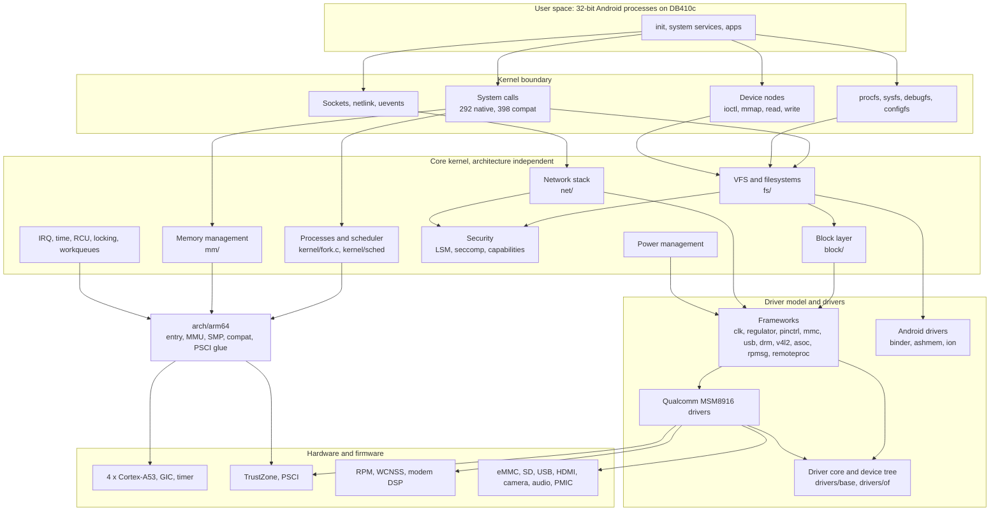
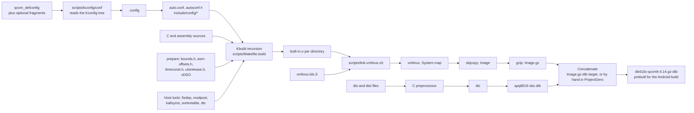
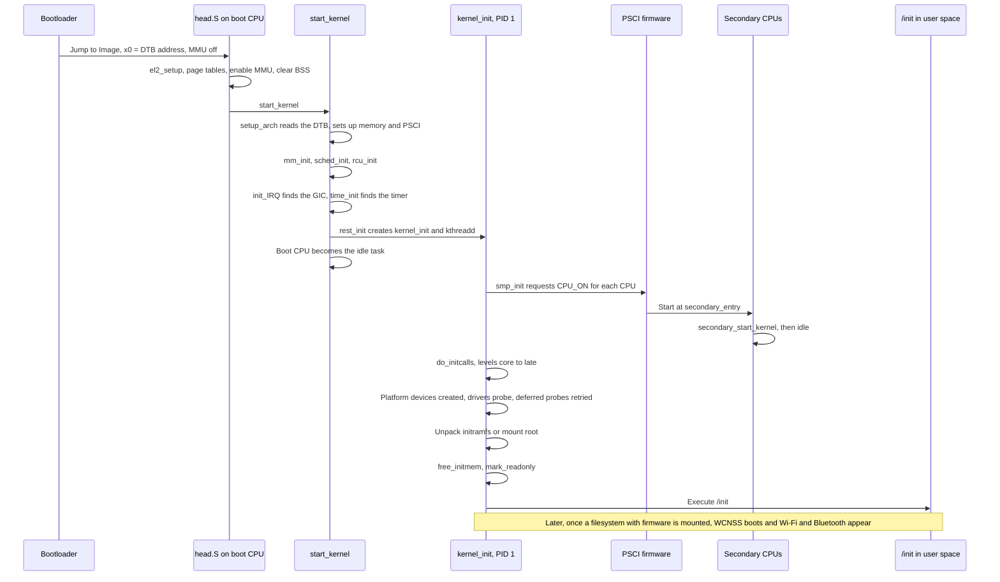
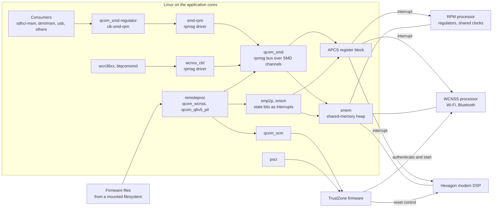
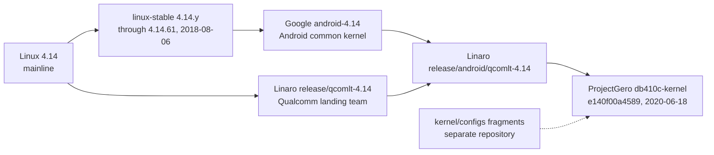
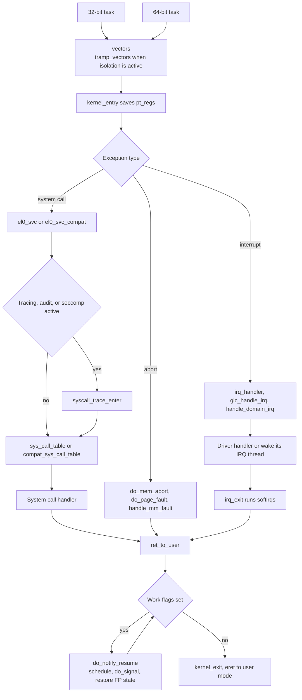
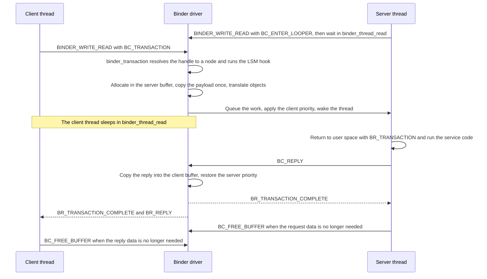
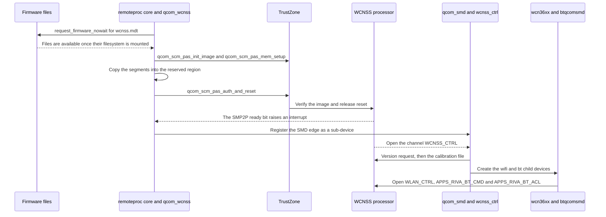

# db410c-kernel — Linux 4.14 kernel for DragonBoard 410c (Android common + Linaro Qualcomm)

| | |
|---|---|
| Repository | `db410c-kernel/` submodule of ProjectGero (`https://github.com/ProjectGero/db410c-kernel.git`) |
| Snapshot analyzed | `e140f00a4589` — "qcom_defconfig: Disable CONFIG_ION_SYSTEM_HEAP" (2020-06-18), the commit pinned by the superproject gitlink. ProjectGero adds no commits of its own. |
| Kernel version | 4.14.61, "Petit Gorille" (`Makefile`) |
| Lineage | Linaro integration branch `release/android/qcomlt-4.14` (named in the merge commits): upstream stable 4.14.61 + Google `android-4.14` + Linaro `release/qcomlt-4.14` |
| Scale | 61,503 tracked files: 25,652 `.c`, 20,105 `.h`, 1,451 `.S`, 2,473 device-tree sources; 30 CPU architectures; full history (715,842 commits) |
| Path convention | Paths are relative to the kernel repository root. Paths prefixed `superproject:` are relative to the ProjectGero top-level checkout. |
| Method | Derived from the source, build files, and git history of this repository. Facts labeled **as built** come from the kernel output directory that already exists in the ProjectGero checkout (`superproject:db410c-kernel/out-db410c/`, built 2026-09-29) and from a Kconfig-only reproduction in a scratch directory; nothing was compiled or booted for this analysis. Where something could not be established from source it is marked **UNKNOWN**. |
| Revision | Second analysis pass (2026-10-02). This pass recomputed the counts and re-ran the two Kconfig experiments, corrected three statements of the first pass (deferred-probe timing, the wake-up-reason interface, the Kconfig file count), and added depth on binder, the energy-aware scheduler, the Qualcomm inter-processor protocols, sdcardfs, traffic accounting, the 32-bit compatibility path, the memory layout, and the smaller Android changes to core code. |

## Purpose

`db410c-kernel` is the operating-system kernel that ProjectGero pairs with its Android 9 userspace on the Qualcomm DragonBoard 410c (DB410c). The DB410c is a single-board computer built around the Snapdragon 410 system-on-chip; the source calls the chip APQ8016 or MSM8916 and calls the board "APQ 8016 SBC".

The repository is a complete Linux kernel source tree, not a small board-support package. It is one upstream base with two patch streams merged on top:

| Stream | What it contributes | Evidence in this repository |
|---|---|---|
| Upstream Linux stable 4.14.y | The base kernel, up to commit `2ae6c0413b47` "Linux 4.14.61" (2018-08-06). | `Makefile` (`VERSION=4 PATCHLEVEL=14 SUBLEVEL=61`), git history |
| Android common kernel, `android-4.14` (Google) | Android-specific kernel features: binder updates, sdcardfs, energy-aware scheduling, per-UID accounting, verified-boot helpers, USB accessory functions, Clang LTO/CFI support, and backported f2fs and file-encryption code. | Merge commits "Merge branch 'google/android-4.14' …"; 555 commits prefixed `ANDROID:` |
| Linaro Qualcomm landing team, `release/qcomlt-4.14` | Hardware support for Snapdragon 410 and 820 boards that had not reached upstream by 4.14: CPU clock and voltage scaling, camera, audio DSP, remote-processor helpers, Wi-Fi fixes, device trees, and `qcom_defconfig`. | Merge commits "Merge branch 'release/qcomlt-4.14' …" |

Measured against upstream 4.14.61, the tree carries 1,655 extra commits (1,545 non-merge) that change 905 files: 89,836 lines added, 10,057 removed, and 190 files that do not exist upstream. Diagram E shows the lineage.

The kernel provides what any Linux kernel provides: process and thread management, scheduling, virtual memory, filesystems, block and network I/O, device drivers, security enforcement, and power management. On top of that it supplies the interfaces Android userspace expects (`/dev/binder`, `/dev/ashmem`, `/dev/ion`, sdcardfs, wakelocks, per-UID statistics) and the drivers for the DB410c hardware.

Three facts about its role in ProjectGero shape the rest of this document:

- **It is built outside the Android build.** Plain `make` produces `Image.gz` and `apq8016-sbc.dtb`. The superproject concatenates the two into `superproject:device/linaro/generic-kernels/db410c-qcomlt-4.14.gz-dtb`, which the Android build then treats as a prebuilt.
- **It is a 64-bit kernel under a 32-bit userspace.** ProjectGero builds Android with `TARGET_ARCH=arm` (`superproject:README.md`), so every Android process is an AArch32 task and reaches the kernel through the compatibility ("compat") system-call path.
- **The same tree builds many other kernels.** It also holds configurations for the DragonBoard 820c, the Android emulator ("ranchu"/"goldfish"), the Cuttlefish virtual device, and 29 other architectures. Only `arch/arm64` with `CONFIG_ARCH_QCOM` matters for DB410c.

## Architecture Overview

Diagram A shows the layers described here.

1. **Monolithic kernel, one privileged image.** All subsystems are linked into a single executable, `vmlinux`, that runs at exception level EL1 in one address space. Subsystems call each other directly. Loadable modules are supported by the source but are turned off in the DB410c configuration, so the as-built kernel is fully static.

2. **Three layers.**
   - The **architecture layer** (`arch/arm64`) owns everything CPU-specific: boot entry, exception vectors, page-table format, context switch, SMP bring-up.
   - The **core kernel** (`kernel/`, `mm/`, `fs/`, `net/`, `block/`, `ipc/`, `security/`, `crypto/`, `lib/`, `init/`) is architecture-independent and reaches hardware only through arch hooks and driver interfaces.
   - **Drivers** (`drivers/`, `sound/`) plug into core frameworks and are bound to hardware described by a device tree.

3. **Frameworks with operation tables.** Almost every extensible part follows one pattern: the framework defines a structure of function pointers, and an implementation fills it in and registers it. Examples are `file_operations` for anything that can be opened, `sched_class` for scheduling policies, `platform_driver` for devices, `clk_ops` for clocks, and `security_hook_list` for security modules. This is how one tree supports thousands of devices without the core knowing about any of them.

4. **A narrow, stable userspace boundary.** User programs enter the kernel through system calls (292 native, 398 compat), virtual filesystems (`/proc`, `/sys`, debugfs, configfs), device nodes with `ioctl`/`mmap`, sockets and netlink, and signals. The headers under `include/uapi` define that contract.

5. **Hardware is described, not hard-coded.** The bootloader hands the kernel a device-tree blob (DTB). The kernel turns it into `struct device_node` objects, creates a platform device for each node, and binds drivers by matching `compatible` strings. A driver whose dependencies are not ready returns `-EPROBE_DEFER` and is retried from the late initcall level onward, each time another probe succeeds, so probe order does not have to be encoded anywhere.

6. **Composition happens at compile time.** About 17,500 configuration symbols, declared in 1,448 `Kconfig` files, decide which source files are compiled and which code paths exist. The resulting `.config` is as much a part of a kernel's identity as its source revision. This matters here: the DB410c `.config` as built omits most of the Android options (see *Technical Debt / Risks*).

7. **Self-registration through linker sections.** Initialization functions, command-line parameter handlers, early device drivers, and exception fix-up entries are placed in dedicated ELF sections by macros (`*_initcall()`, `__setup()`, `IRQCHIP_DECLARE()`, `_ASM_EXTABLE()`). The linker script gathers each section into a table that boot code walks. No central list has to be edited when a file is added.

8. **Preemptible SMP concurrency.** The as-built kernel is fully preemptible (`CONFIG_PREEMPT=y`) on four Cortex-A53 cores. Work runs in four contexts: hard interrupt, softirq, kernel thread, and process context. Shared data is protected by spinlocks, mutexes, read-copy-update (RCU), and per-CPU data.

9. **The kernel is one processor among several on this chip.** On MSM8916 the Linux kernel runs only on the application cores. A power-management processor (RPM), a wireless processor (WCNSS), a modem DSP (Hexagon), and TrustZone firmware run beside it. The kernel talks to them through shared memory (SMEM), shared-memory channels (SMD, exposed as `rpmsg` devices), state bits (SMP2P, SMSM), an inter-processor interrupt register (APCS), and secure monitor calls (SCM, PSCI). Regulators and several clocks are not controlled by writing registers; they are requested from the RPM over a message channel (Diagram D).

10. **Android and Qualcomm additions sit in existing extension points.** Neither stream restructures the kernel. Android adds drivers, a stacked filesystem, netfilter matches, scheduler policy code, and `/proc` files. Linaro adds drivers and device trees. The largest intrusions into core code are the energy-aware scheduler changes in `kernel/sched` (about 5,000 added lines) and the f2fs/fscrypt backports.

## Directory Map

| Path | Responsibility |
|---|---|
| `Makefile`, `Kbuild`, `Kconfig` | Top-level build driver, generated-header rules, and root of the configuration tree. |
| `arch/arm64/kernel/` | Boot entry (`head.S`), exception and system-call entry (`entry.S`), process and signal handling, SMP and PSCI glue, CPU feature and erratum detection, AArch32 compat support (`sys32.c`, `signal32.c`, `kuser32.S`, `armv8_deprecated.c`), and the vDSO. |
| `arch/arm64/mm/` | Page tables, fault handling, early memory setup, DMA mapping, cache and TLB primitives. |
| `arch/arm64/boot/dts/qcom/` | Device trees. `apq8016-sbc.dts` is the DB410c; it includes `apq8016-sbc.dtsi`, `msm8916.dtsi`, and `pm8916.dtsi`. |
| `arch/arm64/configs/` | `defconfig` (generic arm64), `qcom_defconfig` (Linaro, used for DB410c), `ranchu64_defconfig` (Android emulator). |
| `arch/<other>/` | 29 other architectures. `arch/arm` and `arch/x86` also carry Android additions (emulator defconfigs, FIQ glue, Speck NEON code). Not used for DB410c. |
| `init/` | `start_kernel()`, initcall dispatch, root-filesystem mounting, initramfs unpacking, and the Android `dm=` boot parameter (`do_mounts_dm.c`). |
| `kernel/` | Core services: `sched/` (scheduler, plus Android `walt.c`, `tune.c`, `energy.c`), `fork.c`, `exit.c`, `signal.c`, `irq/`, `time/`, `locking/`, `rcu/`, `workqueue.c`, `power/` (suspend, wakelocks, Android `wakeup_reason.c`), `cgroup/`, `bpf/`, `events/` (perf), `trace/`, `printk/`, `module.c`, `seccomp.c`, Android `cfi.c`, and `configs/` (config fragments). |
| `mm/` | Page allocator, slab (SLUB), virtual memory areas, page cache, reclaim, swap, OOM killer, CMA, memory cgroup. |
| `fs/` | The virtual filesystem layer (VFS) plus 73 subdirectories of filesystems and helpers. Notable here: `ext4/`, `f2fs/` (heavily backported), `crypto/` (file-based encryption), `sdcardfs/` (Android-only), `proc/` (with Android `uid.c`), `sysfs/`, `kernfs/`, `fuse/`, `overlayfs/`, `squashfs/`. |
| `block/` | Block layer: `bio` handling, the legacy request queue, the multi-queue path (`blk-mq`), I/O schedulers, partition parsing. |
| `net/` | Network stack: sockets, `core/`, `ipv4/`, `ipv6/`, `netfilter/` (with Android `xt_qtaguid.c`, `xt_quota2.c`), `wireless/` and `mac80211/` (Wi-Fi), `bluetooth/`, `qrtr/` (Qualcomm IPC router). |
| `ipc/` | System V IPC and POSIX message queues. |
| `security/` | Linux Security Module framework (`security.c`), capabilities (`commoncap.c`), SELinux, and other LSMs. |
| `crypto/` | Cipher and hash framework, with boot-time self-tests (`testmgr.c`). Android adds the Speck cipher. |
| `drivers/base/`, `drivers/of/` | Driver core (devices, buses, classes, probing, firmware loading, devres) and device-tree support. |
| `drivers/android/` | Binder IPC driver (`binder.c`, `binder_alloc.c`). |
| `drivers/staging/android/` | ashmem, the ION allocator, the FIQ debugger, and the Cuttlefish `vsoc` driver. |
| `drivers/clk/qcom/`, `drivers/pinctrl/qcom/`, `drivers/soc/qcom/`, `drivers/rpmsg/`, `drivers/remoteproc/`, `drivers/regulator/`, `drivers/spmi/`, `drivers/mfd/`, `drivers/mailbox/`, `drivers/firmware/` | The Qualcomm platform plumbing: clocks, pins, shared memory and messaging, remote-processor loading, regulators, the PMIC bus, SCM and PSCI firmware calls. |
| `drivers/gpu/drm/msm/`, `drivers/media/platform/qcom/`, `drivers/net/wireless/ath/wcn36xx/`, `drivers/bluetooth/`, `drivers/mmc/host/`, `drivers/usb/chipidea/`, `drivers/tty/serial/`, `drivers/iommu/`, `drivers/thermal/qcom/`, `drivers/power/`, `drivers/cpufreq/`, `drivers/cpuidle/` | DB410c peripherals: display and GPU, camera and video codec, Wi-Fi, Bluetooth, eMMC/SD, USB, console UART, IOMMU, thermal sensors, voltage scaling, CPU frequency and idle. |
| `drivers/` (rest) | About 24,000 files of drivers for other hardware. `drivers/net`, `drivers/gpu`, and `drivers/staging` are the largest. |
| `sound/` | ALSA core and ASoC. `sound/soc/qcom/` and `sound/soc/codecs/msm8916-wcd-*.c` drive DB410c audio. |
| `include/linux/`, `include/uapi/`, `include/asm-generic/`, `include/dt-bindings/`, `include/trace/` | Internal APIs, the userspace ABI, generic fallbacks for arch headers, constants shared between C and device trees, and tracepoint definitions. |
| `lib/` | Generic helpers (strings, bitmaps, radix tree, rhashtable, decompressors, CRCs) and in-kernel test modules (`test_*.c`). |
| `scripts/` | Build machinery (`Makefile.build`, `Kbuild.include`, `link-vmlinux.sh`), host tools (`kconfig/`, `dtc/`, `mod/`, `kallsyms.c`, `sortextable.c`), and developer tools (`checkpatch.pl`, `coccinelle/`, `gdb/`). |
| `usr/`, `certs/`, `firmware/` | Built-in initramfs generation, the built-in X.509 keyring, and the (nearly empty) built-in firmware directory. |
| `virt/`, `arch/arm64/kvm/` | KVM hypervisor support. |
| `tools/` | Userspace programs kept with the kernel: `perf`, `objtool`, and `testing/selftests/`. |
| `Documentation/` | Subsystem documentation, device-tree bindings, and the kernel parameter list. Android adds `scheduler/sched-energy.txt`, `scheduler/sched-tune.txt`, and `device-mapper/boot.txt`. |
| `build.config.*`, `verity_dev_keys.x509` | Inputs for Google's emulator and Cuttlefish kernel builds. Not used for DB410c. |

## Build System

### Build definitions

The kernel uses its own build system, Kbuild, driven by GNU make. It has no connection to Android's Soong or `Android.mk` files; this repository contains no `Android.bp`.

| Piece | Role |
|---|---|
| `Kconfig` files (1,448) | Declare configuration symbols, their types, defaults, and dependencies. The root `Kconfig` sources `arch/$SRCARCH/Kconfig`, which sources the rest. |
| `.config` | The chosen value of every symbol. Produced by a Kconfig front end from a defconfig, from fragments, or interactively. |
| Top-level `Makefile` (1,825 lines) | Parses `ARCH`, `CROSS_COMPILE`, and `O=`; separates configuration targets from build targets; sets global compiler flags; lists the top-level directories that make up `vmlinux`; defines the final link. |
| `arch/arm64/Makefile`, `arch/arm64/boot/Makefile` | Architecture flags, the first object to link (`head-y`), the load offset (`TEXT_OFFSET := 0x00080000`), and image targets (`Image`, `Image.gz`, `dtbs`). |
| Per-directory `Makefile`/`Kbuild` files (2,537) | Declarative lists: `obj-y` (built in), `obj-m` (module), `obj-$(CONFIG_FOO)`, `lib-y`, and subdirectories. |
| `scripts/Makefile.build`, `scripts/Makefile.lib`, `scripts/Kbuild.include` | The rules that do the work in each directory: compile, assemble, combine into `built-in.o`, compile device trees. |
| `scripts/link-vmlinux.sh` | The final link, including the multi-pass symbol-table generation. |

### How a build proceeds

1. **Configure.** `make qcom_defconfig` runs `scripts/kconfig/conf --defconfig=arch/arm64/configs/qcom_defconfig Kconfig`. The defconfig lists only values that differ from defaults; `conf` computes the rest and writes `.config`.
2. **Sync.** On the next build, `conf --silentoldconfig` writes `include/config/auto.conf` (read by make), `include/generated/autoconf.h` (included in every compilation), and one small file per symbol under `include/config/`. The per-symbol files let `scripts/basic/fixdep` rebuild only the objects that depend on a changed option.
3. **Prepare.** The `prepare` targets generate version headers, `bounds.h`, `asm-offsets.h`, `timeconst.h`, the arch wrappers for generic headers, and the vDSO. The `scripts` target builds host tools.
4. **Descend.** For each directory in `init-y core-y drivers-y net-y libs-y virt-y`, make re-invokes itself with `scripts/Makefile.build`. Each directory compiles its sources and combines them into `built-in.o` (a thin archive as built, because `CONFIG_THIN_ARCHIVES=y`).
5. **Link.** `scripts/link-vmlinux.sh` links `vmlinux.o` for section-mismatch analysis by `modpost`, then links the kernel two or three times: each pass feeds the symbol table of the previous pass through `scripts/kallsyms` so that the final image contains its own symbol table at stable addresses. It then sorts the exception table (`scripts/sortextable`) and writes `System.map`.
6. **Package.** `objcopy -O binary` turns `vmlinux` into `arch/arm64/boot/Image`; `gzip -9` produces `Image.gz`.
7. **Device trees.** `make dtbs` runs each `.dts` through the C preprocessor and then `scripts/dtc/dtc`.

Diagram B shows the pipeline.

### Important build targets

| Target | Result |
|---|---|
| `<name>_defconfig`, `menuconfig`, `olddefconfig`, `savedefconfig` | Create or update `.config`. |
| `<fragment>.config` | Merge `kernel/configs/<fragment>.config` or `arch/arm64/configs/<fragment>.config` into the existing `.config` with `scripts/kconfig/merge_config.sh`, then run `oldconfig`. |
| `all` | On arm64: `Image.gz` plus `dtbs`. |
| `vmlinux` | The linked ELF kernel. |
| `Image`, `Image.gz` (also `.bz2`, `.lz4`, `.lzma`, `.lzo`) | Raw and compressed boot images. |
| `dtbs`, `qcom/apq8016-sbc.dtb`, `dtbs_install` | Device-tree blobs. |
| `Image-dtb`, `Image.gz-dtb` | Android addition: the image with DTBs appended. Selected as the default by `CONFIG_BUILD_ARM64_APPENDED_DTB_IMAGE` (off as built). |
| `modules`, `modules_install` | Loadable modules. Only meaningful when `CONFIG_MODULES=y`. |
| `headers_install`, `headers_check` | Export sanitized `include/uapi` headers for userspace. |
| `kselftest`, `kselftest-merge` | Run `tools/testing/selftests`; merge the config options the tests need. |
| `dir/file.o`, `dir/`, `file.s`, `file.i`, `file.lst` | Build one object, one directory, or an intermediate form. |
| `C=1`, `W=1`, `coccicheck`, `checkstack`, `includecheck`, `namespacecheck` | Static checks (sparse, extra warnings, Coccinelle semantic patches, stack usage). |
| `htmldocs`, `pdfdocs` | Sphinx documentation. |
| `bindeb-pkg`, `rpm-pkg`, `tar-pkg` | Distribution packages (`scripts/package/`). |
| `clean`, `mrproper`, `distclean` | Remove outputs; `mrproper` also removes `.config`. |

### Configurations in this tree

- `arch/arm64/configs/qcom_defconfig` (527 lines) is the Linaro configuration for Qualcomm boards and the one ProjectGero uses. It enables only `ARCH_QCOM` among the SoC families.
- `arch/arm64/configs/defconfig` is the generic arm64 configuration; `ranchu64_defconfig` targets the Android emulator.
- `kernel/configs/` holds fragments: `distro.config` (Linaro, for Debian-style userspace), `kvm_guest.config`, `xen.config`, `tiny.config`.
- **The Android fragments are not here.** Upstream 4.14 ships `kernel/configs/android-base.config` and `android-recommended.config`. Commit `0dafb9f618dd` ("ANDROID: remove android config fragments") deleted them because "the authoritative versions … were moved into a separate repository", and left `kernel/configs/android-fetch-configs.sh`, which downloads `android-4.14.tar.gz` from `android.googlesource.com/kernel/configs` at `master`. In ProjectGero that repository is the component `superproject:kernel/configs`.
- `build.config.goldfish.*` and `build.config.cuttlefish.x86_64` are parameter files for Google's kernel build script (`build/build.sh`, not in this repository). They name defconfigs, cross-compilers, and output files for emulator kernels.

### Toolchain handling

- **GCC is the default** (`CC = $(CROSS_COMPILE)gcc`). For arm64 the build adds `-mgeneral-regs-only` (no floating point in kernel code), `-mabi=lp64`, `-fno-pic`, and, when `CONFIG_ARM64_ERRATUM_843419=y`, the linker flag `--fix-cortex-a53-843419`.
- **Clang is supported.** When the compiler is Clang, the top `Makefile` passes `--target=$(CLANG_TRIPLE)` and `--gcc-toolchain=…` so that GNU binutils are still used for assembling and linking.
- **Clang LTO and CFI are an Android addition.** `CONFIG_LTO_CLANG` switches the linker to GNU gold with `LLVMgold.so` and the archiver to `llvm-ar`; `CONFIG_CFI_CLANG` (control-flow integrity) depends on it. The `prepare-compiler-check` target refuses to build unless Clang is at least 5.0 and gold at least 1.12. Both are off as built (`CONFIG_LTO_NONE=y`).
- **Host tools** are compiled with `HOSTCC = gcc` and `-std=gnu89`.

### Generated code

Nothing generated at build time is checked in. With `O=<dir>` every generated file lands in the output directory and the source tree stays untouched.

| Generated file | Produced by | From |
|---|---|---|
| `.config` | `scripts/kconfig/conf` | A defconfig or fragments plus the `Kconfig` tree |
| `include/generated/autoconf.h`, `include/config/auto.conf`, `include/config/**` (1,627 files as built) | `conf --silentoldconfig` | `.config` |
| `include/config/kernel.release`, `include/generated/utsrelease.h` | `Makefile`, `scripts/setlocalversion` | Version fields plus the git commit (as built: `4.14.61-ge140f00a`) |
| `include/generated/compile.h` | `scripts/mkcompile_h` | Build user, host, compiler version, timestamp |
| `include/generated/bounds.h`, `include/generated/asm-offsets.h` | `Kbuild`: compile to assembly, then extract constants | `kernel/bounds.c`, `arch/arm64/kernel/asm-offsets.c`. This is how assembly code learns C structure offsets. |
| `include/generated/timeconst.h` | `bc` | `kernel/time/timeconst.bc`, `CONFIG_HZ` |
| `arch/arm64/include/generated/` (46 wrapper headers as built) | `scripts/Makefile.asm-generic` | The `generic-y` lists in `arch/arm64/include/asm/Kbuild` and `arch/arm64/include/uapi/asm/Kbuild`; each file is a one-line wrapper around an `asm-generic` header |
| `arch/arm64/kernel/vmlinux.lds` | C preprocessor | `vmlinux.lds.S`, `include/asm-generic/vmlinux.lds.h` |
| `arch/arm64/kernel/vdso/vdso.so`, `include/generated/vdso-offsets.h` | Compile, link, `gen_vdso_offsets.sh` | `arch/arm64/kernel/vdso/*.S` |
| `.tmp_kallsyms1.S`, `.tmp_kallsyms2.S` | `scripts/kallsyms` | `nm` output of the intermediate links |
| `kernel/config_data.gz`, `kernel/config_data.h` | `gzip`, `scripts/basic/bin2c` | `.config`, embedded for `/proc/config.gz` |
| `usr/initramfs_data.cpio` | `usr/gen_init_cpio` | `CONFIG_INITRAMFS_SOURCE` (empty as built, so the archive is the 512-byte default) |
| `lib/crc32table.h`, `lib/oid_registry_data.c` | `lib/gen_crc32table`, `lib/build_OID_registry` (perl) | Algorithm parameters, `include/linux/oid_registry.h` |
| `drivers/tty/vt/consolemap_deftbl.c`, `drivers/video/logo/logo_*.c` | `scripts/conmakehash`, `scripts/pnmtologo` | Font map, PPM logos |
| `*.dtb` | C preprocessor, `scripts/dtc/dtc` | `*.dts`, `*.dtsi`, `include/dt-bindings/` |

The one class of generated code that **is** checked in is 23 `*_shipped` files: lexers and parsers for Kconfig, `dtc`, and `genksyms`, plus a few driver tables. They are used as-is unless `REGENERATE_PARSERS` is set (`scripts/Makefile.lib`).

### External tools and build-time dependencies

| Dependency | Use |
|---|---|
| GNU make (3.81 or later per `Documentation/process/changes.rst`) | Build driver |
| Target toolchain: GCC and binutils, or Clang with binutils | Compile and link the kernel. The documented minimum is GCC 3.2 and binutils 2.20. |
| Host C compiler | Build `fixdep`, `conf`, `dtc`, `modpost`, `kallsyms`, `sortextable`, and other helpers |
| `bc`, `perl`, `gzip`, a POSIX shell | Generated headers, OID table, compression, build scripts |
| `flex`, `bison` | Only with `REGENERATE_PARSERS` |
| OpenSSL | Only when certificate or module-signing options are enabled (not as built) |
| Android config fragments | Needed to produce an Android-capable `.config`; external to this repository |

### As built by ProjectGero (DB410c)

`superproject:docs/DB410C_ANDROID9_BUILD.md` documents the build:

```sh
export ARCH=arm64
export CROSS_COMPILE=<superproject>/prebuilts/gcc/linux-x86/aarch64/aarch64-linux-android-4.9/bin/aarch64-linux-android-
make O=out-db410c qcom_defconfig
make O=out-db410c HOSTCFLAGS="-Wall -Wmissing-prototypes -Wstrict-prototypes -O2 -fomit-frame-pointer -std=gnu89 -fcommon" -j"$(nproc)" Image.gz dtbs
```

What the existing output directory shows:

- **Compiler:** `gcc version 4.9.x 20150123 (prerelease)`, the Android GCC 4.9 prebuilt (`include/generated/compile.h`). The link used GNU ld with `--fix-cortex-a53-843419`.
- **Why `-fcommon` is needed:** the shipped `dtc` lexer and parser both define the global `yylloc` (`scripts/dtc/dtc-lexer.lex.c_shipped:634`, `scripts/dtc/dtc-parser.tab.c_shipped:1205`). GCC 10 and later default to `-fno-common`, which turns that duplicate into a link error. The `HOSTCFLAGS` override is the Makefile's default value plus `-fcommon`.
- **Artifacts:** `vmlinux` 255.7 MB (with debug info), `Image` 18.8 MB, `Image.gz` 8.77 MB, `apq8016-sbc.dtb` 53 KB, and six other Qualcomm DTBs. No modules were built.
- **Configuration:** 1,557 options `=y`, none `=m`. `CONFIG_MODULES`, `CONFIG_ANDROID`, `CONFIG_STAGING`, and `CONFIG_SECURITY_NETWORK` are not set.

Two checks were made for this analysis, both in a scratch output directory and both limited to Kconfig resolution:

1. Running `make qcom_defconfig` on the pinned commit produced a `.config` identical to the as-built one. The as-built kernel is therefore exactly `qcom_defconfig` with no fragments.
2. Merging the Android 9 fragments resolved cleanly:

   ```sh
   ARCH=arm64 CROSS_COMPILE=… scripts/kconfig/merge_config.sh -O <out> \
       arch/arm64/configs/qcom_defconfig \
       <superproject>/kernel/configs/p/android-4.14/android-base.cfg \
       <superproject>/kernel/configs/p/android-4.14/android-base-arm64.cfg \
       <superproject>/kernel/configs/p/android-4.14/android-recommended.cfg
   ```

   The result has 1,747 options `=y` and 10 `=m`, and includes `ANDROID_BINDER_IPC`, `ASHMEM`, `SECURITY_SELINUX`, `USB_CONFIGFS_F_FS`, `DM_VERITY`, and `MODULES`. That configuration was not compiled or booted.

   Two consequences of the merged configuration matter for the build recipe:

   - Because `MODULES` becomes `y`, ten tristate options whose default is `m` stop being built in: `BRIDGE_NETFILTER`, `HW_RANDOM`, `HW_RANDOM_MSM`, `HW_RANDOM_CAVIUM`, `LCD_CLASS_DEVICE`, `XEN_GNTDEV`, `XEN_GRANT_DEV_ALLOC`, `EFIVAR_FS`, `CRYPTO_ENGINE`, `CRYPTO_DEV_VIRTIO`. The documented `make Image.gz dtbs` does not build modules, so each of these must either be set to `y` or be built and installed with `make modules`.
   - `merge_config.sh` reports four options of the recommended fragment that stay unset: `CPU_SW_DOMAIN_PAN` (defined only for 32-bit ARM), `KPROBE_EVENT` and `UPROBE_EVENT` (this version names them `KPROBE_EVENTS` and `UPROBE_EVENTS`), and `ENABLE_DEFAULT_TRACERS` (inside the tracing menu that `qcom_defconfig` turns off with `# CONFIG_FTRACE is not set`).

## Outputs

| Output | Location (under `O=`) | Notes |
|---|---|---|
| `vmlinux` | top | ELF image with symbols and, as built, DWARF debug info. Input for debuggers and crash analysis; not what the bootloader loads. |
| `Image` | `arch/arm64/boot/` | Raw binary with the 64-byte arm64 header (branch, `text_offset`, `image_size`, magic `ARM\x64`). |
| `Image.gz` | `arch/arm64/boot/` | Gzip of `Image`. The kernel has no self-decompressor on arm64; the bootloader must decompress. |
| `*.dtb` | `arch/arm64/boot/dts/qcom/` | With `ARCH_QCOM`: `apq8016-sbc` (DB410c), `apq8096-db820c`, `msm8916-mtp`, `msm8996-mtp`, `msm8992-bullhead-rev-101`, `msm8994-angler-rev-101`, `ipq8074-hk01`. |
| `Image.gz-dtb`, `Image-dtb` | `arch/arm64/boot/` | Optional concatenated images. ProjectGero does the same concatenation by hand to create `superproject:device/linaro/generic-kernels/db410c-qcomlt-4.14.gz-dtb`. |
| `System.map` | top | Address-sorted symbol list. |
| `.config` | top | The full resolved configuration; also embedded in the image and readable at `/proc/config.gz` as built. |
| `*.ko`, `modules.order`, `modules.builtin`, `Module.symvers` | throughout | Loadable modules and their metadata. None as built. |
| `arch/arm64/kernel/vdso/vdso.so` | — | A small shared object the kernel maps into every 64-bit process for fast time calls. Embedded in `vmlinux`. |
| Exported headers | `usr/include/` after `headers_install` | The userspace ABI headers. ProjectGero's libc does not consume this target; bionic generates its kernel headers from `superproject:external/kernel-headers` (see the bionic analysis). |
| Host tools | `scripts/` | `basic/fixdep`, `kconfig/conf`, `dtc/dtc`, `mod/modpost`, `kallsyms`, `sortextable`, `basic/bin2c`. |
| Userspace tools | `tools/` | `perf`, selftests, and others, each with its own build. |

## Entry Points

| Entry point | Location | When it runs |
|---|---|---|
| Image header `_head`, then `stext` | `arch/arm64/kernel/head.S` | The bootloader jumps to the first byte of `Image` on the boot CPU. |
| EFI stub entry | `arch/arm64/kernel/efi-entry.S`, `drivers/firmware/efi/libstub/` | Only when booted as an EFI application (`CONFIG_EFI_STUB=y` as built). |
| `start_kernel()` | `init/main.c` | First C function; called once from `__primary_switched`. |
| `secondary_entry` → `secondary_start_kernel()` | `head.S`, `arch/arm64/kernel/smp.c` | Each additional CPU, when PSCI firmware releases it. |
| Exception vector table `vectors` | `arch/arm64/kernel/entry.S` | Every exception: system calls (`el0_sync` → `el0_svc`, or `el0_sync_compat` for 32-bit tasks), faults, and interrupts (`el0_irq`, `el1_irq`). |
| Trampoline vectors `tramp_vectors` | `entry.S` | Replace `vectors` for user-mode entries when kernel page-table isolation is active. |
| `handle_arch_irq` | `arch/arm64/kernel/irq.c` | Function pointer set by the interrupt controller driver; on DB410c it is `gic_handle_irq()` in `drivers/irqchip/irq-gic.c`. |
| `sys_call_table`, `compat_sys_call_table` | `arch/arm64/kernel/sys.c`, `sys32.c` | Dispatch tables filled from `SYSCALL_DEFINEn()` definitions across the tree. |
| Initcalls | Sections `.initcall0.init` … `.initcall7.init` | Functions registered with `core_initcall()` … `late_initcall()`, `module_init()`, or `module_platform_driver()`; run by `do_initcalls()`. |
| Early tables | `IRQCHIP_DECLARE`, `TIMER_OF_DECLARE`, `CLK_OF_DECLARE`, `OF_EARLYCON_DECLARE`, `RESERVEDMEM_OF_DECLARE` | Matched against the device tree before the driver model exists. |
| `kernel_init()` (PID 1), `kthreadd()` (PID 2) | `init/main.c`, `kernel/kthread.c` | Created by `rest_init()`. PID 1 finishes boot and executes the first user program. |
| Driver `probe()` | Each driver | When the driver core matches a device to a driver. |
| `file_operations` of device nodes | For example `binder_fops` in `drivers/android/binder.c` | When userspace opens, maps, or issues an `ioctl` on a device. |
| `cpu_resume` | `arch/arm64/kernel/sleep.S` | A CPU returning from a firmware-managed low-power state. |
| Build entry points | `Makefile`, `scripts/kconfig/conf`, `scripts/link-vmlinux.sh` | `make` invocations. |

## Initialization Flow

Diagram C shows the sequence. The stages below name the code that implements each one.

### 1. Bootloader hand-off

`Documentation/arm64/booting.txt` defines the contract. The bootloader must initialize RAM, load a device-tree blob on an 8-byte boundary (2 MB at most), decompress the kernel if it is compressed, place the image `text_offset` (0x80000) bytes above a 2 MB-aligned base, and jump to its first byte with the MMU off, interrupts masked, `x0` holding the physical address of the DTB, and `x1`–`x3` zero. `setup_arch()` prints a warning if `x1`–`x3` are not zero.

For DB410c the device tree leaves two things to the bootloader:

- The `memory` node in `msm8916.dtsi` has `reg = <0 0 0 0>` with the comment "We expect the bootloader to fill in the reg".
- `chosen` contains only `stdout-path = "serial0"`, and `CONFIG_CMDLINE` is empty as built, so the whole kernel command line comes from the bootloader.

Which bootloader ProjectGero uses and what command line it passes are **UNKNOWN** from this repository.

### 2. Assembly entry (`arch/arm64/kernel/head.S`)

`stext` runs with the MMU off:

1. `preserve_boot_args` saves `x0`–`x3`.
2. `el2_setup` checks the current exception level. If the CPU entered at EL2 it configures the hypervisor registers and drops to EL1; either way it records the boot mode, which later decides whether KVM can be used.
3. `__create_page_tables` builds an identity map for the transition and a map of the kernel image at its link address.
4. `__cpu_setup` (in `arch/arm64/mm/proc.S`) programs the translation-control and memory-attribute registers.
5. `__primary_switch` calls `__enable_mmu` and, when `CONFIG_RELOCATABLE` is set, applies relocations.
6. `__primary_switched` sets the stack and `init_task`, installs the vector table (`VBAR_EL1 = vectors`), stores the DTB address in `__fdt_pointer`, clears `.bss`, and branches to `start_kernel()`.

As built, the kernel links at `0xffff000008080000` (48-bit virtual addresses, 4 KB pages, four page-table levels) and is not relocatable (`CONFIG_RANDOMIZE_BASE` is off).

### 3. `start_kernel()` (`init/main.c`)

`start_kernel()` runs on the boot CPU with interrupts disabled until the interrupt controller and timers exist.

| Phase | Key calls | Effect |
|---|---|---|
| Architecture setup | `setup_arch()` | Maps the DTB through the fixmap and validates it (`setup_machine_fdt()`); reads the command line, memory, and reserved regions from it; registers RAM with `memblock`; builds the final kernel page tables (`paging_init()`); expands the DTB into `device_node` objects (`unflatten_device_tree()`); finds PSCI firmware (`psci_dt_init()`); enumerates CPUs (`smp_init_cpus()`). |
| Parameters | `parse_early_param()`, `parse_args()` | Runs handlers registered with `early_param()` and `__setup()`, and sets parameters of built-in code. |
| Memory | `mm_init()` | Releases `memblock` memory to the page allocator (`mem_init()`), starts the slab allocator (`kmem_cache_init()`), and sets up `vmalloc`. |
| Scheduler | `sched_init()` | Creates per-CPU run queues and turns the current thread into the idle task of CPU 0. |
| Core services | `workqueue_init_early()`, `rcu_init()` | Work can be queued; RCU is usable. |
| Interrupts | `early_irq_init()`, `init_IRQ()` | `init_IRQ()` calls `irqchip_init()`, which matches the device tree against `IRQCHIP_DECLARE` entries. On DB410c `"qcom,msm-qgic2"` selects `gic_of_init()`, which installs `gic_handle_irq` as the root handler. |
| Time | `init_timers()`, `hrtimers_init()`, `timekeeping_init()`, `time_init()` | `time_init()` registers fixed clocks (`of_clk_init()`) and probes timers (`timer_probe()`); `"arm,armv8-timer"` selects the ARM architected timer. |
| Console | `console_init()` | Registers consoles. With the `earlycon` parameter, `msm_serial` prints even earlier. |
| Remaining caches | `fork_init()`, `vfs_caches_init()`, `signals_init()`, `proc_root_init()`, `security_init()`, `cgroup_init()` | Process, VFS, and security infrastructure. `security_init()` registers the capability, Yama, and LoadPin hooks, then any LSM enabled in the configuration. |
| Hand-off | `rest_init()` | See below. |

### 4. `rest_init()`: the first threads

`rest_init()` creates two kernel threads and then becomes the idle loop of CPU 0:

- `kernel_init` becomes PID 1. It finishes kernel initialization and later turns into the first user process.
- `kthreadd` becomes PID 2. Every other kernel thread is created by it.

### 5. `kernel_init_freeable()`: SMP and drivers

Running as PID 1 in kernel mode:

1. `do_pre_smp_initcalls()` runs functions registered with `early_initcall()`.
2. `smp_init()` brings up the other CPUs. For each one, `cpu_up()` walks the CPU-hotplug state machine (`kernel/cpu.c`) to `__cpu_up()` (`arch/arm64/kernel/smp.c`), which calls the PSCI `CPU_ON` firmware service (`cpu_psci_cpu_boot()` → `psci_cpu_on()`). The new CPU starts at `secondary_entry`, enables its MMU, runs `secondary_start_kernel()`, and enters its idle loop. `sched_init_smp()` then builds the scheduler's CPU topology.
3. `do_basic_setup()` calls `driver_init()` (devtmpfs, the device, bus, and class cores, the platform bus, device-tree sysfs) and then `do_initcalls()`.

### 6. Initcall levels and DB410c bring-up

`do_initcalls()` runs eight levels in order. Within a level, order follows link order. The table lists where the DB410c platform code registers.

| Level | Macro | DB410c registrations (verified in source) |
|---|---|---|
| 1 | `core_initcall` | `gcc_msm8916_init` (global clock controller), `rpm_smd_clk_init` (RPM-managed clocks) |
| 2 | `postcore_initcall` | `qcom_apcs_ipc_init` (driver for the APCS register block: a mailbox controller, and the parent of the CPU clock device), `qcom_hwspinlock_init` |
| 3 | `arch_initcall` | `msm8916_pinctrl_init`, `qcom_smem_init` (shared memory), `qcom_smd_rpm_init` (RPM message driver), `alloc_vectors_page` and `vdso_init` |
| 3s | `arch_initcall_sync` | `of_platform_default_populate_init()`: creates a platform device for each device-tree node, plus the reserved-memory nodes `qcom,rmtfs-mem` and `ramoops`. Probing starts here. |
| 4 | `subsys_initcall` | `qcom_scm_init` (TrustZone calls), `qcom_smd_init` (shared-memory channels), `rpm_reg_init` (RPM regulators) |
| 5 | `fs_initcall`, `rootfs_initcall` | `firmware_class_init`, `populate_rootfs` |
| 6 | `device_initcall` (also `module_init`, `module_platform_driver`) | Most drivers: SPMI bus and PMIC, `sdhci-msm`, `msm_serial`, MSM DRM, Chipidea USB, WCNSS and modem loaders, `cpuidle-arm`, and `binder_init` when binder is enabled |
| 7 | `late_initcall` | `deferred_probe_initcall`: turns deferred-probe retries on and runs the first retry pass to completion |

The early levels are chosen to follow the hardware dependency chain: almost every peripheral needs a clock from the global clock controller and a regulator from the RPM; the RPM regulators need an SMD channel; SMD needs shared memory and the APCS register that interrupts the other processor. A driver that still finds a dependency missing returns `-EPROBE_DEFER`, and `drivers/base/dd.c` parks the device on a pending list. Nothing on that list is retried during levels 0 to 6: `driver_deferred_probe_trigger()` returns immediately until `deferred_probe_initcall()` sets `driver_deferred_probe_enable` at the late level. From then on, every successful probe moves the whole pending list to a work item that retries it. A device that depends on something probed later in the device level therefore binds only once the late level is reached.

For each match, `really_probe()` applies default pin configuration (`pinctrl_bind_pins()`), configures DMA (`dma_configure()`), and calls the driver's `probe()`. On failure it releases all managed resources (`devres_release_all()`).

### 7. Root filesystem and the first user process

1. `populate_rootfs()` unpacks the built-in initramfs and any bootloader-supplied initrd into the in-memory root. Android adds the `skip_initramfs` parameter (`init/initramfs.c`), which bypasses unpacking and creates only a minimal root.
2. `kernel_init_freeable()` opens `/dev/console`. If `/init` exists in the in-memory root, it is used as the init program.
3. Otherwise `prepare_namespace()` (`init/do_mounts.c`) waits for device probing, runs `md_run_setup()` and Android's `dm_run_setup()`, mounts the device named by `root=`, mounts devtmpfs on `/dev`, and switches root. `dm_run_setup()` (`init/do_mounts_dm.c`) builds device-mapper devices from the `dm=` command-line parameter, which is how a verified root filesystem can be mounted without an initramfs.
4. `kernel_init()` frees the `__init` sections, write-protects kernel text and read-only data (`mark_readonly()`), sets `system_state = SYSTEM_RUNNING`, and executes `/init` from the initramfs, the program named by `init=`, or `/sbin/init`, `/etc/init`, `/bin/init`, `/bin/sh` in turn. If all fail it panics with "No working init found".

### 8. Hardware that starts after userspace

Some DB410c hardware cannot start until a filesystem with firmware files is mounted:

- **Wi-Fi and Bluetooth.** `qcom_wcnss.c` registers a remote processor with auto-boot. `remoteproc_core.c` requests `wcnss.mdt` asynchronously (`request_firmware_nowait()`); when it arrives the image is loaded, TrustZone authenticates and starts it (`qcom_scm_pas_auth_and_reset()`), and the processor announces its channels. `wcnss_ctrl.c` then downloads calibration data (`wlan/prima/WCNSS_qcom_wlan_nv.bin`) and creates the child devices that `wcn36xx` and `btqcomsmd` bind to.
- **GPU.** The Adreno driver loads `a300_pm4.fw` and `a300_pfp.fw` during hardware init (`adreno_load_fw()`).
- **Modem DSP.** `qcom_q6v5_pil.c` needs `mba.mbn` and `modem.mdt`.

As built, `CONFIG_FW_LOADER_USER_HELPER_FALLBACK=y`: if a file is not found under the built-in search path (`firmware_class.path=`, then `/lib/firmware/…`), the kernel emits a uevent and waits for userspace to supply it.

## Main Runtime Flow

After boot the kernel is event-driven. It runs only when a process enters it, an interrupt arrives, or a kernel thread is scheduled. Diagram F shows the entry and return paths.

### 1. System calls

A 64-bit process executes `svc #0`. The CPU takes a synchronous exception to EL1 and enters the "Synchronous 64-bit EL0" slot of `vectors`:

1. `kernel_entry` saves the user registers as a `struct pt_regs` on the task's kernel stack.
2. `el0_sync` reads the exception class and branches to `el0_svc` for a system call.
3. `el0_svc` loads `sys_call_table`, takes the call number from `w8`, checks it against `__NR_syscalls`, clamps it with `mask_nospec64` (a Spectre-v1 hardening), and calls the handler.
4. `ret_fast_syscall` stores the result. If any work flag is set it calls `do_notify_resume()`, which loops until none remain: reschedule, deliver signals (`do_signal()`), run notify-resume hooks, restore floating-point state.
5. `kernel_exit` restores the registers and executes `eret`.

A 32-bit process, which is every Android process on DB410c, enters the "Synchronous 32-bit EL0" slot instead. `el0_svc_compat` selects `compat_sys_call_table`, takes the number from `w7` (ARM register `r7`), and joins the same path. Compat handlers (`COMPAT_SYSCALL_DEFINEn`, `arch/arm64/kernel/sys32.c`, `sys_compat.c`) translate 32-bit structure layouts.

If tracing, audit, or seccomp is active for the task (`_TIF_SYSCALL_WORK`), the call goes through `__sys_trace` and `syscall_trace_enter()`, where a seccomp filter can reject it.

When kernel page-table isolation is active, user-mode entries first land in `tramp_vectors`, a small trampoline that is mapped in user page tables and switches to the full kernel page tables. In this snapshot `unmap_kernel_at_el0()` (`arch/arm64/kernel/cpufeature.c`) enables isolation on any CPU whose ID register does not report immunity (the `CSV3` field) unless `kpti=off` is passed; there is no exemption list for Cortex-A53.

### 2. Interrupts

1. A device raises an interrupt; the CPU enters `el0_irq` or `el1_irq`.
2. The `irq_handler` macro switches to the per-CPU IRQ stack and calls `handle_arch_irq`, which is `gic_handle_irq()`.
3. The GIC driver reads the interrupt number and calls `handle_domain_irq()`, which maps the hardware number to a Linux `irq_desc` through an `irq_domain` and runs its flow handler.
4. The flow handler calls the driver's handler (`handle_irq_event()`). A driver that registered with `request_threaded_irq()` can return `IRQ_WAKE_THREAD` from its hard handler, or supply none at all; either way its dedicated `irq/<n>-<name>` kernel thread is woken and the part of the work that may sleep runs there.
5. `irq_exit()` runs pending softirqs (network receive and transmit, block completion, timers, tasklets, scheduler, RCU). If softirq work keeps arriving, it is handed to the per-CPU `ksoftirqd/<n>` thread.
6. On return to kernel code with preemption enabled and `need_resched` set, `el1_preempt` calls `preempt_schedule_irq()`. On return to user code the work loop of section 1 applies.

Three interrupt controllers are stacked on the GIC on this board. Each is an `irq_domain` with its own `irq_chip`, and each multiplexes many logical interrupts onto one or two GIC lines:

| Controller | Driver | How it is chained |
|---|---|---|
| GPIO | `drivers/pinctrl/qcom/pinctrl-msm.c` | The pin controller is also a GPIO chip and an interrupt chip. One "summary" GIC interrupt fires for any GPIO; `msm_gpio_irq_handler()` scans the pins and dispatches (`gpiochip_set_chained_irqchip()`). |
| PMIC | `drivers/spmi/spmi-pmic-arb.c` | The arbiter owns a tree-indexed domain addressed by PMIC slave, peripheral, and interrupt number; `pmic_arb_chained_irq()` demultiplexes. PMIC devices such as the power key and RTC sit behind it. |
| Remote-processor state bits | `drivers/soc/qcom/smp2p.c` | Each inbound SMP2P entry is a 32-interrupt linear domain. A threaded handler compares the shared 32-bit value with its last copy and calls `handle_nested_irq()` for every bit that changed. The `ready`, `fatal`, and `stop-ack` interrupts of the remote-processor drivers are bits of this kind. |

### 3. Scheduling

- **Classes.** `kernel/sched` chains five scheduling classes in priority order: stop (`stop_task.c`), deadline (`deadline.c`), real-time (`rt.c`), fair (`fair.c`, the CFS scheduler used by normal tasks), and idle (`idle_task.c`). `pick_next_task()` asks each class in turn.
- **Switching.** `__schedule()` (`core.c`) picks the next task and calls `context_switch()`, which switches the address space and then the register state (`__switch_to()` in `arch/arm64/kernel/process.c`, `cpu_switch_to` in `entry.S`).
- **Triggers.** The timer tick (`scheduler_tick()`), wake-ups (`try_to_wake_up()`), blocking calls, and returns from interrupt with `need_resched` set.
- **CPU selection.** `select_task_rq_fair()` chooses the CPU for a waking task.
- **Android additions.** `select_task_rq_fair()` gains an energy-aware branch: when `wake_energy()` allows it, `find_energy_efficient_cpu()` chooses the CPU from an energy model instead of the usual idle-sibling search. `tune.c` adds the `schedtune` cgroup controller, `walt.c` an alternative load-tracking scheme, and the `schedutil` governor is modified to use boosted utilization. *Major Components* describes the mechanism.
- **On DB410c these additions are dormant**, for three independent reasons given under *Major Components*: the feature flag is off, the options are off, and the device tree has no energy data. The four cores are identical, so there is no big.LITTLE asymmetry to exploit, and the default frequency governor as built is `ondemand`.

### 4. Memory faults and allocation

- **Faults.** A data or instruction abort enters `el0_da`/`el0_ia` (or `el1_da`) and calls `do_mem_abort()` (`arch/arm64/mm/fault.c`), which dispatches on the fault status code. `do_page_fault()` finds the virtual memory area and calls the generic `handle_mm_fault()` (`mm/memory.c`), which allocates a zero page, reads a file page through the page cache, performs copy-on-write, or swaps a page in. A kernel-mode fault with no valid mapping is first checked against the exception table (`fixup_exception()`), which is how `copy_from_user()` returns `-EFAULT` instead of crashing.
- **Allocation.** `__alloc_pages_nodemask()` (`mm/page_alloc.c`) tries the free lists (`get_page_from_freelist()`). Under pressure the slow path wakes `kswapd`, reclaims pages directly (`mm/vmscan.c`), compacts memory, and as a last resort invokes the OOM killer (`mm/oom_kill.c`). Small objects come from SLUB caches (`mm/slub.c`); large contiguous buffers for devices come from the contiguous memory allocator (`mm/cma.c`).

### 5. File and block I/O

A `read()` on a file in an ext4 filesystem on the eMMC goes through these layers:

1. `sys_read` → `vfs_read()` (`fs/read_write.c`) → the file's `file_operations` (`ext4_file_read_iter`).
2. The generic page-cache read (`mm/filemap.c`) returns cached pages or asks the filesystem to read them through its `address_space_operations`.
3. The filesystem maps file offsets to disk blocks and submits `struct bio` requests (`submit_bio()` → `generic_make_request()` in `block/blk-core.c`).
4. The block layer merges and schedules requests. As built the default I/O scheduler is CFQ on the legacy request queue.
5. The MMC block driver's queue thread (`mmcqd/<n>`, `drivers/mmc/core/queue.c`) takes requests and issues commands through the MMC core to the host driver `sdhci-msm.c`.
6. The controller's interrupt completes the request; the page is unlocked and the reader is woken.

Path lookup for `open()` runs through `do_sys_open()` → `do_filp_open()` → `path_openat()` → `link_path_walk()` (`fs/namei.c`), using the dentry cache and consulting security hooks at each step.

### 6. Networking

- **Transmit.** `sys_sendmsg` → `sock_sendmsg()` (`net/socket.c`) → the protocol (TCP/UDP in `net/ipv4`, `net/ipv6`) → routing and netfilter hooks → `__dev_queue_xmit()` (`net/core/dev.c`) → the driver's `net_device_ops`.
- **Receive.** The driver hands packets to `netif_receive_skb` (usually from NAPI polling in the `NET_RX` softirq, `net_rx_action()`); `__netif_receive_skb_core()` delivers them to protocol handlers, which queue data on sockets and wake readers.
- **Wi-Fi on DB410c.** `wcn36xx` is a `mac80211` driver. Control messages travel over the SMD channel `WLAN_CTRL` (`smd.c`, `rpmsg_send()`); data frames move through DMA rings shared with the wireless processor (`dxe.c`) and enter the stack with `ieee80211_rx_irqsafe()`.

### 7. Binder transactions (when `CONFIG_ANDROID_BINDER_IPC` is enabled)

1. Each process opens a binder device and maps a receive buffer (`binder_open()`, `binder_mmap()`).
2. The sender issues `ioctl(BINDER_WRITE_READ)`. `binder_thread_write()` decodes the command and `binder_transaction()` resolves the target, checks permissions through LSM hooks (`security_binder_transaction()` and related), and allocates space in the **target's** buffer (`binder_alloc_new_buf()`).
3. The payload is copied once, from the sender's memory directly into pages that are also mapped read-only in the target (`copy_from_user(t->buffer->data, …)`). Binder objects and file descriptors embedded in the payload are translated for the target.
4. `binder_proc_transaction()` queues the work and wakes a waiting thread in the target, propagating the sender's scheduling priority (`binder_transaction_priority()`).
5. The target thread returns from its own `BINDER_WRITE_READ` in `binder_thread_read()` with a pointer into its mapped buffer.

### 8. Idle and CPU power

- **Idle.** An idle CPU runs `do_idle()` (`kernel/sched/idle.c`) → `cpuidle_idle_call()` → the governor (`menu` as built) → `arm_enter_idle_state()` (`drivers/cpuidle/cpuidle-arm.c`) → `arm_cpuidle_suspend()` → PSCI `CPU_SUSPEND`. `msm8916.dtsi` defines one idle state, `spc` (standalone power collapse), besides plain wait-for-interrupt.
- **Frequency.** A cpufreq governor asks `cpufreq-dt` for a new frequency; it sets the CPU clock through the clock framework (`apcs-msm8916.c` selecting between `a53-pll.c` and the global clock controller) and the supply voltage through the regulator framework.
- **Voltage.** The Linaro `qcom-cpr.c` driver (Core Power Reduction) reads per-chip calibration fuses, creates the operating points, registers the `cpufreq-dt` device itself once they exist, and then trims the voltage at run time from a hardware sensor loop.
- **System suspend.** Writing to `/sys/power/state` runs `pm_suspend()` → `enter_state()` → `suspend_devices_and_enter()` (`kernel/power/suspend.c`): freeze tasks, call every device's `dev_pm_ops`, take secondary CPUs offline, and enter the platform sleep state. Whether the board firmware implements PSCI system suspend is **UNKNOWN** from this repository.

### 9. Process lifecycle

`fork()`/`clone()` → `_do_fork()` → `copy_process()` (`kernel/fork.c`) duplicates or shares each resource according to the clone flags and calls `wake_up_new_task()`. `execve()` → `do_execveat_common()` → `search_binary_handler()` → `load_elf_binary()` (`fs/binfmt_elf.c`) replaces the address space; for a 32-bit ELF the compat variant also maps the AArch32 vectors page. `exit()` → `do_exit()` (`kernel/exit.c`) releases resources and notifies the parent.

## Major Components

### Architecture layer (`arch/arm64`)

- **Boot, exceptions, and the MMU** are described above (`arch/arm64/kernel/head.S`, `arch/arm64/kernel/entry.S`, `arch/arm64/mm/mmu.c`, `arch/arm64/mm/fault.c`).
- **CPU features and errata.** `cpufeature.c` reads the ID registers of every CPU, keeps a "sanitised" system-wide view, and evaluates a table of capabilities (`arm64_features[]`); `cpu_errata.c` does the same for known hardware bugs (`arm64_errata[]`). `alternative.c` then patches instructions in the running kernel according to the detected capabilities, so one binary runs optimally on different cores. As built, the Cortex-A53 workarounds (errata 826319, 827319, 824069, 819472, 845719, 843419) are compiled in.
- **Speculation mitigations** present at this version: kernel page-table isolation (`CONFIG_UNMAP_KERNEL_AT_EL0`), branch-predictor hardening (`bpi.S`), speculative-store-bypass control (`ssbd.c`), and array-index masking (`mask_nospec64`).
- **Address-space layout as built** (48-bit addresses, `arch/arm64/include/asm/memory.h`). User space of a 64-bit process spans the lower 2^48 bytes; a 32-bit process is limited to 4 GB (`TASK_SIZE_32`). The kernel half starts at `VA_START` = `0xffff000000000000` with 128 MB reserved for modules. The `vmalloc` area begins right after it (`VMALLOC_START` = `MODULES_END`), and the kernel image is linked at the start of that area, at `0xffff000008080000`. The upper half from `PAGE_OFFSET` = `0xffff800000000000` is the linear map of all RAM. Physical memory is split into two zones: `ZONE_DMA` for RAM up to the first 4 GB boundary, which devices limited to 32-bit addresses can reach, and `ZONE_NORMAL` for anything above it (`max_zone_dma_phys()` in `arch/arm64/mm/init.c`).
- **AArch32 compatibility** is described separately below, because every Android process on DB410c depends on it.
- **vDSO.** `arch/arm64/kernel/vdso/` exports `__kernel_gettimeofday`, `__kernel_clock_gettime`, `__kernel_clock_getres`, and `__kernel_rt_sigreturn` to 64-bit processes only. This tree has no 32-bit vDSO, so time queries from 32-bit processes are real system calls.
- **Firmware interfaces.** `psci.c` and `cpu_ops.c` connect CPU bring-up, hotplug, and idle to PSCI (`drivers/firmware/psci.c`).
- **KVM** (`arch/arm64/kvm`, `virt/kvm`) is enabled as built. It works only if the kernel was entered at EL2; whether the DB410c firmware does that is **UNKNOWN** from this repository.

### 32-bit processes on the 64-bit kernel

ProjectGero's userspace is 32-bit, so this path carries every Android system call.

- **Becoming a compat task.** `execve()` of a 32-bit ARM ELF is handled by `fs/compat_binfmt_elf.c`, which accepts the file only if the CPU supports AArch32 at EL0 (`compat_elf_check_arch()` → `system_supports_32bit_el0()`). `COMPAT_SET_PERSONALITY` sets the thread flag `TIF_32BIT`; `is_compat_task()` tests that flag wherever behavior differs.
- **System calls.** `compat_sys_call_table` is generated from `arch/arm64/include/asm/unistd32.h`. An entry points at the native handler when the arguments have the same layout, or at a `COMPAT_SYSCALL_DEFINEn` handler that converts 32-bit structures (`fs/compat.c`, `kernel/compat.c`, `net/compat.c`, `ipc/compat.c`). Calls that pass a 64-bit value in two 32-bit registers go through small assembly wrappers in `arch/arm64/kernel/entry32.S` (`compat_sys_pread64_wrapper` and similar).
- **Device `ioctl` calls.** A driver supplies a `compat_ioctl` method, or the generic table in `fs/compat_ioctl.c` translates the request. Binder sets `.compat_ioctl = binder_ioctl`: its structures have one layout for both word sizes.
- **Signals.** `arch/arm64/kernel/signal32.c` builds 32-bit signal frames (`compat_setup_rt_frame()`).
- **The vectors page.** At `exec`, `aarch32_setup_vectors_page()` maps a page at `0xffff0000` holding the helpers that 32-bit ARM programs call at fixed addresses (`__kuser_cmpxchg`, `__kuser_cmpxchg64`, `__kuser_get_tls`, `__kuser_memory_barrier` in `kuser32.S`) and the signal-return trampolines.
- **No vDSO.** 32-bit processes get no vDSO in this tree, so `gettimeofday()` and `clock_gettime()` are real system calls.
- **Removed instructions.** `armv8_deprecated.c` can trap and emulate `SWP`, CP15 barrier operations, and `SETEND` for old ARMv7 binaries (`CONFIG_ARMV8_DEPRECATED` and its three sub-options). They are off as built; the Android arm64 fragment turns them on.
- **Capabilities reported to userspace.** `compat_elf_hwcap` and `compat_elf_hwcap2` (`cpufeature.c`) describe the CPU in 32-bit terms.

### Processes and scheduling (`kernel/fork.c`, `kernel/exit.c`, `kernel/signal.c`, `kernel/sched/`)

Every thread is a `task_struct`. A process is a group of tasks that share an address space, file table, and signal handlers; what is shared is decided per `clone()` flag. Namespaces (`nsproxy`) and cgroups attach to tasks to scope and limit what they see and use. The scheduler is described under *Main Runtime Flow*. `kernel/cpu.c` implements CPU hotplug as an ordered state machine of about 140 states (`enum cpuhp_state`), each with a bring-up and tear-down callback.

#### Energy-aware scheduling (Android)

The Android scheduler changes add about 5,000 lines to `kernel/sched`. They have four parts.

1. **An energy model.** Each scheduling-domain level can carry a `struct sched_group_energy`: a table of capacity states (compute capacity and power at each operating point) and a table of idle states (power in each). On arm64 the levels `MC`, `DIE`, and `SYS` get their tables from `cpu_core_energy()`, `cpu_cluster_energy()`, and `cpu_system_energy()` (`arch/arm64/kernel/topology.c`). The numbers come from the device tree: each CPU node lists `sched-energy-costs` phandles to nodes holding `busy-cost-data` and `idle-cost-data` (`kernel/sched/energy.c`).
2. **Energy-aware wake-up.** `select_task_rq_fair()` asks `wake_energy()` whether to try. It declines when the `ENERGY_AWARE` scheduler feature is off or the domain is over-utilized. Otherwise `find_energy_efficient_cpu()` gathers candidate CPUs — with the `FIND_BEST_TARGET` feature, `find_best_target()` picks a "best idle" or "best active" CPU and a backup — and `select_energy_cpu_idx()` and `compute_energy()` estimate the energy of moving the task to each candidate compared with leaving it on its previous CPU. If no candidate exists the normal placement path runs.
3. **Task classes.** The `schedtune` cgroup controller (`tune.c`) gives each group a `boost` value, which inflates the utilization used for placement and frequency selection, and a `prefer_idle` flag. The code allows five groups (`BOOSTGROUPS_COUNT`), although the Kconfig help text says sixteen.
4. **Window-based load tracking.** `walt.c` accumulates run time in fixed windows (20 ms by default) as an alternative to the default decaying averages; two sysctls choose whether CPU and task utilization come from it.

Supporting changes are frequency- and CPU-invariant load accounting (`arch_set_freq_scale()` in `drivers/base/arch_topology.c`, called from `cpufreq-dt`), separate up and down rate limits in the `schedutil` governor, and extra trace events.

Three conditions must all hold for the energy-aware path to run. None holds on DB410c:

- `ENERGY_AWARE` defaults to false unless `CONFIG_DEFAULT_USE_ENERGY_AWARE` is set, and it can be flipped at run time only with `CONFIG_SCHED_DEBUG`, which `qcom_defconfig` turns off.
- The energy tables are loaded by `init_sched_energy_costs()`, which has a single caller: a cpufreq policy notifier in `drivers/base/arch_topology.c` that is registered only when the CPU nodes carry `capacity-dmips-mhz`. No Qualcomm device tree in this repository has that property, including `msm8996.dtsi`, which does contain `sched-energy-costs` tables.
- `msm8916.dtsi` has no `sched-energy-costs` tables.

### Memory management (`mm/`, `arch/arm64/mm/`)

- **Allocators, in boot order:** `memblock` (boot-time), the buddy page allocator, SLUB object caches, `vmalloc`, and per-CPU memory.
- **Address spaces:** each process has an `mm_struct` holding its page tables and a set of `vm_area_struct` regions; pages are populated on demand by the fault path.
- **Page cache:** file contents are cached in `address_space` objects shared by `read()`/`write()` and `mmap()`.
- **Reclaim:** LRU lists scanned by `kswapd` and by allocating tasks; writeback of dirty pages; swap; the OOM killer.
- **Options enabled as built:** compaction, transparent huge pages, KSM, CMA (16 MB default area), and the memory cgroup.
- This tree does not contain the old in-kernel Android low-memory killer; `drivers/staging/android/` has no `lowmemorykiller.c`.

### VFS and filesystems (`fs/`)

The VFS defines four core objects — superblock, inode, dentry, and open file — each with an operations table that a filesystem implements. Shared services are path lookup with a dentry cache (`namei.c`, `dcache.c`), mount namespaces (`namespace.c`), the page cache and writeback, file locking, and notification (`notify/`).

- **Disk filesystems as built:** ext2, ext4 (which also serves ext3), btrfs, vfat, squashfs.
- **Stacked and network filesystems as built:** FUSE, overlayfs, NFS, 9p, and sdcardfs.
- **Pseudo filesystems:** procfs, sysfs (on `kernfs`), devtmpfs, tmpfs, debugfs, configfs, pstore, and the cgroup filesystem.
- **Android changes:** `sdcardfs/` (described below); `crypto/` and the ext4/f2fs hooks for file-based encryption; a large f2fs backport (270 commits); `proc/uid.c`; and `android_fs` tracepoints.

#### sdcardfs

sdcardfs presents an ordinary directory with the ownership and permission rules of Android's shared storage. With 97 commits it is the most heavily patched Android component in this tree. Its Kconfig help says only that it "is based on Wrapfs".

- **Stacking.** Each sdcardfs inode, dentry, and open file wraps a lower object of the underlying filesystem (`lower_inode`, `lower_path`, `lower_file` in `sdcardfs.h`). An operation is forwarded to the lower object after `OVERRIDE_CRED()` replaces the caller's filesystem user and group IDs with the ones given at mount time (`override_fsids()`; with `derive_gid` the user ID is computed per Android user), so the lower filesystem does not see the calling app's identity.
- **Derived permissions.** The owner, group, and mode that sdcardfs reports are computed, not stored. `get_derived_permission()` (`derived_perm.c`) classifies each directory by its position in the tree (`perm_t`: the root, `Android`, `Android/data`, `Android/obb`, `Android/media`, a package directory under one of those, or a package's `cache`) and derives the user ID from the Android user and the application ID of the owning package.
- **Package list.** Userspace supplies the mapping from package name to application ID through a configfs subsystem named `sdcardfs` (`packagelist.c`): one directory per package with the attributes `appid`, `excluded_userids`, and `clear_userid`, plus an `extensions` group and the files `packages_gid.list` and `remove_userid`.
- **Per-mount options.** The same superblock can be mounted more than once with different `gid=` and `mask=` values (`struct sdcardfs_vfsmount_options`). Upstream VFS has no per-mount private data, so an Android patch adds it: a `data` pointer in `struct vfsmount`, `mount2` and `alloc_mnt_data` in `struct file_system_type`, and `remount_fs2`, `clone_mnt_data`, `copy_mnt_data`, and `show_options2` in `struct super_operations`.
- **Other hooks added for it.** `d_canonical_path` in `struct dentry_operations`, which inotify uses to watch the lower path, and `vfs_rmdir2()`.
- **Mount options.** `fsuid`, `fsgid`, `gid`, `mask`, `userid`, `multiuser`, `derive_gid`, `default_normal`, `reserved_mb`.

### Block layer and storage (`block/`, `drivers/mmc/`, `drivers/md/`)

The block layer turns `bio` requests into device requests. This version has both the legacy single-queue path with the `noop`, `deadline`, and `cfq` schedulers and the multi-queue path (`blk-mq`) with `mq-deadline`, `bfq`, and `kyber`. Partition tables are parsed in `block/partitions/` (GPT as built).

The MMC stack (`drivers/mmc/core`, `drivers/mmc/host/sdhci.c`, `sdhci-msm.c`) drives the eMMC and the SD slot.

`drivers/md` holds the device mapper. Android adds `dm-android-verity.c`, a target named `android-verity` that reads verified-boot metadata from the partition itself, checks it against a key in the system keyring, and then sets up `dm-verity`. As built, `CONFIG_MD` is off, so no device-mapper code is compiled.

### Networking (`net/`, `drivers/net/`)

- **Core:** sockets, protocol families, `sk_buff` packet buffers, `net_device`, NAPI polling, queueing disciplines, netfilter with connection tracking, and network namespaces.
- **Wireless:** `cfg80211` (configuration API) and `mac80211` (software MAC), with `wcn36xx` as the hardware driver.
- **Bluetooth:** the HCI core, with `btqcomsmd` carrying HCI over SMD channels.
- **QRTR** (`net/qrtr`): the `AF_QIPCRTR` socket family, Qualcomm's service-addressed IPC between processors. `drivers/soc/qcom/qmi_interface.c` and `qmi_encdec.c` (Linaro) let kernel drivers speak the QMI protocol over it.
- **Android changes:** socket creation gated on Android group IDs (`CONFIG_ANDROID_PARANOID_NETWORK`, see *Design Notes*); `xt_qtaguid`, described next; `xt_quota2`; the `IDLETIMER` target; administrative socket teardown (`INET_DIAG_DESTROY`); a sysctl for the initial TCP receive window (`tcp_default_init_rwnd`); TCP buffer knobs in sysfs (`net/ipv4/sysfs_net_ipv4.c`); and per-interface routing tables for IPv6 router advertisements (`accept_ra_rt_table`).
- **`xt_qtaguid`** (`net/netfilter/xt_qtaguid.c`) accounts traffic per application. It registers as revision 1 of the iptables match named `owner`; a comment in the source says it "masquerades as the 'owner' module so that iptables tools can deal with it". Every packet is billed to a tag made of the owning UID and an optional accounting tag that userspace attaches to a socket. Userspace writes single-letter commands to `/proc/net/xt_qtaguid/ctrl` (`t` tag a socket, `u` untag, `d` delete counters, `s` select a counter set) and reads `/proc/net/xt_qtaguid/stats` and the per-interface files under `iface_stat/`. Notifiers on network devices and addresses keep the interface list current.

### Driver core and device tree (`drivers/base/`, `drivers/of/`)

- **Object model.** `struct device`, `device_driver`, `bus_type`, and `class` are built on `kobject`, which gives every object a reference count and a sysfs directory.
- **Events.** Adding or removing a device sends a uevent over netlink (and, as built, to the helper `/sbin/hotplug` if it exists). devtmpfs creates the `/dev` node.
- **Resource management.** `devres.c` ties allocations to a device's bound lifetime (`devm_*` APIs), so they are released automatically when probe fails or the driver unbinds.
- **Other services.** Firmware loading (`firmware_class.c`), deferred probing (`dd.c`), the component framework (`component.c`) that lets several devices form one logical device, power domains, and system and runtime power callbacks.
- **Device tree.** `of/fdt.c` scans the flat blob during early boot; `of/base.c` is the tree API; `of/platform.c` creates devices; `of/irq.c`, `of/address.c`, and `of_reserved_mem.c` translate interrupts, addresses, and reserved regions.

### Interrupts, time, and deferred work (`kernel/irq/`, `kernel/time/`, `kernel/softirq.c`, `kernel/workqueue.c`)

`kernel/irq` is the generic interrupt layer: descriptors, chips, hierarchical domains, and threaded handlers. `kernel/time` covers clock sources, clock-event devices, high-resolution timers, the tick (stopped on idle CPUs as built, `NO_HZ_IDLE`, `HZ=250`), timekeeping, POSIX timers, and RTC-backed alarm timers. Deferred work runs as softirqs, tasklets, workqueue items on shared `kworker` pools, or dedicated kernel threads.

### Security (`security/`, `kernel/seccomp.c`, `kernel/cfi.c`)

- **LSM framework.** `security/security.c` keeps a list of callbacks per hook. The capability module is always first, then Yama and LoadPin, then a major module. SELinux registers 191 hooks; it requires `SECURITY_NETWORK`, `AUDIT`, `NET`, and `INET`.
- **Credentials and confinement.** `struct cred`, capabilities, user namespaces, seccomp-BPF filters, and the kernel keyring.
- **Self-protection as built:** read-only kernel text and data (`STRICT_KERNEL_RWX`), virtually mapped stacks (`VMAP_STACK`), and the hardware PAN and UAO features. Stack protector, KASLR, hardened usercopy, and `FORTIFY_SOURCE` are off as built.
- **Android additions:** LSM hooks for binder, `SECURITY_PERF_EVENTS_RESTRICT`, and Clang control-flow integrity support (`kernel/cfi.c` handles CFI failures and tracks which modules carry CFI checks).

### Power management (`kernel/power/`, `drivers/base/power/`, `drivers/cpufreq/`, `drivers/cpuidle/`, `drivers/thermal/`)

System sleep, wake-up sources, runtime PM, generic power domains, operating-point tables, CPU frequency and idle governors, device frequency scaling, and thermal zones with cooling devices. Android adds three things here:

- `kernel/power/wakeup_reason.c` exposes `/sys/kernel/wakeup_reasons/last_resume_reason` and `last_suspend_time`. It offers `log_wakeup_reason(irq)` for interrupt-controller drivers and `log_suspend_abort_reason()` for the suspend path. In this tree only the abort function is called (from `kernel/power/suspend.c`, `kernel/power/process.c`, and `drivers/base/power/main.c`); **nothing calls `log_wakeup_reason()`**, so the file can report why a suspend was aborted and how long it lasted, but never which interrupt woke the system.
- `drivers/cpufreq/cpufreq_times.c` records per-task and per-UID time at each CPU frequency. It is fed from the scheduler's time accounting (`cpufreq_acct_update_power()` in `kernel/sched/cputime.c`), from frequency transitions (`cpufreq_times_record_transition()` in `cpufreq.c`), and from task creation and exit in `kernel/fork.c`.
- USB wakelock helpers (`drivers/usb/phy/otg-wakelock.c`) and extra `power_supply` properties. Userspace wakelocks (`/sys/power/wake_lock`, `CONFIG_PM_WAKELOCKS`) and autosleep are upstream features that Android relies on.

### IPC

- **Generic:** pipes, UNIX sockets, System V IPC and POSIX message queues (`ipc/`), futexes (`kernel/futex.c`), eventfd, signalfd, epoll, and shared memory through tmpfs.
- **Binder** (`drivers/android/binder.c`, 5,883 lines, and `binder_alloc.c`). One misc device per name in `CONFIG_ANDROID_BINDER_DEVICES` (default `binder,hwbinder,vndbinder`), each an independent namespace of services. Core objects are processes, threads, nodes (service endpoints), references (handles), and transactions. In this tree the Kconfig symbol for the 32-bit binder ABI no longer exists, so the driver always uses the 64-bit structure layout (protocol version 8) and 32-bit userspace must be built for it.
- **ashmem** (`drivers/staging/android/ashmem.c`): named shared-memory regions that the kernel may discard under pressure when unpinned.
- **ION** (`drivers/staging/android/ion/`): allocates buffers from heaps (system, carveout, chunk, CMA) and returns them as `dma-buf` file descriptors that can be passed between processes and drivers.
- **Sync** (`drivers/dma-buf/sync_file.c`, `sw_sync.c`): fences that signal when a buffer operation completes.

#### Binder in depth

- **Devices and contexts.** `binder_init()` registers one misc device per configured name. Each has its own `binder_context` and therefore its own context manager, the service that owns handle 0; a process claims that role with `BINDER_SET_CONTEXT_MGR` after the `security_binder_set_context_mgr()` hook agrees.
- **Interface.** `binder_ioctl()` handles six requests: `BINDER_WRITE_READ`, `BINDER_SET_MAX_THREADS`, `BINDER_SET_CONTEXT_MGR`, `BINDER_THREAD_EXIT`, `BINDER_VERSION`, and `BINDER_GET_NODE_DEBUG_INFO`. Everything else travels inside `BINDER_WRITE_READ`: the write buffer carries `BC_*` commands from the process and the read buffer returns `BR_*` work to it.
- **Objects and references.** A `binder_node` is a service object owned by one process, identified by a user-space pointer and cookie. A `binder_ref` is another process's handle to a node, identified by a small integer. Both carry strong and weak counts, and the driver tells the owner about count transitions with `BR_INCREFS`, `BR_ACQUIRE`, `BR_RELEASE`, and `BR_DECREFS`.
- **Translation.** A transaction payload contains an array of offsets to embedded objects, which the driver rewrites for the receiver. A local object becomes a handle (`binder_translate_binder()` creates the node and the reference). A handle becomes a local pointer again if the receiver owns the node (`binder_translate_handle()`). A file descriptor is installed in the receiver's descriptor table under a new number (`binder_translate_fd()`). Descriptor arrays and scatter-gather buffers (`BINDER_TYPE_FDA`, `BINDER_TYPE_PTR`, sent with `BC_TRANSACTION_SG`) are fixed up relative to their parent buffer.
- **Thread pool.** Threads join with `BC_ENTER_LOOPER` or `BC_REGISTER_LOOPER` and wait in `binder_thread_read()`. Work is queued to a specific thread when it is a reply or a call back into a thread that is itself waiting for a reply (`transaction_stack`); otherwise it goes to any waiting thread, or to the process queue. When a thread finishes reading and finds that no other thread is waiting, that no spawn request is already outstanding, and that fewer than `max_threads` have been started, the driver appends `BR_SPAWN_LOOPER` to ask userspace for another thread.
- **Synchronous and one-way calls.** A synchronous sender blocks until `BR_REPLY`. A one-way call (`TF_ONE_WAY`) returns at once; the driver delivers at most one per node at a time, parking the rest on `node->async_todo` until the receiver frees the previous buffer with `BC_FREE_BUFFER`. One-way calls may use only half of the receive buffer (`free_async_space`).
- **Priority inheritance.** This is the largest Android-only change to the driver. `binder_transaction_priority()` gives the receiving thread the sender's scheduling policy and priority, raised to the node's minimum if that is higher; a real-time policy is passed on only if the node was published with `FLAT_BINDER_FLAG_INHERIT_RT`. The result is capped by the receiver's `RLIMIT_RTPRIO` and `RLIMIT_NICE` unless it has `CAP_SYS_NICE`. `binder_restore_priority()` undoes the change when the reply is sent.
- **Receive buffer** (`binder_alloc.c`). `binder_mmap()` caps the mapping at 4 MB, forbids writable mappings, and reserves a kernel virtual area of the same size at a constant offset from the user mapping. Pages are allocated on demand and mapped at both addresses, which is what makes the single copy possible. Free buffers sit in a red-black tree ordered by size for best-fit allocation. Pages that no buffer uses go on a global LRU list, from which a shrinker releases them under memory pressure.
- **Death notification.** A reference holder registers with `BC_REQUEST_DEATH_NOTIFICATION`. When the owner closes the device, `binder_node_release()` queues `BR_DEAD_BINDER` to every registered holder.
- **Teardown.** `flush` and `release` only set bits (`BINDER_DEFERRED_FLUSH`, `BINDER_DEFERRED_RELEASE`, `BINDER_DEFERRED_PUT_FILES`); the work item `binder_deferred_func()` does the actual release of nodes, references, threads, and buffers.
- **Observability.** debugfs `binder/` holds `state`, `stats`, `transactions`, `transaction_log`, `failed_transaction_log`, and one file per process; `binder_trace.h` defines the tracepoints.

Diagram G shows a synchronous call.

### Tracing and debugging

`kernel/trace` (ftrace, tracepoints, trace events), `kernel/events` (perf), `kernel/bpf`, kprobes, `printk`, kgdb, pstore, and the sanitizers (KASAN, UBSAN, KCOV, lockdep, kmemleak). As built, perf, `DEBUG_FS`, `KALLSYMS_ALL`, and magic SysRq are on; ftrace is turned off explicitly by `qcom_defconfig`; BPF system calls, kprobes, and every sanitizer are off. The device tree reserves a `ramoops` region for crash logs, but `CONFIG_PSTORE_RAM` is off as built, so nothing uses it.

### Qualcomm platform support for DB410c

Every row was checked by matching the `compatible` string in the DB410c device tree to the driver that declares it.

| Function | Driver | `compatible` |
|---|---|---|
| Interrupt controller | `drivers/irqchip/irq-gic.c` | `qcom,msm-qgic2` |
| System timer | `drivers/clocksource/arm_arch_timer.c` | `arm,armv8-timer` |
| CPU power, reset | `drivers/firmware/psci.c` | `arm,psci-1.0` (via `smc`) |
| TrustZone calls | `drivers/firmware/qcom_scm.c` | `qcom,scm` |
| Global clocks and resets | `drivers/clk/qcom/gcc-msm8916.c` | `qcom,gcc-msm8916` |
| CPU clock | `drivers/clk/qcom/apcs-msm8916.c`, `a53-pll.c` (Linaro) | `qcom,msm8916-a53pll`; the mux device `qcom-apcs-msm8916-clk` is created by the APCS driver, not by the device tree |
| CPU voltage (CPR) | `drivers/power/avs/qcom-cpr.c` (Linaro) | `qcom,cpr` |
| Pins and GPIO | `drivers/pinctrl/qcom/pinctrl-msm8916.c` | `qcom,msm8916-pinctrl` |
| Shared memory | `drivers/soc/qcom/smem.c` | `qcom,smem` |
| APCS block: the register that interrupts other processors | `drivers/mailbox/qcom-apcs-ipc-mailbox.c`; also exposed as a `syscon` regmap | `qcom,msm8916-apcs-kpss-global`, `syscon`. The DB410c nodes use the `qcom,ipc = <&apcs 8 N>` property, so SMD, SMP2P, and SMSM write the register through the syscon path rather than a mailbox channel. |
| Message channels | `drivers/rpmsg/qcom_smd.c` | `qcom,smd` |
| State bits | `drivers/soc/qcom/smp2p.c`, `smsm.c` | `qcom,smp2p`, `qcom,smsm` |
| RPM requests | `drivers/soc/qcom/smd-rpm.c` | `qcom,rpm-msm8916` |
| RPM clocks, regulators | `drivers/clk/qcom/clk-smd-rpm.c`, `drivers/regulator/qcom_smd-regulator.c` | `qcom,rpmcc-msm8916`, `qcom,rpm-pm8916-regulators` |
| PMIC bus and PMIC | `drivers/spmi/spmi-pmic-arb.c`, `drivers/mfd/qcom-spmi-pmic.c` | `qcom,spmi-pmic-arb`, `qcom,pm8916` |
| PMIC functions | `drivers/pinctrl/qcom/pinctrl-spmi-gpio.c`, `drivers/rtc/rtc-pm8xxx.c`, `drivers/input/misc/pm8941-pwrkey.c`, `drivers/power/reset/qcom-pon.c`, `drivers/leds/leds-qcom-lpg.c` | `qcom,pm8916-gpio`, `qcom,pm8941-rtc`, `qcom,pm8941-pwrkey`, `qcom,pm8916-pon`, `qcom,pm8916-pwm` |
| Console UART | `drivers/tty/serial/msm_serial.c` | `qcom,msm-uartdm-v1.4` |
| eMMC, SD | `drivers/mmc/host/sdhci-msm.c` | `qcom,sdhci-msm-v4` |
| USB | `drivers/usb/chipidea/ci_hdrc_msm.c`, `drivers/phy/qualcomm/phy-qcom-usb-hs.c`, `drivers/usb/misc/usb3503.c` | `qcom,ci-hdrc`, `qcom,usb-hs-phy`, `smsc,usb3503` |
| I2C, SPI, DMA | `drivers/i2c/busses/i2c-qup.c`, `drivers/spi/spi-qup.c`, `drivers/dma/qcom/bam_dma.c` | `qcom,i2c-qup-v2.2.1`, `qcom,spi-qup-v2.2.1`, `qcom,bam-v1.7.0` |
| IOMMU | `drivers/iommu/qcom_iommu.c` | `qcom,msm-iommu-v1` |
| Display | `drivers/gpu/drm/msm/` (`mdp/mdp5`, `dsi`), `drivers/gpu/drm/bridge/adv7511/` | `qcom,mdss`, `qcom,mdp5`, `qcom,mdss-dsi-ctrl`, `adi,adv7533` |
| GPU (Adreno 306) | `drivers/gpu/drm/msm/adreno/` | `qcom,adreno` |
| Camera | `drivers/media/platform/qcom/camss/`, `drivers/i2c/busses/i2c-qcom-cci.c` (Linaro), `drivers/media/i2c/ov5645.c` | `qcom,msm8916-camss`, `qcom,cci-v1.0.8`, `ovti,ov5645` |
| Video codec | `drivers/media/platform/qcom/venus/` | `qcom,msm8916-venus` (driver off as built) |
| Wi-Fi/BT processor | `drivers/remoteproc/qcom_wcnss.c`, `drivers/soc/qcom/wcnss_ctrl.c` | `qcom,pronto-v2-pil`, `qcom,wcnss` |
| Wi-Fi, Bluetooth | `drivers/net/wireless/ath/wcn36xx/`, `drivers/bluetooth/btqcomsmd.c` | `qcom,wcnss-wlan`, `qcom,wcnss-bt` |
| Modem DSP | `drivers/remoteproc/qcom_q6v5_pil.c`, `drivers/soc/qcom/rmtfs_mem.c` | `qcom,q6v5-pil`, `qcom,rmtfs-mem` |
| Audio | `sound/soc/qcom/apq8016_sbc.c`, `lpass-apq8016.c`, `sound/soc/codecs/msm8916-wcd-analog.c`, `msm8916-wcd-digital.c` | `qcom,apq8016-sbc-sndcard`, `qcom,lpass-cpu-apq8016`, codec nodes |
| Thermal | `drivers/thermal/qcom/tsens.c` | `qcom,msm8916-tsens` |
| Random numbers, fuses | `drivers/char/hw_random/msm-rng.c`, `drivers/nvmem/qfprom.c` | `qcom,prng`, `qcom,qfprom` |
| Reset, power-off | `drivers/power/reset/msm-poweroff.c` | `qcom,pshold` |

The node `firmware/android` (`compatible = "android,firmware"`, added by commit `620383795390`) has no kernel driver. It carries an `fstab` entry for the `system` partition that Android userspace reads from `/proc/device-tree`.

The display and GPU stack is assembled with the component framework: `msm_drv.c` registers sub-drivers for MDP, DSI, eDP, HDMI, and Adreno, waits until every device referenced from the `qcom,mdss` node has probed, and only then creates one DRM device. On DB410c the pipeline is MDP5 → DSI host and 28 nm PHY → ADV7533 DSI-to-HDMI bridge → HDMI connector. The camera subsystem exposes a media-controller graph CSIPHY → CSID → ISPIF → VFE with one V4L2 sub-device per stage.

**GPU command path.** Userspace submits a command stream with `DRM_IOCTL_MSM_GEM_SUBMIT`. `msm_ioctl_gem_submit()` (`msm_gem_submit.c`) looks up and locks the referenced buffer objects, waits on or attaches fences, pins the buffers into the GPU's IOMMU address space, and applies relocations. `msm_gpu_submit()` powers the GPU up through runtime PM and writes the commands to the ring buffer (`adreno_submit()`). The GPU interrupt (`a3xx_irq()`) queues `retire_worker()`, which signals fences and unpins buffers. A hang-check timer queues `recover_worker()` if the GPU stops making progress.

**USB.** The Chipidea core (`drivers/usb/chipidea/`) supports both roles. `extcon-usb-gpio` reports the ID pin, and `ci_otg_work()` switches between host and device mode. In device mode the controller is a UDC for the gadget framework. Android composes its gadget through configfs: FunctionFS (`function/f_fs.c`, required by the Android base fragment) lets userspace daemons implement USB functions, `f_accessory.c` implements the Android Open Accessory protocol behind `/dev/usb_accessory`, `f_audio_source.c` presents the device as a USB audio source, and with `CONFIG_USB_CONFIGFS_UEVENT` an `android_usb` class device emits `USB_STATE=CONNECTED`, `CONFIGURED`, and `DISCONNECTED` uevents.

#### How Linux talks to the other processors

Five small protocols are layered on one another (Diagram D). Diagram H shows them in use when the wireless processor boots.

- **SMEM, the shared heap** (`drivers/soc/qcom/smem.c`). A region of RAM reserved in the device tree holds a global heap with a fixed table of 512 numbered items, and optionally private partitions that only one pair of processors may use. Any processor can allocate an item or find one by number. Allocation is serialized across processors by a hardware lock in the TCSR register block (`qcom_hwspinlock.c`). At probe the driver checks the layout version that the boot loader wrote.
- **SMD, message channels** (`drivers/rpmsg/qcom_smd.c`). A channel is a pair of ring buffers and a control block, all of them SMEM items, listed in an allocation table that the driver scans for new entries. Each side publishes its state (`SMD_CHANNEL_CLOSED`, `OPENING`, `OPENED`, and so on). When the remote side starts opening a channel, the driver registers an `rpmsg` device named after it, and the `rpmsg` driver that binds to that device completes the handshake. Channels are grouped into *edges*, one per remote processor: the RPM, `hexagon`, and `pronto` on MSM8916. Sending copies the data into the transmit ring and writes the edge's bit in the APCS register to interrupt the other side.
- **SMP2P and SMSM, state bits** (`smp2p.c`, `smsm.c`). SMP2P shares one 32-bit value in each direction between two processors. Each value has a single writer, so no cross-processor lock is needed. Inbound bits become interrupts (see *Interrupts*); outbound bits are a `qcom_smem_state` that drivers set or clear, for example to ask a remote processor to stop. SMSM is a system-wide variant: one 32-bit entry per processor plus a subscription matrix that says which processors want an interrupt when an entry changes.
- **RPM requests** (`drivers/soc/qcom/smd-rpm.c`). The RPM owns the regulators and clocks that several processors share. A request names a resource by type and ID and carries key–value pairs (for a regulator: `swen` to enable, `uv` for microvolts, `ma` for load) for either the active set or the sleep set. `qcom_rpm_smd_write()` sends it on the `rpm_requests` channel and waits for the acknowledgement. `qcom_smd-regulator.c` and `clk-smd-rpm.c` present these as ordinary regulators and clocks.
- **Authenticated firmware loading** (`drivers/soc/qcom/mdt_loader.c`, `drivers/firmware/qcom_scm.c`). Remote-processor firmware is a split ELF image: an `.mdt` file with headers and signatures and one `.bNN` file per segment. `qcom_mdt_load()` hands the header to TrustZone (`qcom_scm_pas_init_image()`), declares the memory range (`qcom_scm_pas_mem_setup()`), and copies each segment into the reserved region. `qcom_scm_pas_auth_and_reset()` then has TrustZone verify the image and start the processor.

The remoteproc core ties these together. For the wireless processor, `rproc_start()` loads the segments and calls `wcnss_start()`, which enables the supplies and the RF chip's clocks, flags that calibration data must be downloaded, has TrustZone authenticate the image and release reset, and waits up to 5 seconds for the `ready` bit. The core then probes the sub-devices the driver registered: the SMD edge, which makes the processor's channels appear, and `sysmon`, which notifies a remote processor when another one restarts. A watchdog or fatal interrupt reports a crash, after which a work item stops and restarts the processor.

### Android additions at a glance

"As built" is the existing ProjectGero `.config`; "with fragments" is the Kconfig-only merge described under *Build System*.

| Feature | Source | Main option | Userspace interface | As built | With fragments |
|---|---|---|---|---|---|
| Binder | `drivers/android/` | `ANDROID_BINDER_IPC` | `/dev/binder`, `/dev/hwbinder`, `/dev/vndbinder` | off | on |
| ashmem | `drivers/staging/android/ashmem.c` | `ASHMEM` | `/dev/ashmem` | off | on |
| ION | `drivers/staging/android/ion/` | `ION` | `/dev/ion` | off | on, system heap off |
| SELinux | `security/selinux/` (upstream) | `SECURITY_SELINUX` | `selinuxfs`, policy load | off | on, default LSM |
| sdcardfs | `fs/sdcardfs/` | `SDCARD_FS` | filesystem `sdcardfs`, configfs package list | on | on |
| Paranoid network | `net/ipv4/af_inet.c`, `net/ipv6/af_inet6.c`, `security/commoncap.c` | `ANDROID_PARANOID_NETWORK` (default y) | group-ID checks | on | on |
| Traffic accounting | `net/netfilter/xt_qtaguid.c`, `xt_quota2.c` | `NETFILTER_XT_MATCH_QTAGUID` | `/proc/net/xt_qtaguid/` | off | on |
| Per-UID statistics | `drivers/misc/uid_sys_stats.c`, `fs/proc/uid.c`, `drivers/cpufreq/cpufreq_times.c` | `UID_SYS_STATS`, `PROC_UID`, `CPU_FREQ_TIMES` | `/proc/uid_cputime/`, `/proc/uid_io/`, `/proc/uid/`, `/proc/uid_time_in_state` | only `PROC_UID` | `UID_SYS_STATS` and `PROC_UID` |
| USB gadget functions | `drivers/usb/gadget/configfs.c`, `function/f_fs.c`, `f_accessory.c`, `f_audio_source.c` | `USB_CONFIGFS`, `USB_CONFIGFS_F_FS`, `USB_CONFIGFS_F_ACC`, `USB_CONFIGFS_UEVENT` | configfs gadget, FunctionFS, `USB_STATE=` uevents | off | on |
| Verified boot | `drivers/md/dm-verity*`, `dm-android-verity.c`, `init/do_mounts_dm.c` | `DM_VERITY`, `DM_ANDROID_VERITY` | `dm=`, `veritykeyid=`, `androidboot.veritymode=` | off | `DM_VERITY` on |
| File-based encryption | `fs/crypto/`, `crypto/speck.c` | `EXT4_ENCRYPTION`, `F2FS_FS_ENCRYPTION` | fscrypt ioctls | off | off |
| Wakelocks | `kernel/power/wakelock.c` (upstream) | `PM_WAKELOCKS` | `/sys/power/wake_lock` | off | on |
| Wake-up reasons | `kernel/power/wakeup_reason.c` | built with `SUSPEND` | `/sys/kernel/wakeup_reasons/` | on | on |
| Input helpers | `drivers/input/keyreset.c`, `keycombo.c`, `misc/keychord.c`, `misc/gpio_*.c` | `INPUT_KEYRESET`, `INPUT_KEYCHORD`, `INPUT_GPIO` | `/dev/keychord` | off | on |
| Energy-aware scheduling | `kernel/sched/fair.c`, `energy.c`, `tune.c`, `walt.c` | `DEFAULT_USE_ENERGY_AWARE`, `SCHED_TUNE`, `SCHED_WALT` | `schedtune` cgroup | off | off |
| cgroup extras Android needs | upstream | `CGROUP_FREEZER`, `CGROUP_BPF`, `RT_GROUP_SCHED` | cgroup files, BPF | off | on |
| Boot helpers | `init/initramfs.c`, `arch/arm64/boot/Makefile` | — | `skip_initramfs`, `Image.gz-dtb` | present | present |
| Clang LTO/CFI | `Makefile`, `kernel/cfi.c` | `LTO_CLANG`, `CFI_CLANG` | — | off | off |
| Emulator and virtual-device drivers | `drivers/staging/goldfish/`, `drivers/staging/android/vsoc.c`, `fiq_debugger/` | `GOLDFISH_*`, `ANDROID_VSOC`, `FIQ_DEBUGGER` | — | off | off |

#### Smaller Android changes in core code

Besides the components above, the Android stream makes many small changes to core code. These are the ones that add or alter an interface; each was checked in the source.

| Area | Change | Where |
|---|---|---|
| Memory | Userspace can name anonymous mappings with `prctl(PR_SET_VMA, PR_SET_VMA_ANON_NAME, …)`; the names show up in `/proc/<pid>/maps`. | `kernel/sys.c`, `include/linux/mm_types.h`, `fs/proc/task_mmu.c` |
| VFS | Per-mount private data and `d_canonical_path` (for sdcardfs); the `FIDTRIM` ioctl in ext4; FUSE and epoll waits that cooperate with the task freezer, so that suspend is not blocked by a sleeping daemon. | `fs/namespace.c`, `include/linux/dcache.h`, `fs/ext4/ioctl.c`, `fs/fuse/dev.c`, `fs/eventpoll.c` |
| Process information | `/proc/uid/<uid>/` and per-task `time_in_state`. | `fs/proc/uid.c`, `fs/proc/base.c` |
| MMC | The queue thread runs with the `SCHED_FIFO` policy; optional extra retries when detecting SD cards (`CONFIG_MMC_PARANOID_SD_INIT`). | `drivers/mmc/core/queue.c`, `drivers/mmc/core/sd.c` |
| Networking | `tcp_default_init_rwnd`, `accept_ra_rt_table`, sysfs TCP buffer knobs. | `net/ipv4/`, `net/ipv6/addrconf.c` |
| Boot | `CONFIG_CMDLINE_EXTEND` (the bootloader's arguments are appended to the built-in command line), `skip_initramfs`, `dm=`. | `arch/arm64/Kconfig`, `drivers/of/fdt.c`, `init/` |
| Diagnostics | An oops also dumps the memory around each register value (`show_extra_register_data()`). With `SECURITY_PERF_EVENTS_RESTRICT`, `perf_event_paranoid` defaults to 3, which denies `perf_event_open()` to unprivileged users. | `arch/arm64/kernel/process.c`, `kernel/events/core.c` |
| Power | Suspend-abort logging, the name of the last active wake-up source, and extra `power_supply` properties. | `kernel/power/`, `drivers/base/power/wakeup.c`, `include/linux/power_supply.h` |
| Scheduler hooks | Time-in-frequency accounting in `cputime.c`; frequency-invariant load tracking; trace events for load tracking. | `kernel/sched/`, `drivers/base/arch_topology.c`, `include/trace/events/sched.h` |

## Important Abstractions

| Abstraction | Defined in | Role |
|---|---|---|
| `struct task_struct` | `include/linux/sched.h` | One schedulable thread: state, scheduling entities, credentials, and pointers to its address space, files, signals, namespaces, and cgroups. |
| `struct sched_class`, `struct rq` | `kernel/sched/sched.h` | A scheduling policy as a table of callbacks; the per-CPU run queue. |
| `struct mm_struct`, `struct vm_area_struct`, `struct page` | `include/linux/mm_types.h` | A process address space, one mapped region of it, and one physical page frame. |
| `struct file`, `struct inode`, `struct dentry`, `struct super_block` | `include/linux/fs.h`, `include/linux/dcache.h` | An open file, a filesystem object, a cached name-to-inode link, and a mounted filesystem. |
| `struct file_operations`, `inode_operations`, `address_space_operations`, `file_system_type` | `include/linux/fs.h` | The tables a filesystem or device fills in. `file_operations` is the single most common extension point in the kernel. |
| `struct bio`, `struct request_queue`, `struct gendisk` | `include/linux/blk_types.h`, `blkdev.h`, `genhd.h` | A block I/O request, a device's queue, and a disk. |
| `struct sk_buff`, `struct sock`, `struct net_device`, `struct proto_ops` | `include/linux/skbuff.h`, `include/net/sock.h`, `include/linux/netdevice.h`, `include/linux/net.h` | A packet, a socket's protocol state, a network interface, and the socket-call table of a protocol family. |
| `struct device`, `device_driver`, `bus_type`, `class`, `kobject` | `include/linux/device.h`, `include/linux/kobject.h` | The driver model. `platform_driver` (`platform_device.h`) is the variant used by nearly all SoC drivers. |
| `struct device_node`, `struct of_device_id` | `include/linux/of.h`, `include/linux/mod_devicetable.h` | A device-tree node and a driver's match table. |
| `struct irq_desc`, `irq_chip`, `irq_domain`, `irqaction` | `include/linux/irqdesc.h`, `irq.h`, `irqdomain.h`, `interrupt.h` | A Linux interrupt, the controller operations, a hardware-to-Linux number mapping, and a registered handler. |
| `struct clk_ops`, `regulator_ops`, `dev_pm_ops` | `include/linux/clk-provider.h`, `regulator/driver.h`, `pm.h` | Provider interfaces of the clock and regulator frameworks, and a driver's power callbacks. |
| `struct rpmsg_driver`, `struct rproc` | `include/linux/rpmsg.h`, `remoteproc.h` | A driver for a message channel to another processor; a remote processor's lifecycle. |
| `struct work_struct`, `struct hrtimer`, `struct notifier_block` | `include/linux/workqueue.h`, `hrtimer.h`, `notifier.h` | Deferred work, a high-resolution timer, and a subscription to a notifier chain. |
| `struct cred`, `struct security_hook_list` | `include/linux/cred.h`, `lsm_hooks.h` | A task's identity and privileges; one registered security callback. |
| `struct nsproxy`, `struct cgroup_subsys` | `include/linux/nsproxy.h`, `cgroup-defs.h` | A task's set of namespaces; a resource controller. |
| `struct binder_proc`, `binder_thread`, `binder_node`, `binder_ref`, `binder_transaction` | `drivers/android/binder.c` | Binder's view of a process, a thread, a service endpoint, a handle to an endpoint, and a call in flight. |
| `struct binder_alloc`, `struct binder_buffer` | `drivers/android/binder_alloc.h` | A process's receive area, mapped in both the kernel and the process, and one message buffer inside it. |
| `struct sched_group_energy`, `struct energy_env` | `include/linux/sched/topology.h`, `kernel/sched/fair.c` | The per-domain energy tables and the work area in which candidate CPUs are compared during an energy-aware wake-up. |
| `struct qcom_smd_edge`, `struct qcom_smd_channel` | `drivers/rpmsg/qcom_smd.c` | The link to one remote processor and one message channel on it. |
| `struct sdcardfs_inode_data`, `perm_t` | `fs/sdcardfs/sdcardfs.h` | The derived identity of a file in sdcardfs and its position class in the Android storage layout. |
| `struct pt_regs` | `arch/arm64/include/asm/ptrace.h` | The saved user register state on kernel entry. |
| Initcall and `__setup` tables | `include/linux/init.h`, `include/asm-generic/vmlinux.lds.h` | The linker-section registries that drive boot. |
| Kernel-wide idioms | `include/linux/err.h`, `list.h`, `kref.h`, `rcupdate.h`, `kernel.h` | `ERR_PTR` error pointers, intrusive lists, reference counts, RCU, and `container_of()`, which recovers an outer structure from a pointer to an embedded member. |

## Internal Dependencies

- **Direction.** Drivers depend on core frameworks; frameworks depend on the core kernel; the core kernel depends on the architecture layer through a fixed set of hooks (`asm/` headers, `arch_*` functions). The architecture layer does not depend on specific drivers: it finds the interrupt controller, timer, and firmware through the device-tree match tables.
- **Declared dependencies.** `Kconfig` `depends on` and `select` statements are the authoritative dependency graph between features. For example `SECURITY_SELINUX` depends on `SECURITY_NETWORK && AUDIT && NET && INET`, `CFI_CLANG` depends on `LTO_CLANG`, and `SDCARD_FS` depends on `CONFIGFS_FS`.
- **Link-level interface.** Code shared across subsystems is exported with `EXPORT_SYMBOL()` (16,277 uses) or `EXPORT_SYMBOL_GPL()` (13,842 uses). Built-in code can call any global symbol, but loadable modules can use only exported ones.
- **Headers.** `include/linux/` is the internal API. `include/uapi/` is the userspace ABI and is included by the internal headers, never the reverse.
- **A DB410c dependency chain.** `sdhci-msm` needs clocks from `gcc-msm8916` and supplies from `qcom_smd-regulator`; that needs `smd-rpm`; that needs an `rpmsg` channel from `qcom_smd`; that needs `smem`, the `tcsr-mutex` hardware spinlock, and the APCS register block. Wi-Fi adds `qcom_scm`, `qcom_wcnss`, `smp2p`, `wcnss_ctrl`, `mac80211`, and `cfg80211`.
- **Android features lean on generic ones.** Binder uses the VM (`vm_insert_page`, a shrinker on an LRU list), workqueues, LSM hooks, and the scheduler's priority interfaces. sdcardfs wraps another filesystem through the VFS and uses configfs. ashmem uses shmem. ION uses dma-buf and CMA. `xt_qtaguid` is a netfilter match.

## External Dependencies

### Build time

| Dependency | Interface seen from this repository |
|---|---|
| Cross toolchain | `CROSS_COMPILE` prefix; GCC or Clang plus GNU binutils. ProjectGero uses `superproject:prebuilts/gcc/linux-x86/aarch64/aarch64-linux-android-4.9`. |
| Host toolchain and utilities | `gcc`, `make`, `bc`, `perl`, `gzip`, shell. |
| Android kernel config fragments | `kernel/configs/android-fetch-configs.sh` points at `android.googlesource.com/kernel/configs`; ProjectGero carries that repository as `superproject:kernel/configs` (fragments under `p/android-4.14/`). |
| Google kernel build scripts | `build.config.*` are inputs to `build/build.sh` and reference `prebuilts-master/clang/…` and `prebuilts/gcc/…`. Not used for DB410c. |

### Boot time

| Dependency | Interface |
|---|---|
| Bootloader | The arm64 boot protocol (`Documentation/arm64/booting.txt`): loads and decompresses the image, supplies the DTB with the `memory` node filled in, and supplies the command line. Identity **UNKNOWN** from this repository. |
| PSCI firmware | Secure monitor calls for CPU on/off, CPU suspend, and system reset (`drivers/firmware/psci.c`; device tree `method = "smc"`). |
| TrustZone | SCM calls (`drivers/firmware/qcom_scm.c`) to authenticate and start remote-processor firmware and to reset the modem. The device tree reserves memory for `tz` and a `hypervisor`. |
| RPM firmware | Runs on a separate processor; owns shared regulators and clocks; reached over the `rpm_requests` SMD channel. |

### Run time

| Dependency | Interface |
|---|---|
| Firmware files | Loaded by name through `request_firmware()`: `wcnss.mdt` and its segments, `wlan/prima/WCNSS_qcom_wlan_nv.bin`, `a300_pm4.fw`, `a300_pfp.fw`, `mba.mbn`, `modem.mdt`, `qcom/venus-1.8/venus.mdt`. None are in this repository. |
| Userspace init and device manager | `/init`; uevents over netlink; the firmware-loading fallback; `/sys` and `/dev`. |
| Android userspace | Binder, ashmem, ION, SELinux policy, `xt_qtaguid`, wakelocks, sdcardfs, the configfs USB gadget, and the `firmware/android` device-tree node. The option list Android 9 requires is `superproject:kernel/configs/p/android-4.14/android-base.cfg`. |
| Remote-filesystem service | `rmtfs_mem.c` exports the reserved region shared with the modem as a character device (`qcom_rmtfs_mem<id>`), so that a userspace service can serve the modem's storage requests. The service is not in this repository. |

### Source provenance

Upstream `linux-stable`, Google's `android-4.14` common kernel, and Linaro's `qcomlt-4.14`, combined by merge. Of the non-merge commits on top of 4.14.61, the largest author domains are google.com (443), linaro.org (331), huawei.com (180, almost all f2fs), arm.com (128), and codeaurora.org (126).

## Data Flow

| Flow | Path |
|---|---|
| Configuration to code | `qcom_defconfig` → `conf` → `.config` → `autoconf.h` (`#define CONFIG_FOO 1`) and `auto.conf` (`CONFIG_FOO=y`) → `#ifdef`/`IS_ENABLED()` in C and `obj-$(CONFIG_FOO)` in Makefiles. |
| Hardware description to bound drivers | `.dts` → `dtc` → DTB → bootloader → `x0` → `__fdt_pointer` → `unflatten_device_tree()` → `of_platform_default_populate()` → `platform_device` → match on `compatible` → `probe()` reads properties, maps registers, requests clocks, regulators, and interrupts. |
| Command line | Bootloader → DTB `/chosen/bootargs` → `early_init_dt_scan_chosen()` → `boot_command_line` → `early_param`/`__setup` handlers and built-in parameters; the remainder is passed to init as arguments and environment. |
| User data to storage | `write()` → page cache (dirty pages) → writeback thread → filesystem → `bio` → request queue → `mmcqd` → `sdhci-msm` → eMMC. |
| Network receive (Wi-Fi) | WCNSS processor → shared DMA ring → `wcn36xx` interrupt → `mac80211` → `netif_receive_skb` → IP → TCP/UDP → socket queue → `recv()`. |
| Regulator or clock request | Consumer driver → regulator/clock framework → `qcom_smd-regulator`/`clk-smd-rpm` → `qcom_rpm_smd_write()` → `rpmsg_send()` → SMD FIFO in shared memory → a write to the APCS register interrupts the RPM processor → acknowledgement on the same channel (the caller waits on a completion). |
| Remote-processor firmware | File → `request_firmware()` → `qcom_mdt_load()` copies segments into the reserved region → `qcom_scm_pas_auth_and_reset()` → processor boots → SMP2P "ready" interrupt → SMD channels appear → child devices are created. |
| Binder call | Sender buffer → single copy into the target's kernel-managed, user-mapped pages → target thread reads a pointer to it. |
| Display frame | Userspace buffer (GEM object) → atomic commit ioctl → MDP5 plane and CRTC registers → DSI → ADV7533 → HDMI; vblank interrupt completes the commit. |
| Kernel events to userspace | `kobject_uevent()` → netlink broadcast; `printk()` → ring buffer → console and `/dev/kmsg`; tracepoints → ring buffer → tracefs or perf. |

## Concurrency / Process Model

### Execution contexts

| Context | Entered by | May sleep | Examples |
|---|---|---|---|
| Hard interrupt | A hardware interrupt | No | `gic_handle_irq()` → a driver's handler |
| Softirq and tasklet | `irq_exit()`, or the `ksoftirqd/<n>` thread under load | No | Network receive and transmit, block completion, timers, RCU callbacks |
| Process context | A system call or fault from a user task | Yes | `vfs_read()`, `binder_ioctl()` |
| Kernel thread | Created through `kthreadd` | Yes | `kworker/*`, `kswapd0`, `irq/<n>-<name>`, `mmcqd/<n>` |
| Idle | The per-CPU idle task | — | `do_idle()` |

The rule that code in the first two contexts must not sleep determines which locks and allocation flags a function may use, and is why drivers split work into a short handler and a threaded or workqueue part.

### SMP and preemption

- The device tree describes four CPUs; the as-built kernel supports up to 64 (`NR_CPUS=64`). Each CPU has its own run queue, idle task, interrupt stack, and per-CPU variables.
- CPUs signal each other with inter-processor interrupts (`handle_IPI()` in `arch/arm64/kernel/smp.c`): reschedule, run a function, stop, timer broadcast, IRQ work, and wake-up.
- With `CONFIG_PREEMPT=y`, kernel code can be preempted anywhere it does not hold a spinlock or has not disabled preemption. RCU is the preemptible tree implementation (`CONFIG_PREEMPT_RCU=y`).

### Synchronization

| Primitive | Use |
|---|---|
| Spinlocks (`spin_lock_irqsave()` and variants) | Short critical sections, including interrupt context |
| Mutexes, read-write semaphores | Longer sections in sleepable context; both spin briefly on a running owner as built |
| RCU (`kernel/rcu/tree.c`) | Read-mostly data: readers take no lock; writers publish a new version and free the old one after a grace period |
| Sequence locks | Small, frequently read data such as timekeeping |
| Per-CPU data, atomics, `kref`/`refcount_t` | Avoid sharing; count references |
| Completions, wait queues | Wait for an event |
| Futex (`kernel/futex.c`) | The kernel half of userspace locks |

Lock ordering is documented per subsystem. Binder, for example, states its order at the top of `binder.c`: outer process lock, then node lock, then inner process lock. The lock validator (`lockdep`) exists in the tree but is off as built.

### Kernel threads and deferred work

- **Per-CPU threads** registered through `smp_hotplug_thread`: `cpuhp/<n>`, `ksoftirqd/<n>`, `migration/<n>`, and, when the corresponding options are on, `watchdog/<n>` and `rcuc/<n>`.
- **Global threads:** `kthreadd`, `kdevtmpfs`, `kswapd<n>`, `kcompactd<n>`, `oom_reaper`, `kauditd`, `ksmd`, one `irq/<n>-<name>` thread per threaded interrupt, and one `mmcqd/<n>` per MMC queue.
- **Workqueues** (`kernel/workqueue.c`): shared worker pools serve the system queues `events`, `events_highpri`, `events_long`, `events_unbound`, `events_freezable`, and `events_power_efficient`. As built, `WQ_POWER_EFFICIENT_DEFAULT=y` lets power-efficient queues run on any CPU so idle CPUs stay idle.
- **Driver-specific queues:** the MSM DRM driver uses the ordered queues `msm` and `msm:atomic`; `qcom_smd.c` scans for new channels and handles state changes in work items.

### Processes as userspace sees them

Threads and processes come from `clone()`. Isolation uses namespaces (mount, PID, network, IPC, UTS, user, cgroup). Resource control uses cgroups; as built the controllers are `cpu`, `cpuacct`, `cpuset`, `memory`, `devices`, `pids`, `hugetlb`, and `perf_event`. The `freezer` and `blkio` controllers are off as built.

### Other processors

The RPM, WCNSS, and modem run their own firmware concurrently with Linux. Linux treats them as asynchronous peers: it writes to shared memory, raises an interrupt on the other side, and receives interrupts back. Requests to the RPM are made synchronous by waiting on a completion for up to 5 seconds (`RPM_REQUEST_TIMEOUT` in `smd-rpm.c`).

## Configuration

### Build time

`.config` is the primary configuration. See *Build System* for how it is produced. The values that characterize the as-built DB410c kernel:

| Area | As built |
|---|---|
| Platform | `ARCH_QCOM` only; SMP; 48-bit virtual addresses, 4 KB pages; `COMPAT=y` |
| Scheduling and time | `PREEMPT`, `HZ=250`, `NO_HZ_IDLE`, high-resolution timers, `SCHED_MC` |
| CPU power | Default governor `ondemand` (also `performance`, `powersave`, `userspace`, `conservative`); cpuidle `menu` governor; PSCI |
| Memory | SLUB, swap, compaction, transparent huge pages, KSM, CMA (16 MB), memory cgroup |
| Modules | Off |
| Security | `SECURITY=y` with no major LSM (default "DAC"); seccomp filter; audit; `STRICT_KERNEL_RWX`; `VMAP_STACK`; stack protector off; KASLR off; `/dev/mem` enabled without `STRICT_DEVMEM` |
| Android options | `ANDROID` and `STAGING` off; `SDCARD_FS`, `ANDROID_PARANOID_NETWORK`, `SW_SYNC`, `PROC_UID` on |
| Storage and filesystems | ext2/ext4, btrfs, vfat, squashfs, FUSE, overlayfs, NFS (including NFS root), 9p; default I/O scheduler `cfq`; no device mapper |
| Networking | IPv4/IPv6, iptables with NAT, bridge, VLAN, TUN, `cfg80211`/`mac80211`, `WCN36XX`, `ATH10K`, Bluetooth, QRTR |
| Firmware loading | `FW_LOADER_USER_HELPER_FALLBACK=y`; `UEVENT_HELPER_PATH="/sbin/hotplug"` |
| Boot | Empty built-in command line; initrd support with gzip, bzip2, LZMA, XZ, LZO, LZ4; `DEVTMPFS_MOUNT`; EFI stub and ACPI support compiled in |
| Debugging | `DEBUG_INFO`, `KALLSYMS_ALL`, `/proc/config.gz`, magic SysRq, debugfs; ftrace off |
| Virtualization | KVM, Xen guest support, virtio |

### Boot time: the kernel command line

Handlers are registered with `__setup()` (481 uses tree-wide) and `early_param()` (267); parameters of built-in drivers are addressed as `<module>.<param>=`. `Documentation/admin-guide/kernel-parameters.txt` is the reference. Parameters that matter for this tree:

| Parameter | Handler | Effect |
|---|---|---|
| `console=`, `earlycon` | `kernel/printk/`, `drivers/tty/serial/earlycon.c`, `msm_serial.c` | Select the console; print before the console driver probes. The device tree's `stdout-path` already points at the board UART. |
| `root=`, `rootwait`, `init=` | `init/do_mounts.c`, `init/main.c` | Root device and first program. |
| `skip_initramfs` | `init/initramfs.c` (Android) | Ignore the initramfs. |
| `dm=` | `init/do_mounts_dm.c` (Android) | Create device-mapper devices before mounting root. |
| `veritykeyid=`, `androidboot.veritymode=`, `androidboot.verifiedbootstate=`, `buildvariant=` | `drivers/md/dm-android-verity.c` (Android) | Verified-boot key and mode. |
| `binder.devices=` | `drivers/android/binder.c` | Override the list of binder device names. |
| `firmware_class.path=` | `drivers/base/firmware_class.c` | Extra firmware search directory. |
| `kpti=` | `arch/arm64/kernel/cpufeature.c` | Force kernel page-table isolation on or off. |
| `initcall_debug` | `init/main.c` | Log each initcall and its duration. |

Other `androidboot.*` parameters are not interpreted by the kernel; they are visible to userspace through `/proc/cmdline`.

How a built-in command line combines with the bootloader's is itself a build option, evaluated in `drivers/of/fdt.c`: use the bootloader's and fall back to the built-in one (`CMDLINE_FROM_BOOTLOADER`), append the bootloader's to the built-in one (`CMDLINE_EXTEND`, an Android addition for arm64), or ignore the bootloader's (`CMDLINE_FORCE`). The choice is moot as built because `CONFIG_CMDLINE` is empty.

### Device tree

The DTB configures hardware: which devices exist (`status = "okay"`), their registers, interrupts, clocks, supplies, and pins; reserved memory; CPU operating points and idle states; and `chosen` values. Bindings are documented under `Documentation/devicetree/bindings/`. The device tree is compiled separately from the kernel image, so a board can be re-described without rebuilding `Image`.

### Run time

- `/proc/sys` (sysctl tables in `kernel/sysctl.c` and per subsystem).
- sysfs attributes under `/sys/devices`, `/sys/class`, `/sys/module/<name>/parameters`, `/sys/power`, `/sys/kernel`.
- configfs (USB gadget composition, the sdcardfs package list).
- The cgroup filesystem.
- debugfs, for example `binder/` state and transaction logs.

### Build variables

`ARCH`, `CROSS_COMPILE`, `O=` (output directory), `V=1` (verbose), `W=` (extra warnings), `C=` (sparse), `KCFLAGS`, `HOSTCFLAGS`, `CLANG_TRIPLE`, `LOCALVERSION`, and `KBUILD_BUILD_TIMESTAMP`/`KBUILD_BUILD_USER`/`KBUILD_BUILD_HOST`, which override the values embedded in `compile.h` and make builds reproducible.

## Error Handling

- **Return values.** Functions return 0 or a negative `errno`. Functions that return pointers encode errors in the pointer itself (`ERR_PTR()`, `IS_ERR()`, `PTR_ERR()` in `include/linux/err.h`; the top 4,095 addresses are reserved for this). Allocation failures return `NULL`.
- **Unwinding.** The standard idiom is a chain of `goto` labels that undo completed steps in reverse order. Drivers avoid most of it by using managed resources: `devm_kzalloc()` alone is used 4,268 times under `drivers/` and `sound/`, and `really_probe()` releases everything on failure.
- **Ordering problems are not errors.** `-EPROBE_DEFER` means "retry later" and is handled by the driver core.
- **Faults on user pointers.** Every instruction that may touch user memory has an entry in the exception table (`__ex_table`, sorted at build time). A fault there resumes at a fix-up address (`fixup_exception()` in `arch/arm64/mm/extable.c`) and the caller returns `-EFAULT`.
- **Faults caused by user programs** become signals (`force_sig_info()`, `arm64_notify_die()`): `SIGSEGV`, `SIGBUS`, `SIGILL`. An unknown system-call number returns `-ENOSYS` (`do_ni_syscall()`).
- **Assertions.** `WARN_ON()` logs a backtrace, taints the kernel, and continues. `BUG_ON()` raises a breakpoint exception that ends in an oops.
- **Oops.** An unrecoverable kernel fault calls `die()` (`arch/arm64/kernel/traps.c`), which prints the register state and a backtrace and kills the current task. If the fault happened in interrupt context, or `panic_on_oops` is set, it panics instead.
- **Panic.** `panic()` (`kernel/panic.c`) disables interrupts, prints the message, stops the other CPUs, runs the panic notifier chain, dumps the log to pstore, optionally jumps to a crash kernel (`KEXEC` and `CRASH_DUMP` are on as built), and then reboots after `panic_timeout` seconds. As built `PANIC_TIMEOUT=0`, which means it halts.
- **Memory exhaustion.** The allocator reclaims, compacts, and finally calls the OOM killer, which selects and kills a process; the `oom_reaper` thread frees its memory.
- **Stalls.** The RCU stall detector reports a CPU stuck for 21 seconds as built. The soft-lockup, hard-lockup, and hung-task detectors are off as built.
- **Fatal early-boot conditions.** An invalid DTB stops the boot CPU in a loop after a critical message (`setup_machine_fdt()`). A missing interrupt controller, a missing architected timer, or a missing init program each call `panic()`.
- **Remote processors.** `qcom_wcnss.c` and `qcom_q6v5_pil.c` have `wdog` and `fatal` interrupts that call `rproc_report_crash()`; the remoteproc core then restarts the processor from a work item unless recovery is disabled. An RPM request with no acknowledgement fails after 5 seconds.
- **Firmware.** A missing file fails the request. With the userspace fallback enabled the request first waits for userspace, by default up to 60 seconds (`loading_timeout` in `firmware_class.c`); commit `bd12be592454` disabled the Venus codec driver for exactly this reason.
- **Thermal.** The thermal core responds to trip points with cooling devices and, at a critical trip, an orderly power-off.
- **Build-time checks.** `modpost` reports references from permanent code into `__init` sections. `scripts/checksyscalls.sh` reports system calls the architecture has not wired up. Kconfig does not fail when a requested option cannot be satisfied: it drops it silently, and only `merge_config.sh` prints the discrepancy.

## Tests

### Organization

| Kind | Location | How it runs |
|---|---|---|
| Userspace selftests ("kselftest") | `tools/testing/selftests/` — 37 targets in the top `Makefile`, including `bpf`, `cpufreq`, `cpu-hotplug`, `exec`, `firmware`, `ftrace`, `futex`, `ipc`, `memfd`, `mount`, `net`, `ptrace`, `seccomp`, `sync`, `timers`, `vm`, `zram` | `make kselftest` builds and runs them on the running kernel; `make -C tools/testing/selftests install` produces `run_kselftest.sh` for a target device. Each directory lists the options it needs in a `config` file, merged by `make kselftest-merge`. |
| In-kernel test modules | `lib/test_*.c` (for example `test_bpf`, `test_kasan`, `test_printf`, `test_rhashtable`, `test_user_copy`, `test_firmware`), `lib/locking-selftest.c`, `mm/kmemleak-test.c` | Enabled by Kconfig; run at boot or module load and report through the kernel log. |
| Boot-time self-tests | `crypto/testmgr.c` (test vectors for every algorithm), `kernel/trace/trace_selftest.c`, `lib/locking-selftest.c` | Run automatically when the feature is enabled. |
| Stress ("torture") tests | `kernel/rcu/rcutorture.c`, `kernel/locking/locktorture.c`, `kernel/torture.c`; scripts under `tools/testing/selftests/rcutorture/` | Long-running concurrency stress, usually under QEMU. |
| Subsystem self-tests | `drivers/gpu/drm/selftests/`, `drivers/of/unittest.c`, `drivers/android/binder_alloc_selftest.c` | Kconfig-gated. |
| Userspace harnesses for kernel code | `tools/testing/radix-tree/`, `tools/testing/nvdimm/` | Compile kernel data-structure code in userspace with mocks. |
| Automation | `tools/testing/ktest/` | Scripted build, install, boot, and bisect. |
| Fault injection | `lib/fault-inject.c`, `mm/failslab.c`, `tools/testing/fault-injection/` | Make allocations and I/O fail on purpose. |
| Static analysis | `scripts/checkpatch.pl`, `scripts/coccinelle/`, sparse (`make C=1`), `make W=1` | Developer-run. |

### What is and is not covered

- Selftests cover the system-call interface, timers, memory management, networking, namespaces, seccomp, and several architectures. `tools/testing/selftests/sync` tests the fence framework Android's graphics stack uses.
- **Android additions:** the only test in this repository is `binder_alloc_selftest.c`, which exercises the binder buffer allocator once, on the first binder `ioctl`, when `CONFIG_ANDROID_BINDER_IPC_SELFTEST` is set. The Speck cipher adds vectors to `crypto/testmgr.h`.
- **The 1,655 commits on top of upstream change nothing under `tools/testing/`.** sdcardfs, `xt_qtaguid`, the energy-aware scheduler, the verified-boot code, and the Linaro Qualcomm drivers have no tests here. ProjectGero has a separate component, `superproject:kernel/tests`; it was not examined for this analysis.
- **None of this ran in ProjectGero.** The as-built configuration enables no test option, and the superproject records board boot as not yet validated.

## Key Source Files to Read

| Path | Why it matters |
|---|---|
| `Makefile`, `arch/arm64/Makefile` | How a kernel is assembled: directory lists, flags, image targets, and the Android LTO/CFI and appended-DTB additions. |
| `scripts/Makefile.build`, `scripts/link-vmlinux.sh` | The per-directory rules and the multi-pass final link. |
| `arch/arm64/configs/qcom_defconfig` | The entire DB410c configuration in 527 lines, including what it leaves out. |
| `arch/arm64/boot/dts/qcom/msm8916.dtsi`, `apq8016-sbc.dtsi` | The hardware as the kernel sees it: CPUs, reserved memory, every peripheral, and the links to the other processors. |
| `Documentation/arm64/booting.txt` | The bootloader contract. |
| `arch/arm64/kernel/head.S` | From the first instruction to `start_kernel()`. |
| `init/main.c` | `start_kernel()`, initcall levels, and the hand-off to user space. |
| `include/linux/init.h`, `include/asm-generic/vmlinux.lds.h` | The linker-section mechanism behind initcalls and other self-registering tables. |
| `arch/arm64/kernel/entry.S` | Every path into and out of the kernel, including the compat and trampoline variants. |
| `kernel/sched/core.c`, `kernel/sched/sched.h`, `kernel/sched/fair.c` | The scheduler core, its class interface, and where the Android energy-aware code hooks in. |
| `kernel/fork.c`, `include/linux/sched.h` | The task model. |
| `mm/memory.c`, `mm/page_alloc.c` | Fault handling and page allocation. |
| `include/linux/fs.h`, `fs/namei.c`, `fs/read_write.c` | The VFS object model and its two central paths. |
| `drivers/base/dd.c`, `drivers/of/platform.c` | How devices come from the device tree and how drivers bind, including deferred probing. |
| `drivers/android/binder.c`, `drivers/android/binder_alloc.c` | Android's IPC, with its locking rules documented at the top of the file, and the buffer allocator behind the single-copy design. |
| `drivers/rpmsg/qcom_smd.c`, `drivers/soc/qcom/smem.c`, `drivers/soc/qcom/smd-rpm.c` | How Linux talks to the other processors on the chip. |

## Design Notes

### Patterns

- **Objects in C.** A structure embeds a base structure and a pointer to a table of operations; `container_of()` recovers the outer object from the embedded one. `struct device` inside `struct platform_device`, and `struct inode` inside a filesystem's own inode, are the canonical cases.
- **Layered driver stacks.** A subsystem core defines the userspace interface once; a class or protocol layer handles the bus or standard; a small host driver touches the registers. The eMMC path is MMC block → MMC core → SDHCI → `sdhci-msm`. Audio is ALSA core → ASoC → machine driver, CPU interface, and codec drivers.
- **Mechanism separated from policy.** Scheduling classes, cpufreq and cpuidle governors, I/O schedulers, thermal governors, and security modules are all replaceable policies behind a fixed mechanism.
- **Lifetime by reference counting and RCU.** `kobject`/`kref` counts keep objects alive while in use; RCU lets readers proceed without locks while writers retire old versions.
- **Managed resources and deferred probing** remove most error-path and ordering code from drivers.
- **Notifier chains** let subsystems react to events without direct dependencies. The CPR driver, for example, follows CPU frequency changes through a cpufreq notifier.
- **Run-time code patching.** "Alternatives" rewrite instructions for the detected CPU, and static keys (`JUMP_LABEL=y` in `qcom_defconfig`) turn rarely changed branches into patched no-ops.

### Boundaries

- **The userspace ABI is stable; internal APIs are not.** Anything under `include/uapi` must keep working for existing programs. Internal interfaces change freely between versions, which is why out-of-tree code such as the Android and Linaro patches has to be carried and re-merged for every base version.
- **Architecture versus generic code**, and **hardware description versus driver code**, as described in the overview.
- **`EXPORT_SYMBOL_GPL`** limits a symbol to modules that declare a GPL-compatible license.

### Extension points

- A new `Kconfig` symbol plus an `obj-$(CONFIG_…)` line adds a source file to the build.
- Driver registration macros (`module_platform_driver()`, `module_rpmsg_driver()`, `module_spmi_driver()`) with an `of_device_id` match table.
- Initcall levels for built-in code that is not a driver.
- Early device tables (`IRQCHIP_DECLARE`, `TIMER_OF_DECLARE`, `CLK_OF_DECLARE`, `OF_EARLYCON_DECLARE`, `RESERVEDMEM_OF_DECLARE`).
- Registration functions for filesystems (`register_filesystem()`), binary formats, I/O schedulers, cpufreq governors, netfilter matches (`xt_register_match()`), crypto algorithms, and LSM hooks (`security_add_hooks()`).
- Command-line parameters (`__setup()`, `early_param()`, `module_param()`), sysctl tables, and tracepoints (`TRACE_EVENT()`).
- Config fragments (`make <name>.config`) and new board device trees.
- Loadable modules, where enabled.

### Decisions specific to this tree

1. **The defconfig is not self-sufficient for Android.** Google moved the Android fragments out of the kernel tree, and Linaro's `qcom_defconfig` assumes they will be merged in. One line shows the assumption directly: `CONFIG_ION_SYSTEM_HEAP=n` has no effect unless a fragment first enables `STAGING`, `ANDROID`, and `ION`.
2. **Socket creation is restricted by default.** `ANDROID_PARANOID_NETWORK` is `default y` and does not depend on `ANDROID` (`net/Kconfig`). With it, `inet_create()` and `inet6_create()` refuse to create sockets unless the caller is in group 3003 (`AID_INET`) or has `CAP_NET_RAW`, and `security/commoncap.c` grants `CAP_NET_RAW` and `CAP_NET_ADMIN` to groups 3004 and 3005. The group numbers are compiled in (`include/linux/android_aid.h`). No defconfig or fragment in this repository turns the option off, so a non-Android userspace on this kernel has no networking for unprivileged users.
3. **Binder supports only the 64-bit ABI.** The UAPI header still contains both layouts, but the Kconfig symbol that selected the 32-bit one is gone, so a 32-bit userspace must use the 64-bit binder structures.
4. **CPU frequency scaling is created by the voltage driver.** `qcom,apq8016` is on the blacklist in `cpufreq-dt-platdev.c`, so the generic code does not create the `cpufreq-dt` device. `qcom-cpr.c` registers it after it has built the operating-point table from the chip's fuses. If CPR fails to probe, the board has no frequency scaling.
5. **SMD is presented as an `rpmsg` bus.** Qualcomm's shared-memory channel protocol is wrapped so that `smd-rpm`, `wcnss_ctrl`, and `btqcomsmd` are ordinary `rpmsg` drivers. The newer GLINK transport for other chips (`qcom_glink_*.c`) plugs into the same bus.
6. **Firmware for the wireless processor is authenticated outside Linux.** The kernel only copies image segments into reserved memory; TrustZone verifies them and releases the processor (`qcom_scm_pas_*`).
7. **Reserved-memory nodes become devices.** `of_platform_default_populate_init()` explicitly creates platform devices for `ramoops` and `qcom,rmtfs-mem`, which would otherwise be skipped because they sit under `/reserved-memory`. The generalized match table and the `qcom,rmtfs-mem` entry are part of the delta over upstream 4.14.61 (commits `314dfeee14cc`, `743d10826e48`).
8. **Boot without an initramfs.** `skip_initramfs` and `dm=` exist so that Android can mount a verified `system` partition directly as root.
9. **Kernel page-table isolation applies to Cortex-A53 in this version.** The decision function has no list of unaffected cores, so isolation is on by default on DB410c and can be turned off with `kpti=off`.
10. **The energy model is device-tree data, loaded through cpufreq.** `sched-energy-costs` tables exist for Juno, HiKey (`hi6220.dtsi`), MSM8996, and Versatile Express, but not for MSM8916. The tables are read only from a cpufreq policy notifier that is registered when the CPU nodes also carry `capacity-dmips-mhz`, so both properties are needed.
11. **Traffic accounting borrows the name of a standard match.** `xt_qtaguid` registers as revision 1 of the `owner` match so that unmodified iptables tools can install its rules.
12. **Binder changes the scheduling of other tasks from inside a driver.** The Android priority-inheritance code calls `sched_setscheduler_nocheck()` and `set_user_nice()` on the receiving thread. It applies its own limit first (`binder_do_set_priority()`): unless the receiver has `CAP_SYS_NICE`, the inherited priority is capped by the receiver's `RLIMIT_RTPRIO` and `RLIMIT_NICE`. Restoring the saved priority after the reply skips that check.

## Technical Debt / Risks

Each item states its evidence. Items 1, 5, and 6 are about the configuration ProjectGero currently builds, not about the source code.

1. **The documented build produces a kernel without the Android interfaces.**
   - `make qcom_defconfig` alone reproduces the as-built `.config` exactly.
   - Compared with the Android 9 base requirements for 4.14 (`superproject:kernel/configs/p/android-4.14/android-base.cfg` and `android-base-arm64.cfg`), 109 of 185 required options are missing. They include `ANDROID_BINDER_IPC`, `ASHMEM`, `SECURITY_SELINUX`, `USB_CONFIGFS_F_FS`, `NETFILTER_XT_MATCH_QTAGUID`, `CGROUP_BPF`, `CGROUP_FREEZER`, `PM_WAKELOCKS`, and `MODULES`. Four options the fragment requires to be off are on: `DEVMEM`, `FHANDLE`, `NFS_FS`, `SYSVIPC`.
   - The cause is in this repository: commit `0dafb9f618dd` removed the fragments, and nothing in `qcom_defconfig` replaces them.
   - The superproject lists board boot as not yet validated. A kernel with no `/dev/binder` and no SELinux should be expected to fail with Android 9 userspace; that expectation rests on knowledge of Android, not on this repository.
   - Merging the three fragments satisfies all 185 requirements at the Kconfig level (see *Build System*). That configuration has not been compiled or booted, and it turns ten built-in options into modules that the documented build command does not produce.

2. **Even with the fragments, ION ends up with no heap.** `qcom_defconfig` disables `ION_SYSTEM_HEAP` (commit `e140f00a4589`: "audioserver/codec2 won't start and it will bring down the whole system"), and the merged configuration enables none of the carveout, chunk, or CMA heaps. How Android userspace behaves with a heap-less `/dev/ion` is **UNKNOWN** from this repository.

3. **The fragment download is unpinned.** `kernel/configs/android-fetch-configs.sh` is `curl …/+archive/master/android-4.14.tar.gz | tar xzv`: it tracks `master`, verifies nothing, and needs the network. ProjectGero's pinned `superproject:kernel/configs` avoids this if it is used instead.

4. **The kernel version is frozen.** The base is 4.14.61 from 2018-08-06. The last merge from `android-4.14` is dated 2018-10-22. Only four commits follow it: three device-tree changes from October 2018 and a two-line defconfig change in 2020. No later stable release is included. (That later 4.14.y releases exist is outside knowledge, not something this repository shows.)

5. **`qcom_defconfig` has drifted from the Kconfig tree and from the device tree.**
   - 60 of its 507 `=y` lines have no effect. Most are options for other SoC vendors, inherited from the generic defconfig and dropped because only `ARCH_QCOM` is enabled. Four are not vendor leftovers: `VIDEO_OV5645` (the DB410c camera sensor), `ARM_QCOM_CPUFREQ_KRYO` (set by both arm64 defconfigs, but no `Kconfig` file in this tree defines it), `CRYPTO_CRCT10DIF_ARM64_CE`, and `SERIAL_OF_PLATFORM`.
   - `VIDEO_OV5645` is dropped because the sensor menu in `drivers/media/i2c/Kconfig` is hidden while `MEDIA_SUBDRV_AUTOSELECT=y`. The DB410c device tree enables the camera subsystem and two OV5645 sensors, so the camera pipeline has no sensor driver to bind.
   - The device tree marks the Venus video codec `okay`, but the driver is disabled (commit `bd12be592454`, "Disable Venus for now").
   - The device tree reserves a `ramoops` region, but `PSTORE_RAM` is off, so crash logs are not preserved. The recommended Android fragment turns `PSTORE_RAM` and `PSTORE_CONSOLE` on.
   - The PMIC ADC and temperature-alarm nodes have no driver built (`QCOM_SPMI_VADC`, `QCOM_SPMI_TEMP_ALARM` off).

6. **Hardening is off and debugging is on, as built.** No stack protector, no KASLR, no hardened usercopy, `/dev/mem` without `STRICT_DEVMEM`, and no major LSM; `/proc/config.gz`, `KALLSYMS_ALL`, debugfs, and magic SysRq are enabled. The Android fragments turn on `CC_STACKPROTECTOR_STRONG`, `RANDOMIZE_BASE`, `HARDENED_USERCOPY`, `ARM64_SW_TTBR0_PAN`, and SELinux, and remove `/dev/mem` (verified in the Kconfig-only merge).

7. **A large delta is carried on top of upstream.** 1,655 commits and about 90,000 added lines, including 46 `FROMLIST:` patches (posted for upstream review but not merged when applied), 29 `BACKPORT:` patches, and 26 reverts. Whole components exist only here: sdcardfs (5,053 lines), `xt_qtaguid`, and the scheduler additions (5,075 lines added in `kernel/sched`). Moving to a newer base means re-merging three streams.

8. **The scheduler additions are unused weight, and not only on this board.** No energy model exists for MSM8916, the four cores are identical, and the related options are off as built and remain off with the fragments. Beyond DB410c, the loader for the energy tables runs only when the CPU nodes carry `capacity-dmips-mhz`, and no Qualcomm device tree in this repository has that property; the MSM8996 energy data added by commit `865a02ba09d1` is therefore never read. The `SCHED_TUNE` help text also disagrees with the code about the number of groups (16 against `BOOSTGROUPS_COUNT` 5).

9. **None of the added code has tests in this repository** apart from the binder allocator self-test (see *Tests*).

10. **The wake-up-reason interface cannot report a wake-up interrupt.** `log_wakeup_reason()` is defined and declared but has no caller anywhere in the tree; the interrupt-controller hook that would call it is not part of this kernel. `/sys/kernel/wakeup_reasons/last_resume_reason` can therefore show only suspend-abort messages.

11. **Staging-quality code sits on the Android path.** ashmem and ION live in `drivers/staging/android/`, whose `TODO` file still lists "audit userspace interfaces to make sure they are sane" and, for ION, "Better test framework".

12. **Host-tool sources do not build cleanly with current compilers.** The shipped `dtc` lexer and parser both define `yylloc`, which needs `-fcommon` on GCC 10 and later; ProjectGero already works around this. The target compiler is a GCC 4.9 prerelease from 2015.

13. **The default socket restriction is a trap outside Android.** See *Design Notes*, item 2. `kernel/configs/distro.config`, the Linaro fragment for general-purpose distributions, does not disable it.

14. **Wireless, GPU, and modem depend on firmware that is not in the repository,** and a missing file can stall boot. With the userspace fallback enabled, each missing firmware request waits for the loading timeout; the Venus commit message reports a 60-second boot delay from this.

15. **Stale files can mislead.** The `build.config.goldfish.*` files declare `BRANCH=android-4.4` in a 4.14 tree. `verity_dev_keys.x509` at the repository root is a development key referenced only by `arch/x86/configs/x86_64_cuttlefish_defconfig`.

16. **Generic debt markers, for scale.** The `.c` and `.h` files contain 3,644 `TODO`, 4,069 `FIXME`, and 2,912 `XXX` markers; `drivers/staging` holds 48 drivers; 52 Kconfig entries depend on `BROKEN`. Almost all of this is outside the DB410c configuration.

Open questions that this repository cannot answer:

- Which bootloader loads the image, and what command line and memory size it passes.
- Whether the firmware starts the kernel at EL2, which decides whether KVM is usable.
- Whether the board firmware supports PSCI system suspend.
- Whether any kernel built from this tree has booted in ProjectGero.

## Architecture Diagram

### Diagram A — Layers and boundaries



### Diagram B — Build pipeline



### Diagram C — Boot sequence



### Diagram D — Linux and the other processors on MSM8916



### Diagram E — Source lineage



### Diagram F — Entry from user mode and return



### Diagram G — A synchronous binder call



### Diagram H — Boot of the wireless processor


