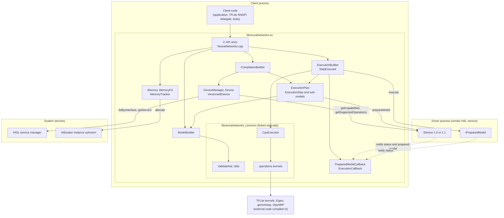
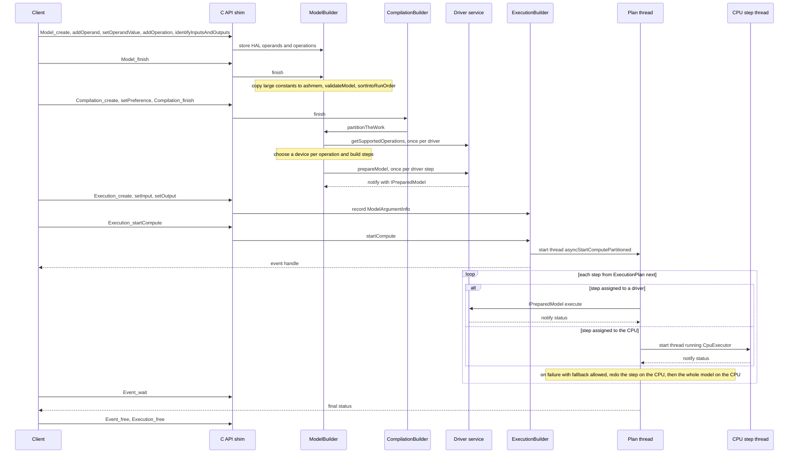
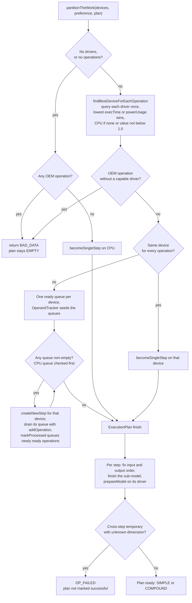
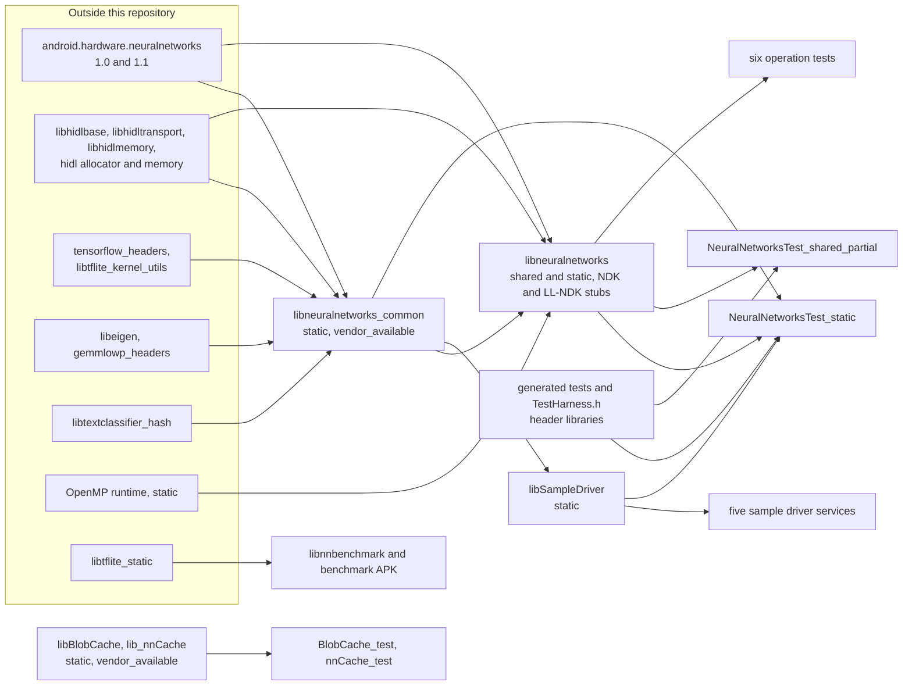
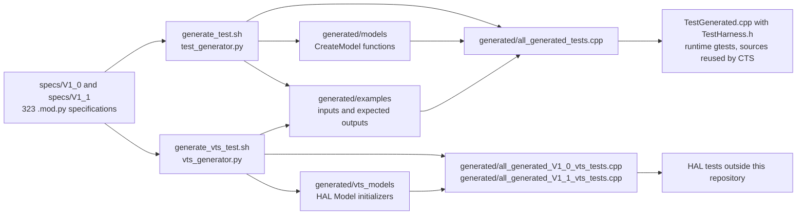
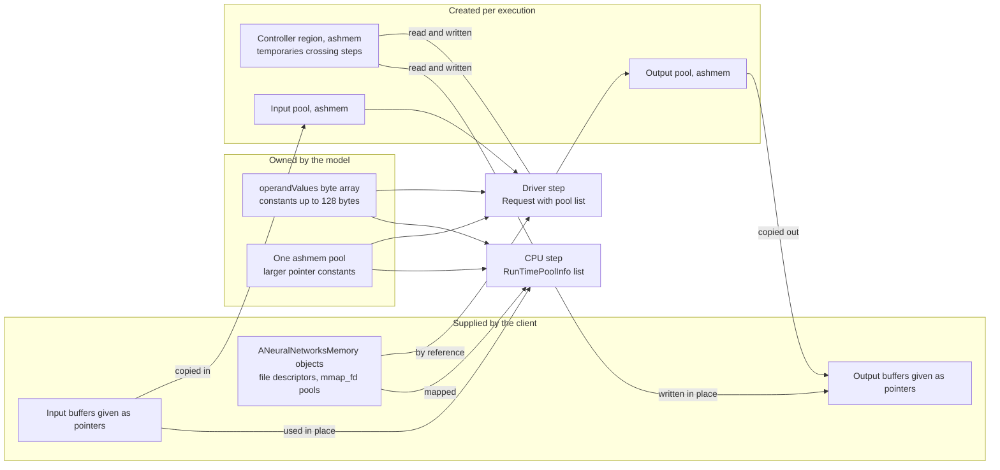

# frameworks/ml — Android Neural Networks API (NNAPI) runtime, CPU reference executor, and sample HAL drivers

| | |
|---|---|
| Repository | `frameworks/ml/` submodule of ProjectGero (`https://github.com/ProjectGero/platform_frameworks_ml.git`) |
| Snapshot analyzed | `98701a8` — "Merge cherrypicks of [4315359, …] into pi-release" (2018-06-12), the commit pinned by the superproject gitlink. The last functional change is `829a18d` "Make fully_connected op use reference implementation in certain cases." |
| Lineage | The repository began in 2012 as an unrelated machine-learning framework ("bordeaux"), which was removed on 2017-04-28. The `nn/` directory was started on 2017-06-27. 623 of the 1,255 commits touch `nn/` (460 in 2017, 163 in 2018). |
| Platform era | Android 9 (Pie), API level 28. NNAPI with HAL versions 1.0 and 1.1. |
| Scale | 1,478 tracked files. 1,346 of them are under `nn/runtime/test/` (mostly generated test data). The hand-written runtime, common library, drivers, and build files total about 23,500 lines. |
| Path convention | Paths are relative to the `frameworks/ml` repository root. Paths prefixed `superproject:` are relative to the ProjectGero top-level checkout. |
| Method | Derived from the source and build files of this repository. Two labels mark other evidence. **As built**: checked against the DB410c build output that already exists in the ProjectGero checkout (`superproject:out/`, built 2026-09-29): the installed library, its unstripped symbol file, and the Soong build graph. **Reproduced**: scratch experiments run outside both repositories — the Python generators run on every specification under Python 3.13.5, and small host replicas of single expressions or algorithms (g++ and Python). No Android code was compiled or run. Where something could not be established it is marked **UNKNOWN**. |
| Revision | Second analysis pass (2026-10-03). This pass re-verified the first pass's claims against the source. It corrected three statements: the Python generators do not need an AOSP tree (only their shell wrappers do); an unknown fused-activation code gives uninitialized bounds only in the float kernels; and some operand values *are* checked at execution. It replaced two inferences with direct evidence (the static OpenMP link, and the staleness of generated files, now measured). It added the operation matrix, four places where documentation and implementation disagree, more unchecked-value cases, the as-built flags and size breakdown, the generator self-test and regeneration results, and Diagrams F and G. |

## Purpose

`frameworks/ml` holds one project, `nn/`: the **Android Neural Networks API (NNAPI)**. NNAPI is an NDK C API for running inference on already-trained models. A client describes a model as a dataflow graph of tensor operations, and the runtime executes it, using vendor hardware drivers where they exist and a built-in CPU implementation otherwise.

The repository provides:

- **`libneuralnetworks.so`** — the runtime. It implements the 24 public C functions, builds and validates the model, discovers drivers, splits the model across drivers and the CPU, runs it, and falls back to the CPU when a driver fails.
- **`libneuralnetworks_common`** — a static library used by both the runtime and drivers. It contains model and request validation, the CPU executor for all 38 operations, HAL version conversion, and logging.
- **Public headers** — `NeuralNetworks.h` (the NDK header, API 27+), `NeuralNetworksOEM.h` (vendor-specific operand and operation codes), and `NeuralNetworksWrapper.h` (a C++ convenience wrapper used by the tests).
- **Sample HAL drivers** — five HIDL services that implement the driver interface by running the CPU executor. `nn/README.txt` says they are "NOT TO BE SHIPPED".
- **Driver-side cache libraries** — `libBlobCache` and `lib_nnCache`, a key/value blob cache with file persistence, offered to vendor drivers.
- **Tests and tooling** — gtest suites, 323 Python model specifications with generators that emit C++ tests, a benchmark APK, and a script that copies enum definitions into the HAL.

Not in this repository: the HAL interface definition (`hardware/interfaces/neuralnetworks`), the numeric kernels themselves (TensorFlow Lite, Eigen, gemmlowp), and any model file format. NNAPI has no model loader; clients build the graph call by call.

## Architecture Overview

1. **Three layers in two kinds of process.** The client process holds the API shim, the runtime, and the CPU executor (all inside `libneuralnetworks.so`). Each driver is a separate HIDL service process. The runtime talks to drivers only through `IDevice` and `IPreparedModel` (Diagram A).

2. **Four opaque objects with a builder lifecycle.** Each public handle is a C++ object behind a `reinterpret_cast`:

   | Public handle | Internal class | Lifecycle |
   |---|---|---|
   | `ANeuralNetworksModel` | `ModelBuilder` | add operands and operations, then `finish` (immutable afterwards) |
   | `ANeuralNetworksCompilation` | `CompilationBuilder` | set preference, then `finish` (partition and prepare) |
   | `ANeuralNetworksExecution` | `ExecutionBuilder` | bind inputs and outputs, then `startCompute` |
   | `ANeuralNetworksEvent` | heap-allocated `sp<ExecutionCallback>` | wait, then free |
   | `ANeuralNetworksMemory` | `Memory` / `MemoryFd` | wraps a file descriptor as a shared pool |

3. **The HAL structs are the internal representation.** `ModelBuilder` stores operands and operations directly as HIDL types (`Operand`, `Operation`, `hidl_vec`). `setHidlModel()` is therefore a plain copy, and the runtime, the CPU executor, and the drivers all consume the same `V1_1::Model` structure.

4. **The CPU is always a device.** It has no entry in the device list. It is represented by a null device pointer and by the index one past the last driver. Driver performance numbers are ratios relative to the CPU, whose performance is 1.0 by definition.

5. **Compilation is partitioning plus per-device preparation.** `ANeuralNetworksCompilation_finish` asks every driver which operations it supports, assigns each operation to the best device, groups operations into steps, builds a sub-model per step, and asks each driver to prepare its sub-model. The result is an `ExecutionPlan`.

6. **Execution walks the plan step by step, with fallback.** One thread per execution runs the steps in order. A step that fails on a driver is retried on the CPU; if that also fails, the whole original model is run on the CPU.

7. **Shared memory pools are the data plane.** Constants, inputs, outputs, and inter-step temporaries travel as `hidl_memory` pools addressed by `(poolIndex, offset, length)`. Two pool kinds exist: `"ashmem"` (allocated through the HIDL allocator) and `"mmap_fd"` (a client file descriptor). See Diagram G.

8. **One adapter hides HAL versions.** `VersionedIDevice` holds both a 1.0 and a 1.1 interface pointer and converts models and capabilities as needed. The rest of the runtime uses only the newest types.

9. **Narrow ABI.** A linker version script exports only the 24 `ANeuralNetworks*` symbols. The same symbol file drives the NDK and LL-NDK stub libraries.

10. **Tests are generated and checked in.** Operation tests are written once as Python specifications. Generators turn them into C++ for the runtime tests, and into HIDL-level C++ consumed by HAL tests outside this repository (Diagram E).

## Directory Map

| Path | Responsibility |
|---|---|
| `nn/runtime/` | The runtime: C API shim (`NeuralNetworks.cpp`), `ModelBuilder`, `CompilationBuilder`, `ExecutionBuilder` and `StepExecutor`, `ExecutionPlan` (partitioner), `Manager` (driver discovery), `VersionedIDevice`, `Memory`, `Callbacks`. Also the symbol file `libneuralnetworks.map.txt` and `NOTICE`. |
| `nn/runtime/include/` | Public headers: `NeuralNetworks.h` (2,541 lines; the API contract and the semantics of every operation), `NeuralNetworksOEM.h`, `NeuralNetworksWrapper.h`. |
| `nn/common/` | Code shared by runtime and drivers: `CpuExecutor.cpp` (the interpreter), `ValidateHal.cpp`, `Utils.cpp` (tables, logging, memory allocation, per-operation signature checks, HAL version conversion), `OperationsUtils.cpp` (shape inference and quantization helpers), `GraphDump.cpp` (Graphviz output). |
| `nn/common/include/` | Internal headers for the above. `HalInterfaces.h` pulls the HIDL types into scope. |
| `nn/common/operations/` | Operation kernels (16 `.cpp` files, 6 headers for the class-style operations) and six per-operation gtest files (`*Test.cpp`). |
| `nn/driver/sample/` | `SampleDriver` base class, five concrete drivers with `main()`, and their `init.rc` fragments. |
| `nn/driver/cache/` | `BlobCache/` (in-memory key/value cache with eviction policies and flatten/unflatten) and `nnCache/` (process singleton with file persistence). Adapted from `frameworks/native/opengl/libs` according to the build-file comments. |
| `nn/runtime/test/` | gtest sources for the runtime. `TestMain.cpp` is the test entry point. |
| `nn/runtime/test/specs/` | 323 model specifications (`V1_0/` has 147, `V1_1/` has 176) and the generation scripts `generate_test.sh`, `generate_vts_test.sh`, `slicing.sh`. |
| `nn/runtime/test/generated/` | Checked-in generator output: `models/`, `examples/`, `vts_models/`, and the three `all_generated_*.cpp` aggregators. |
| `nn/runtime/test/benchmark/` | `NeuralNetworksApiBenchmark` APK: Java UI and instrumentation tests, a JNI library that runs TFLite MobileNet models with NNAPI enabled, and two `.tflite` assets. |
| `nn/tools/test_generator/` | `test_generator.py` (specification language and runtime-test backend), `vts_generator.py` (HIDL backend), `slicing.py` (cuts a model after N operations), `include/TestHarness.h` (comparison helpers), and `tests/` (golden-output tests for the generator). |
| `nn/tools/sync_enums_to_hal.py` | Rewrites the operand and operation enums of the HAL `types.hal` files from `NeuralNetworks.h`. |
| `CleanSpec.mk`, `OWNERS` | Incremental-build clean step (removes a stale `NeuralNetworksTest` directory) and code owners. |

## Build System

### Build definitions

All native code is built by Soong (`Android.bp`). The one exception is the benchmark APK, which uses `nn/runtime/test/benchmark/Android.mk`.

| Build file | Defines |
|---|---|
| `nn/Android.bp` | `neuralnetworks_defaults` and three header-only libraries that export test directories |
| `nn/common/Android.bp` | `libneuralnetworks_common`, `libneuralnetworks_utils`, `libneuralnetworks_common_headers`, six operation tests |
| `nn/runtime/Android.bp` | `libneuralnetworks` (`cc_library`, `ndk_library`, `llndk_library`), `libneuralnetworks_headers`, `libneuralnetworks_private_headers`, `libneuralnetworks_ndk_headers` |
| `nn/driver/sample/Android.bp` | `libSampleDriver` and five service binaries |
| `nn/driver/cache/**/Android.bp` | `libBlobCache`, `lib_nnCache`, and their tests |
| `nn/runtime/test/Android.bp` | `NeuralNetworksTest_static`, `NeuralNetworksTest_shared_partial` |
| `nn/runtime/test/benchmark/` | `NeuralNetworksApiBenchmark` (`Android.mk`), `libnnbenchmark` (`Android.bp`) |

### Shared compiler policy

`neuralnetworks_defaults` (`nn/Android.bp`) applies to almost every module:

- `-Wall -Wextra -Werror -O3`
- `-DNN_DEBUGGABLE` on debuggable products (eng and userdebug), through the `debuggable` product variable
- A commented-out AddressSanitizer block, with instructions to enable it here and in `nn/runtime/test/Android.bp`

`libneuralnetworks_common` adds `-DNAMESPACE_FOR_HASH_FUNCTIONS=farmhash` and disables four warnings triggered by the third-party headers. The runtime, the common library, the sample drivers, and the tests all set `openmp: true`.

### Important build targets

| Module | Type | Notes |
|---|---|---|
| `libneuralnetworks` | `cc_library` (shared and static) | Nine runtime sources plus `libneuralnetworks_common` linked statically. Version script `libneuralnetworks.map.txt`. Not host-supported. |
| `libneuralnetworks` | `ndk_library` | NDK stub library, `first_version: "27"` (Android 8.1). |
| `libneuralnetworks` | `llndk_library` | Makes the library available to vendor code as LL-NDK. |
| `libneuralnetworks_ndk_headers` | `ndk_headers` | Ships only `include/NeuralNetworks.h`, installed as `android/NeuralNetworks.h`. |
| `libneuralnetworks_common` | `cc_library_static`, `vendor_available` | Executor, validation, kernels. Whole-archives `libtflite_kernel_utils`. |
| `libneuralnetworks_utils` | `cc_library_static`, `vendor_available` | `Utils.cpp` only. No module in this repository uses it. |
| `android.hardware.neuralnetworks@1.1-service-sample-{all,float-fast,float-slow,quant,minimal}` | `cc_binary`, `proprietary`, installed under `hw/` | Sample driver services, each with an `init_rc` file. |
| `libSampleDriver` | `cc_library_static` | The `SampleDriver` base class, linked into the white-box tests. |
| `libBlobCache`, `lib_nnCache` | `cc_library_static`, `vendor_available` | Cache libraries. Their defaults forbid new dependencies above `libcutils`. |
| `NeuralNetworksTest_static` | `cc_test` | Links the runtime statically so tests can reach internal classes. |
| `NeuralNetworksTest_shared_partial` | `cc_test` | Links `libneuralnetworks.so`; public API tests only (`-DNNTEST_ONLY_PUBLIC_API`). |
| `embedding_lookup_test`, `hashtable_lookup_test`, `lsh_projection_test`, `lstm_test`, `rnn_test`, `svdf_test` | `cc_test` | Per-operation tests, run through the public API. |
| `BlobCache_test`, `nnCache_test` | `cc_test` | `BlobCache_test` is the only module that sets `host_supported: true`. |
| `NeuralNetworksApiBenchmark`, `libnnbenchmark` | APK and JNI library | The APK builds against SDK 27. The JNI library links `libtflite_static`. |

### Generated code

No code is generated at build time. All generated files are produced by hand-run scripts and checked in:

| Generated files | Source of truth | Generator |
|---|---|---|
| `nn/runtime/test/generated/models/*.model.cpp`, `examples/*.example.cpp`, `all_generated_tests.cpp` | `nn/runtime/test/specs/V1_*/*.mod.py` | `specs/generate_test.sh` → `tools/test_generator/test_generator.py` |
| `nn/runtime/test/generated/vts_models/*.model.cpp`, `all_generated_V1_0_vts_tests.cpp`, `all_generated_V1_1_vts_tests.cpp` | Same specifications | `specs/generate_vts_test.sh` → `tools/test_generator/vts_generator.py` |
| `hardware/interfaces/neuralnetworks/{1.0,1.1}/types.hal` (outside this repository) | `nn/runtime/include/NeuralNetworks.h` | `tools/sync_enums_to_hal.py` |

Nothing in the repository checks that the generated files are current. There is no `PREUPLOAD.cfg` or similar hook file. The Tests section reports what a fresh regeneration produces.

### External tools and build-time dependencies

- Soong and the AOSP C++ toolchain, with OpenMP support.
- Python 3 for the generators (`#!/usr/bin/python3`).
  - `test_generator.py` and `vts_generator.py` need nothing else. **Reproduced:** both ran on all 323 specifications from a scratch copy, with no AOSP tree.
  - The shell wrappers (`generate_test.sh`, `generate_vts_test.sh`, `slicing.sh`) and `sync_enums_to_hal.py` do need a full AOSP tree: they build paths from `ANDROID_BUILD_TOP`.
- `slicing.sh` additionally needs `adb` and a connected device. It builds a temporary test, runs it on the device, and pulls the outputs back.
- The HIDL-generated libraries `android.hardware.neuralnetworks@1.0` and `@1.1`, built from `hardware/interfaces`.

### As built by ProjectGero (DB410c)

Checked against the existing output directory; product `db410c`, build type `userdebug`, SDK 28.

**What was built**

- The Soong build graph defines every native module of this repository (drivers, tests, cache libraries, benchmark JNI library).
- Build outputs exist for only two of them: `libneuralnetworks_common` (static) and `libneuralnetworks` (shared and static), in the single variant `android_arm_armv7-a-neon`. NDK stub variants for API 27, 28, `REL`, and `current` were also produced.
- No sample driver, test, or cache-library output exists. No `android.hardware.neuralnetworks` service binary is installed under `system/` or `vendor/`. The framework compatibility matrix lists the HAL (versions 1.0–1.1, any instance name) as optional. With no driver registered, the runtime runs every model on its in-process CPU path.

**How it was built** (from the build graph)

- Compile flags for both modules: clang, Thumb mode, ARMv7-A with NEON, `-Wall -Wextra -Werror -O3 -DNN_DEBUGGABLE -fopenmp -fPIC`. The common library adds `-DNAMESPACE_FOR_HASH_FUNCTIONS=farmhash` and the four `-Wno-…` flags.
- Link inputs of the shared library: the nine runtime objects, `libneuralnetworks_common.a`, and the prebuilt static OpenMP runtime `libomp.a`, plus toolchain support archives. Link flags include `--gc-sections` and `--version-script,frameworks/ml/nn/runtime/libneuralnetworks.map.txt`.

**What the result looks like**

- `system/lib/libneuralnetworks.so` is a 32-bit ARM shared object of 768,744 bytes. There is no 64-bit copy.
- Its dynamic symbol table defines exactly the 24 `ANeuralNetworks*` functions, all under the version node `LIBNEURALNETWORKS`.
- Its `NEEDED` list matches `nn/runtime/Android.bp`, plus `libc++`, `libc`, `libm`, `libdl`.
- `.text` is 649,644 bytes. `.bss` is 1,613,144 bytes, of which the convolution scratch buffer `android::nn::static_scratch_buffer` is 1,605,632 bytes.
- Code bytes by origin, from the unstripped symbol file (1,486 functions, aliases counted once):

  | Origin | Share of code bytes |
  |---|---|
  | OpenMP runtime (statically linked) | 49% |
  | `android::nn` (runtime and common library) | 27% |
  | TFLite kernels | 10% |
  | gemmlowp | 4% |
  | HAL glue (callbacks, generated `toString`) | 2% |
  | Eigen (mostly inlined into its callers) | 2% |
  | Other (libc++ instantiations, compiler runtime, unwinder) | 5% |

- The largest single function is `CpuExecutor::executeOperation` (29 KB).
- Because the build is `userdebug`, `NN_DEBUGGABLE` is defined. The four `debug.nn.*` property names are present in the binary.
- Section garbage collection removed code that nothing in the shared library calls, for example `CallbackBase::on_finish`, `VersionedIDevice::getStatus`, `graphDump`, and `CompilationBuilder::setPartitioning`.

## Outputs

| Output | Install location | Description |
|---|---|---|
| `libneuralnetworks.so` | `/system/lib[64]/` | The NNAPI runtime, including the CPU executor. |
| NDK stub `libneuralnetworks.so` and `android/NeuralNetworks.h` | NDK sysroot | Link-time stubs and the public header for applications. |
| `libneuralnetworks_common.a`, `libneuralnetworks_utils.a` | Not installed | Static libraries for the runtime and for vendor drivers. |
| `android.hardware.neuralnetworks@1.1-service-sample-*` (five) | `/vendor/bin/hw/` (path taken from the `.rc` files) | Sample driver services. Each registers one `IDevice` instance. |
| `libBlobCache.a`, `lib_nnCache.a` | Not installed | Cache libraries for vendor drivers. |
| `NeuralNetworksTest_static`, `NeuralNetworksTest_shared_partial`, operation tests, cache tests | `/data/nativetest[64]/` (path used by `slicing.sh` and `CleanSpec.mk`) | Native tests. |
| `NeuralNetworksApiBenchmark.apk` with `libnnbenchmark.so` | Test APK (`device-tests` suite) | Benchmark of two MobileNet models. |
| `nnCache` cache file | A path chosen by the driver through `NNCache::setCacheFilename()` | Runtime artifact: `"nn$$"` magic, CRC-32C, then the flattened `BlobCache`. |

Which of these modules a product installs is decided outside this repository.

## Entry Points

**Public C API** (`nn/runtime/NeuralNetworks.cpp`, exported by `nn/runtime/libneuralnetworks.map.txt`):

| Group | Functions |
|---|---|
| Memory (2) | `ANeuralNetworksMemory_createFromFd`, `_free` |
| Model (9) | `ANeuralNetworksModel_create`, `_free`, `_finish`, `_addOperand`, `_setOperandValue`, `_setOperandValueFromMemory`, `_addOperation`, `_identifyInputsAndOutputs`, `_relaxComputationFloat32toFloat16` |
| Compilation (4) | `ANeuralNetworksCompilation_create`, `_free`, `_setPreference`, `_finish` |
| Execution (7) | `ANeuralNetworksExecution_create`, `_free`, `_setInput`, `_setInputFromMemory`, `_setOutput`, `_setOutputFromMemory`, `_startCompute` |
| Event (2) | `ANeuralNetworksEvent_wait`, `_free` |

**HIDL callbacks into the runtime** (`nn/runtime/Callbacks.cpp`): `PreparedModelCallback::notify(status, preparedModel)` and `ExecutionCallback::notify(status)`. Drivers call these to report completion.

**Driver processes** (`nn/driver/sample/`):

- `main()` in each of `SampleDriverAll.cpp`, `SampleDriverFloatFast.cpp`, `SampleDriverFloatSlow.cpp`, `SampleDriverQuant.cpp`, `SampleDriverMinimal.cpp`. Each constructs its driver and calls `SampleDriver::run()`.
- Service startup is declared in the `.rc` files: `class hal`, `user system`, `group system`.
- HIDL server methods: `IDevice::getCapabilities[_1_1]`, `getSupportedOperations[_1_1]`, `prepareModel[_1_1]`, `getStatus`, and `IPreparedModel::execute`.

**Tests and tools:**

- `main()` in `nn/runtime/test/TestMain.cpp`.
- Four JNI functions in `nn/runtime/test/benchmark/libnnbenchmark/benchmark_jni.cpp`: `initModel`, `destroyModel`, `resizeInputTensors`, `runBenchmark`.
- Script entry points: `test_generator.py`, `vts_generator.py`, `slicing.py`, `sync_enums_to_hal.py`, `tools/test_generator/tests/test.py`, and the three shell scripts in `nn/runtime/test/specs/`.

## Initialization Flow

The runtime has no library constructor and no explicit initialization call. Everything is created lazily.

1. **Library load.** Only static storage is set up: the verbose-logging mask `vLogMask` (initially all bits set), the convolution scratch buffer (1,605,632 bytes of zero-initialized storage), and the kernel mutexes.

2. **First `ANeuralNetworksModel_create`.** Calls `initVLogMask()`, which reads the system property `debug.nn.vlog` and rebuilds the mask. This repeats on every model creation.

3. **First `ANeuralNetworksCompilation_create`.** The `CompilationBuilder` constructor calls `DeviceManager::get()`, which constructs the singleton (`nn/runtime/Manager.cpp`):
   1. `findAvailableDevices()` gets the HIDL service manager and calls `listByInterface(V1_0::IDevice::descriptor)`.
   2. For each instance name it calls `V1_0::IDevice::getService(name)` and then `registerDevice()`.
   3. `Device::initialize()` wraps the interface in a `VersionedIDevice`, which tries to cast it to `V1_1::IDevice`. It then calls `getCapabilities_1_1` (or `getCapabilities` for a 1.0 driver) and stores three `PerformanceInfo` values: float32, quantized8, and relaxed float32-to-float16.
   4. A device whose capability query fails is dropped.
   5. On debuggable builds the constructor then reads `debug.nn.partition` and `debug.nn.cpuonly`.

   The device list is built once and never refreshed. The runtime registers no death recipient and never calls `IDevice::getStatus`.

4. **First shared-memory allocation.** `allocateSharedMemory()` (`nn/common/Utils.cpp`) keeps a function-static handle obtained from `IAllocator::getService("ashmem")`.

5. **Sample driver process.** `main()` → `SampleDriver::run()`: `configureRpcThreadpool(4, true)`, `registerAsService(name)`, `joinRpcThreadpool()`. If the thread pool ever returns, the process logs "Service exited!" and returns 1. Each driver calls `initVLogMask()` inside `getCapabilities_1_1`.

## Main Runtime Flow

Diagram B shows the full sequence.

### 1. Build the model (`ModelBuilder`)

- `addOperand` validates the type and appends an `Operand` with lifetime `TEMPORARY_VARIABLE`.
- `setOperandValue` handles three cases:
  - A null buffer marks the operand `NO_VALUE` (an omitted optional argument).
  - A value of at most 128 bytes (`ANEURALNETWORKS_MAX_SIZE_OF_IMMEDIATELY_COPIED_VALUES`) is copied into `mSmallOperandValues` with alignment padding; lifetime `CONSTANT_COPY`.
  - A larger value is recorded by pointer only; lifetime `CONSTANT_REFERENCE`, location filled in later.
- `setOperandValueFromMemory` records a reference into a client `Memory`; lifetime `CONSTANT_REFERENCE`.
- `addOperation` checks the operation code, checks the operation's signature with `validateOperation()` (operand counts and types), appends the `Operation`, and increments `numberOfConsumers` on each input.
- `identifyInputsAndOutputs` copies the index lists and changes the lifetimes to `MODEL_INPUT` and `MODEL_OUTPUT`.

### 2. Finish the model (`ModelBuilder::finish`)

1. `copyLargeValuesToSharedMemory()` allocates one ashmem pool for all large constants and copies them in.
2. Builds a temporary HAL `Model` and runs `validateModel()` (`nn/common/ValidateHal.cpp`). A failure marks the model permanently invalid.
3. `sortIntoRunOrder()` reorders the operations topologically, so a single-threaded executor can run them in list order.

### 3. Compile (`CompilationBuilder::finish`)

1. Takes the device list from `DeviceManager::getDrivers()`. The list is empty when CPU-only mode is on.
2. Marks the compilation finished.
3. If partitioning is enabled (the default), calls `ModelBuilder::partitionTheWork()` (defined in `nn/runtime/ExecutionPlan.cpp`; Diagram C):
   1. **No drivers, or no operations:** reject OEM operations, then make a single CPU step.
   2. **`findBestDeviceForEachOperation()`:** send the whole model to each driver once (`getSupportedOperations`). For each operation, among the drivers that support it, pick the lowest `execTime`, or the lowest `powerUsage` when the preference is `PREFER_LOW_POWER`. The performance record is chosen by the type of the operation's first input (float32, relaxed float32, or quantized8). If no driver supports the operation, or the best value is not below 1.0, the CPU is chosen. An OEM operation must have a driver.
   3. **One device for everything:** make a single step for that device with the whole model.
   4. **Otherwise:** keep one ready-queue per device and an `OperandTracker` that reports an operation as ready when all its non-constant inputs have been produced. Repeatedly pick a device with a non-empty queue (the CPU is checked first, to let it prepare inputs for the other devices), create a new `ExecutionStep`, and drain that device's queue into the step. Operations that become ready are queued on their own device.
4. `ExecutionPlan::finish()` completes each step (`ExecutionStep::finishSubModel`): it fixes the sub-model's input and output order, finishes the sub-model, and calls `prepareModel` on the step's driver, waiting for the callback.
5. Error handling: `UNEXPECTED_NULL` and `BAD_DATA` are treated as user errors and returned. Any other partitioning error is returned only when fallback is disabled; otherwise `finish` returns success and the execution will later run on the CPU.

### 4. Execute (`ExecutionBuilder`, `StepExecutor`)

1. `setInput` / `setOutput` / `…FromMemory` fill a `ModelArgumentInfo` per argument: state (`POINTER`, `MEMORY`, `HAS_NO_VALUE`), final dimensions, and location. Unspecified model dimensions may be supplied here; fully specified ones may not be overridden.
2. `startCompute` checks that every argument was set. What happens next depends on the plan (Diagram F):

   | Situation at `startCompute` | Behavior |
   |---|---|
   | Partitioning mode 0 | The plan is not used. The whole model runs on the CPU. |
   | Plan finished successfully | One thread runs `asyncStartComputePartitioned`; the event is returned immediately. |
   | Plan did not finish successfully, fallback allowed | The whole model runs on the CPU. |
   | Plan did not finish successfully, fallback disabled | `startCompute` returns `OP_FAILED`. |
   | Plan still empty after a compilation that returned a user error | The plan thread finds no step and reports success without computing (see Technical Debt, item 1). |

   For a successful plan, the `Controller` owns one ashmem region sized for every temporary operand that crosses a step boundary, and a map from operand index to offset in that region.
3. The plan thread loops over `ExecutionPlan::next()`. Each call creates a `StepExecutor` for the next step and wires its arguments:
   - model inputs and outputs map to the client's arguments;
   - temporaries produced by an earlier step, or needed by a later one, map to offsets in the controller's region;
   - a model output that a later step consumes is passed to that step as an input.
4. `StepExecutor::startCompute` then takes one of two paths:
   - **Driver path (`startComputeOnDevice`).** Pointer arguments are packed into two new ashmem pools (one for inputs, one for outputs) and the input data is copied in. A `Request` is built and `IPreparedModel::execute` is called. The call then waits for the callback and copies pointer outputs back.
   - **CPU path (`startComputeOnCpu`).** Model and request pools are mapped into `RunTimePoolInfo` objects. Each pointer argument becomes its own pool that points straight at the client buffer, so nothing is copied. A new thread runs `CpuExecutor::run` and notifies the callback.
5. **Fallback.** If a step fails to start or reports an error, and fallback is allowed:
   - `cpuFallbackPartial` re-creates the same step and runs it on the CPU;
   - if that fails, or the step was already a CPU step, `cpuFallbackFull` runs the entire original model on the CPU.
6. When `next()` returns no executor, the plan thread signals the event with success.
7. `ANeuralNetworksEvent_wait` blocks until the event is signalled, joins the plan thread, and converts the HAL status to a result code.

### CPU interpretation (`CpuExecutor::run`)

1. `initializeRunTimeInfo()` builds one `RunTimeOperandInfo` per operand: constants point into the model's value array or pools, arguments point into request pools, temporaries start with no buffer and a use count taken from `numberOfConsumers`.
2. For each operation, in list order, `executeOperation()` runs three stages:
   1. a `…Prepare` function infers and checks the output shape;
   2. `setInfoAndAllocateIfNeeded()` checks model outputs against the inferred shape and allocates temporaries on the heap;
   3. the kernel computes the result.
3. After each operation, `freeNoLongerUsedOperands()` frees temporaries whose last consumer has run.
4. At the end, `RunTimePoolInfo::update()` commits each ashmem pool and `msync`s writable `mmap_fd` pools.

### Driver side (`SampleDriver`)

`prepareModel_1_1` validates the model and the preference, maps the model's pools, and immediately notifies the callback with a `SamplePreparedModel`. `execute` validates the request and starts a detached thread that runs `CpuExecutor` and notifies the callback.

## Major Components

### API shim (`nn/runtime/NeuralNetworks.cpp`)

Null-checks pointer arguments, casts handles to their classes, and forwards. Lines 40–247 are 110 `static_assert`s that pin the public constants to their numeric values and to the matching HAL enum values, so the NDK header and the HAL cannot drift apart silently.

### Model construction (`nn/runtime/ModelBuilder.{h,cpp}`)

Owns the operand and operation vectors, the input and output index lists, the small-constant byte array, the list of pending large constants, the ashmem pool for those constants, and a `MemoryTracker` for all pools the model references. It is also the type of every sub-model, so sub-models are built and validated through the same methods as client models.

### Compilation (`nn/runtime/CompilationBuilder.{h,cpp}`)

Holds the execution preference (default `PREFER_FAST_SINGLE_ANSWER`), the partitioning mode captured from `DeviceManager`, and the `ExecutionPlan`. The overload `finish(devices)` and `setPartitioning()` exist so tests can inject drivers and modes.

### Partitioner and plan (`nn/runtime/ExecutionPlan.{h,cpp}`)

- **`ExecutionPlan`** has three states: `EMPTY`, `SIMPLE` (one step, the original model), and `COMPOUND` (a list of `ExecutionStep`s). A separate flag records whether `finish` succeeded.
- **`ExecutionStep`** owns a sub-model, the target device, the prepared sub-model, and five remapping tables between original and sub-model operand indexes:
  - model inputs, and model outputs;
  - temporaries that are inputs of this step;
  - temporaries that are outputs of this step;
  - model outputs that are inputs of this step.
- **Fixed ordering contract.** Sub-model inputs are ordered as model inputs, then temporaries, then model outputs used as inputs. Sub-model outputs are ordered as model outputs, then temporaries. `finishSubModel()` establishes this order and `next()` depends on it.
- **`Controller`** carries the per-execution state: the temporaries region and the next step index.
- A plan fails to finish if any cross-step temporary has an unknown dimension, because its size in the shared region could not be computed.

### Execution (`nn/runtime/ExecutionBuilder.{h,cpp}`)

`ExecutionBuilder` records the client's arguments. `StepExecutor` runs one model (the original or a sub-model) on one device or on the CPU. The file also contains the plan-thread loop and both fallback functions.

### Device management (`nn/runtime/Manager.{h,cpp}`)

`DeviceManager` is a process singleton that owns the discovered `Device` objects and the debug settings. `Device` pairs a name with a `VersionedIDevice` and cached performance numbers. On debuggable builds, a device whose name starts with `sample` can be told (property `debug.nn.sample.supported`) to refuse a pseudo-random subset of operations, which forces interesting partitionings.

### HAL version adapter (`nn/runtime/VersionedIDevice.{h,cpp}`)

For each call it uses the 1.1 method when the driver implements 1.1. Otherwise it converts the model to 1.0 if `compliantWithV1_0(model)` holds, and fails if not. Transport errors are turned into `GENERAL_FAILURE`. It also wraps `getStatus`, which nothing calls.

### Memory (`nn/runtime/Memory.{h,cpp}`)

- `Memory` — an ashmem region allocated through the HIDL allocator and mapped in this process.
- `MemoryFd` — duplicates a client file descriptor into a `native_handle` of one descriptor and three integers (protection flags and the two halves of the offset), exposed as an `"mmap_fd"` `hidl_memory`. It maps the file lazily in `getPointer()`.
- `MemoryTracker` — assigns each distinct `Memory` a pool index.

### Callbacks (`nn/runtime/Callbacks.{h,cpp}`)

`CallbackBase` is a one-shot event built from a mutex and a condition variable, with an optional bound thread that `wait()` joins. `PreparedModelCallback` and `ExecutionCallback` add the HIDL `notify` methods and store the result. The classes are declared in the namespace `android::hardware::neuralnetworks::V1_0::implementation` although they live in the runtime.

### Validation and utilities (`nn/common/ValidateHal.cpp`, `nn/common/Utils.cpp`)

- `validateModel()` checks, for both HAL versions:
  - operand type and rank, scale, zero point, lifetime, and location;
  - the length of constants, and that constants lie inside their pool;
  - each operation's code and signature;
  - that an operation writes only temporaries and model outputs, and that each is written exactly once;
  - that input and output lists have the right lifetimes and no duplicates;
  - that pools are `"ashmem"` or `"mmap_fd"` with a non-null handle.
- `validateRequest()` checks argument counts, locations, and dimension overrides against the model.
- `validateOperation()` is a function of about 1,090 lines: one switch over the 38 operations that checks operand counts and operand types.
- `Utils.cpp` also holds the name and size tables, `allocateSharedMemory()`, `alignBytesNeeded()`, the result-code conversions, and the `compliantWithV1_x` / `convertToV1_x` families.

### CPU executor and kernels (`nn/common/CpuExecutor.cpp`, `nn/common/OperationsUtils.cpp`, `nn/common/operations/`)

`CpuExecutor::executeOperation` is one switch with a case per operation. Kernels come in two styles:

| Style | Files | Shape |
|---|---|---|
| Free functions | `SimpleMath.cpp`, `Conv2D.cpp`, `DepthwiseConv2D.cpp`, `Pooling.cpp`, `Activation.cpp`, `FullyConnected.cpp`, `Concatenation.cpp`, `Normalization.cpp`, `Reshape.cpp`, `StridedSlice.cpp` | `xxxPrepare()` in `OperationsUtils.cpp` plus `xxxFloat32()` / `xxxQuant8()` / `xxxGeneric()` |
| Classes | `EmbeddingLookup`, `HashtableLookup`, `LSHProjection`, `LSTM`, `RNN`, `SVDF` | Constructor binds operands, static `Prepare()`, then `Eval()` |

Most kernels are thin adapters over TensorFlow Lite. An adapter converts a `Shape` to `tflite::Dims<4>` (dimensions reversed), computes quantization multipliers and activation ranges, and calls `tflite::optimized_ops`, `tflite::reference_ops`, or `tflite::tensor_utils`. A few kernels are written directly in this repository: the float activations, the quantized ReLU family, the two lookups, `LSH_PROJECTION` (over farmhash), `RNN`, and `RESHAPE`/`SQUEEZE` (a `memcpy`).

Three notable details:

- `Conv2D.cpp` keeps a static 1.6 MB im2col buffer and a file-level mutex. Larger convolutions allocate from the heap, and requests of 2 GB or more are refused.
- `fullyConnectedFloat32` uses the reference implementation when the number of input elements equals the square of the batch size. The source cites bug b/80425683: the optimized implementation gives wrong results in that case.
- The quantized `LOGISTIC` and `SOFTMAX` kernels require an output scale of 1/256 and a zero point of 0, and fail at execution otherwise.

#### Operation matrix

The table combines the validator (`validateOperation()`) and the executor. **F** is `TENSOR_FLOAT32` and **Q** is `TENSOR_QUANT8_ASYMM`. "Inputs → outputs" are the operand counts the validator accepts; two counts mean an explicit-padding and an implicit-padding form. Operations 0–28 belong to HAL 1.0 and 29–37 to HAL 1.1.

| Code | Operation | Inputs → outputs | Tensor types accepted | CPU kernel |
|---|---|---|---|---|
| 0 | `ADD` | 3 → 1 | F, Q | `optimized_ops::Add`, `BroadcastAdd` |
| 1 | `AVERAGE_POOL_2D` | 7 or 10 → 1 | F, Q | `optimized_ops::AveragePool` |
| 2 | `CONCATENATION` | n+1 (n ≥ 1) → 1 | any type, all inputs alike (executor: F, Q only) | `optimized_ops::Concatenation` |
| 3 | `CONV_2D` | 7 or 10 → 1 | F, Q (bias `TENSOR_INT32` for Q) | `optimized_ops::Conv` with im2col |
| 4 | `DEPTHWISE_CONV_2D` | 8 or 11 → 1 | F, Q | `optimized_ops::DepthwiseConv` |
| 5 | `DEPTH_TO_SPACE` | 2 → 1 | F, Q | `optimized_ops::DepthToSpace` |
| 6 | `DEQUANTIZE` | 1 → 1 | Q in, F out | `optimized_ops::Dequantize` |
| 7 | `EMBEDDING_LOOKUP` | 2 → 1 | lookups `TENSOR_INT32`; values any type | row `memcpy` with index check |
| 8 | `FLOOR` | 1 → 1 | F | `optimized_ops::Floor` |
| 9 | `FULLY_CONNECTED` | 4 → 1 | F, Q | `optimized_ops::FullyConnected` (or `reference_ops`) |
| 10 | `HASHTABLE_LOOKUP` | 3 → 2 | lookups and keys `TENSOR_INT32`; values any type; hits Q | `bsearch` plus row `memcpy` |
| 11 | `L2_NORMALIZATION` | 1 → 1 | F | `optimized_ops::L2Normalization` |
| 12 | `L2_POOL_2D` | 7 or 10 → 1 | F | `optimized_ops::L2Pool` |
| 13 | `LOCAL_RESPONSE_NORMALIZATION` | 5 → 1 | F | `optimized_ops::LocalResponseNormalization` |
| 14 | `LOGISTIC` | 1 → 1 | F, Q | loop (F); `optimized_ops::Logistic` (Q) |
| 15 | `LSH_PROJECTION` | 4 → 1 | hash and weight F; input any type; output `TENSOR_INT32` | `farmhash::Fingerprint64` |
| 16 | `LSTM` | 23 → 4 | F | `tensor_utils` |
| 17 | `MAX_POOL_2D` | 7 or 10 → 1 | F, Q | `optimized_ops::MaxPool` |
| 18 | `MUL` | 3 → 1 | F, Q | `optimized_ops::Mul`, `BroadcastMul` |
| 19–21 | `RELU`, `RELU1`, `RELU6` | 1 → 1 | F, Q | loops |
| 22 | `RESHAPE` | 2 → 1 | F, Q | `memcpy` |
| 23 | `RESIZE_BILINEAR` | 3 → 1 | F | `optimized_ops::ResizeBilinear` |
| 24 | `RNN` | 6 → 2 | F | loops with `ActivationFunctor` |
| 25 | `SOFTMAX` | 2 → 1 | F, Q (rank 2 or 4) | `optimized_ops::Softmax` |
| 26 | `SPACE_TO_DEPTH` | 2 → 1 | F, Q | `optimized_ops::SpaceToDepth` |
| 27 | `SVDF` | 7 → 2 | F | `tensor_utils` |
| 28 | `TANH` | 1 → 1 | F | loop |
| 29 | `BATCH_TO_SPACE_ND` | 2 → 1 | F, Q | `optimized_ops::BatchToSpaceND` |
| 30 | `DIV` | 3 → 1 | F | `optimized_ops::Div`, `BroadcastDiv` |
| 31 | `MEAN` | 3 → 1 | F, Q | `reference_ops::Mean` |
| 32 | `PAD` | 2 → 1 | F, Q | `optimized_ops::Pad` |
| 33 | `SPACE_TO_BATCH_ND` | 3 → 1 | F, Q | `optimized_ops::SpaceToBatchND` |
| 34 | `SQUEEZE` | 2 → 1 | F, Q | `memcpy` |
| 35 | `STRIDED_SLICE` | 7 → 1 | F, Q | `reference_ops::StridedSlice` |
| 36 | `SUB` | 3 → 1 | F | `optimized_ops::Sub`, `BroadcastSub` |
| 37 | `TRANSPOSE` | 2 → 1 | F, Q | `reference_ops::Transpose` |
| 10000 | `OEM_OPERATION` | not checked | not checked | none: the CPU path rejects it |

### Sample drivers (`nn/driver/sample/`)

`SampleDriver` implements the 1.0 methods by converting to 1.1, and implements preparation and execution with `CpuExecutor`. Subclasses supply only capabilities and the supported-operation rule (see Configuration).

### Driver cache (`nn/driver/cache/`)

`BlobCache` keeps its entries in a vector sorted by key and finds them with binary search. It has size limits, two victim-selection policies (`RANDOM`, `LRU`), and three capacity policies (`HALVE`, `FIT`, `FIT_HALVE`). Its flattened form carries a magic number, version numbers, and the build ID from `ro.build.id`; a cache from another build is treated as empty. `NNCache` is a mutex-protected singleton that adds a file header (magic and CRC-32C) and a deferred save four seconds after an insertion. Only their own tests use these libraries inside this repository.

### Benchmark app (`nn/runtime/test/benchmark/`)

The app does not use this repository's API directly. It copies a `.tflite` asset to its cache directory, builds a TFLite interpreter over it, resizes the input to `[1, 224, 224, 3]`, and calls `Interpreter::UseNNAPI(true)` before each `Invoke()`. A benchmark is a 0.3-second warm-up followed by at least 1 second (10 seconds in "long" mode) of repeated invocations, reported as average milliseconds per invocation. How TFLite reaches `libneuralnetworks.so` is outside this repository.

### Test generator (`nn/tools/test_generator/`)

`test_generator.py` defines a small specification language as Python classes (`Model`, `Input`, `Output`, `IgnoredOutput`, `Internal`, `Parameter`, `Int32Scalar`, `Float32Scalar`, `Example`). A specification file is executed inside the generator's namespace; class-level registries collect the operands and operations; the generator then sorts them topologically and prints C++. `vts_generator.py` reuses the same front end and prints a HAL `Model` initializer. `slicing.py` truncates a model after N operations to help locate the first operation that produces a wrong result. `tests/test.py` is adapted from the RenderScript compiler's test harness, as its usage text still says.

## Important Abstractions

| Abstraction | Where | Meaning |
|---|---|---|
| Operand and `OperandLifeTime` | HAL types, used throughout | A typed tensor or scalar. Lifetime says where its data comes from: `TEMPORARY_VARIABLE`, `MODEL_INPUT`, `MODEL_OUTPUT`, `CONSTANT_COPY` (inside the model's byte array), `CONSTANT_REFERENCE` (inside a pool), `NO_VALUE` (omitted optional argument). |
| `DataLocation` | HAL type | `(poolIndex, offset, length)`. The single addressing scheme for constants and arguments. |
| Pool | `hidl_memory`, `Memory`, `RunTimePoolInfo` | A shared memory region. `"ashmem"` or `"mmap_fd"` across processes; inside the CPU path a pool may also be a bare client pointer. |
| Unspecified dimension | `NeuralNetworks.h`, `ModelArgumentInfo::updateDimensionInfo` | A dimension of 0 means "unknown until execution". Constants must be fully specified. Inputs and outputs must be fully specified by the time they are bound. |
| `ModelArgumentInfo` | `nn/runtime/ExecutionBuilder.h` | How one input or output was supplied: pointer, memory, no value, or not yet specified. |
| `ExecutionPlan` / `ExecutionStep` / `Controller` | `nn/runtime/ExecutionPlan.h` | The compiled form of a model: steps bound to devices, and the per-execution cursor and temporaries region. |
| `Device` / `VersionedIDevice` | `nn/runtime/Manager.h`, `VersionedIDevice.h` | A driver as the runtime sees it. A null device means the CPU. |
| `PerformanceInfo` | HAL type | `execTime` and `powerUsage` relative to the CPU (1.0). The only inputs to device selection besides operation support. |
| Partitioning mode | `DeviceManager::kPartitioning*` | `No` (0), `WithFallback` (1, default), `WithoutFallback` (2). |
| `RunTimeOperandInfo` and `Shape` | `nn/common/include/CpuExecutor.h`, `OperationsUtils.h` | The executor's per-operand state (buffer, dimensions, uses left) and the value type passed to kernels (type, dimensions, scale, zero point). |
| Prepare / Eval | `nn/common/` | Every operation first infers its output shape, then computes. Shape errors surface as execution failures. |
| Explicit and implicit padding | `CpuExecutor.cpp`, `calculateExplicitPadding()` | Convolution and pooling take either four padding values or one padding scheme (`SAME`, `VALID`). The executor converts a scheme into four values before shape inference. |
| Stateless recurrent operations | `LSTM.h`, `RNN.h`, `SVDF.h` | State is an explicit input operand and an explicit output operand. The runtime keeps nothing between executions. |
| Relaxed computation | `ModelBuilder::mRelaxComputationFloat32toFloat16` | A per-model flag (API 28) that lets float32 tensors be computed with float16 precision. It selects a different performance record and is forwarded to 1.1 drivers. |
| OEM types and operation | `NeuralNetworksOEM.h` | Codes from 10000 upward. The runtime does not interpret them. They must be handled by a driver; the CPU path rejects them. |
| `VLOG(tag)` | `nn/common/include/Utils.h` | Verbose logging gated by a bit mask with tags `MODEL`, `COMPILATION`, `EXECUTION`, `CPUEXE`, `MANAGER`, `DRIVER`. |

## Internal Dependencies

Diagram D shows the module graph. In terms of source:

- `NeuralNetworks.cpp` depends on every builder class and on `Memory` and `Callbacks`.
- `CompilationBuilder` depends on `Manager` (devices, partitioning mode), `ExecutionPlan`, and `ModelBuilder`.
- `ExecutionPlan.cpp` implements three `ModelBuilder` methods (`partitionTheWork`, `findBestDeviceForEachOperation`, `getPerformanceInfo`) and creates `StepExecutor`s. `ModelBuilder`, `ExecutionPlan`, and `ExecutionBuilder` therefore depend on one another, held together by `friend` declarations.
- `ExecutionBuilder.cpp` depends on `CpuExecutor` for the CPU path and on `VersionedIDevice` and `Callbacks` for the driver path.
- All runtime classes depend on `nn/common`. `nn/common` depends on nothing in `nn/runtime` except the public header `NeuralNetworks.h` (for result codes and constants).
- `nn/driver/sample` depends only on `nn/common`. A driver built from this code needs neither the runtime nor its headers beyond `NeuralNetworks.h`.
- `nn/driver/cache` is self-contained.
- The static test binary depends on runtime internals, on `libSampleDriver` (tests subclass `SampleDriver` to create in-process fake drivers), and on the generated test files.

## External Dependencies

### Build-time and link-time

| Dependency | Used for |
|---|---|
| `android.hardware.neuralnetworks@1.0`, `@1.1` | The HAL types and interfaces: `IDevice`, `IPreparedModel`, `IPreparedModelCallback`, `IExecutionCallback`, `Model`, `Request`, `Capabilities`, `ErrorStatus`. |
| `libhidlbase`, `libhidltransport`, `libhidlmemory` | HIDL transport, the service manager, `hidl_memory`, `mapMemory()`. |
| `android.hidl.allocator@1.0`, `android.hidl.memory@1.0` | `IAllocator` (ashmem allocation) and `IMemory` (mapping, `update`/`commit`). |
| `tensorflow_headers`, `libtflite_kernel_utils` (`external/tensorflow`) | TFLite internal kernels: `optimized_ops`, `reference_ops`, `tensor_utils`, `types.h`. |
| `libeigen`, `gemmlowp_headers` | Linear algebra for the float kernels and quantized matrix multiplication. |
| `libtextclassifier_hash` and its headers | `farmhash::Fingerprint64`, used by `LSH_PROJECTION`. |
| `libbase`, `liblog`, `libutils`, `libcutils` | Logging, properties, strong pointers, `native_handle`. |
| OpenMP runtime (`libomp.a`, as built) | Threading inside Eigen; `kmp_set_blocktime`. |
| `libgmock`, gtest | Tests. |
| `libtflite_static`, `external/flatbuffers` | The benchmark's JNI library only. |
| `libandroid` | `ASharedMemory_create` in the tests. |

### Runtime interfaces

| Interface | Direction | Visible from this source |
|---|---|---|
| HIDL service manager | runtime → system | `listByInterface` and `getService` for `IDevice`. |
| `IDevice` instances | runtime → driver process | Capabilities, supported operations, model preparation. `getStatus` is wrapped but never called. |
| `IPreparedModel` | runtime → driver process | `execute(Request, callback)`. |
| Callback interfaces | driver process → runtime | `notify` on the two callback objects. |
| `IAllocator` instance `"ashmem"` | runtime → system | Allocation of shared memory. |
| System properties | read | `debug.nn.vlog`, `debug.nn.partition`, `debug.nn.cpuonly`, `debug.nn.sample.supported`, and `ro.build.id` (cache library). |
| File descriptors | client → runtime → driver | `dup`, `mmap`, `munmap`, `msync` on client-supplied descriptors. |
| CTS (`cts/tests/tests/neuralnetworks`) | consumer | A comment in `nn/runtime/test/Android.bp` says the public-API test list must be mirrored there. |
| HAL tests (`hardware/interfaces/neuralnetworks/*/vts`) | consumer | Named in `nn/README.txt`. The generated HIDL test files reference a fixture `NeuralnetworksHidlTest` that is not defined in this repository. |

Which threads deliver HIDL callbacks in the client process is **UNKNOWN** from this source: the runtime never configures a HIDL thread pool itself.

## Data Flow

Diagram G shows the pools involved in one execution.

1. **Constants.**
   - Small values (≤ 128 bytes) are copied into the model's `operandValues` byte array.
   - Large pointer values are copied into one ashmem pool when the model is finished.
   - Values in a client `Memory` are never copied; the pool is passed by reference.
2. **Model to driver.** The complete HAL `Model`, including the small-constant array and all pool handles, is sent to each driver once for `getSupportedOperations`. Each step's sub-model is sent again for `prepareModel`. Sub-models copy small constants and share pools.
3. **Arguments on the driver path.** Pointer inputs are copied into a new ashmem pool, pointer outputs are copied out of another. Memory arguments are passed by reference.
4. **Arguments on the CPU path.** Pointer arguments are used in place. Memory arguments are mapped.
5. **Between steps.** A temporary produced by one step and consumed by another lives in the controller's single ashmem region. The producing step sees it as an output at a fixed offset, the consuming step as an input at the same offset.
6. **Model outputs reused as inputs.** A model output consumed by a later step is bound to that step's input using the client's own output buffer or memory.
7. **Inside the CPU executor.** Each operand has a buffer pointer. Temporaries are heap arrays allocated when first written and freed after their last consumer. Kernels read and write these buffers directly.
8. **Results.** After a CPU run, ashmem pools are committed and writable file-backed pools are `msync`ed. Status returns through the callback object to `ANeuralNetworksEvent_wait`.

## Concurrency / Process Model

**Processes.** One client process containing the runtime; zero or more driver service processes; the system's HIDL service manager and allocator. The sample drivers run as `system:system` in class `hal`.

**Client-side threads.**

- API calls run on the caller's thread. Model building, compilation (including all driver calls and waiting for preparation), and argument binding are synchronous.
- `startCompute` creates one `std::thread` per execution for the plan loop. Each CPU step creates one more `std::thread` and the plan thread waits for it. There is no thread pool; the source carries "TODO: use a thread pool".
- A driver step is a blocking HIDL call followed by a wait on the callback, all on the plan thread.
- `CallbackBase::wait()` joins the bound thread. `ANeuralNetworksEvent_free` waits for completion before deleting, so freeing an event blocks until its execution ends.

**Synchronization.**

- `CallbackBase`: one mutex and one condition variable per callback.
- `Conv2D.cpp`: a file-level mutex guards the static scratch buffer and the shared `gemmlowp::GemmContext`. Float and quantized convolutions are therefore serialized across the whole process.
- `FullyConnected.cpp`: a separate file-level mutex guards its own `GemmContext` for the quantized kernel.
- `DeviceManager`: constructed once as a function-local static. The device list is not modified afterwards. `setUseCpuOnly()` is a test hook with no locking.
- `vLogMask`: a plain global rewritten without locking on every model creation.
- `MemoryTracker`: documented as not thread-safe; the caller must serialize.

**Kernel-level parallelism.** Eigen uses OpenMP. `ScopedOpenmpSettings` (constructed in `CpuExecutor::run`) lowers the OpenMP block time from the default 200 ms to 20 ms for the duration of a run and restores it afterwards. The setting is per thread. Quantized convolution and fully-connected kernels let gemmlowp choose its own thread count.

**Threading contract for clients** (from `NeuralNetworks.h`): one thread at a time may modify a model, compilation, or execution. A finished model or compilation may be used from several threads. Several threads may wait on the same event. Several executions may run concurrently.

**Driver-side threads.** A sample driver has a four-thread HIDL pool and creates one detached thread per execution.

**Cache library.** `NNCache` uses one mutex. Each insertion may start a detached thread that sleeps four seconds and then saves the cache.

## Configuration

### Build-time switches

| Switch | Defined by | Effect |
|---|---|---|
| `NN_DEBUGGABLE` | `nn/Android.bp`, on eng and userdebug products | Enables the three `debug.nn.*` behavior properties and prints pointers and request contents in verbose logs (`SHOW_IF_DEBUG`). |
| `NNTEST_ONLY_PUBLIC_API` | `NeuralNetworksTest_shared_partial` | Removes tests that need internal symbols. |
| `DISABLE_PARTITIONED_EXECUTION` | Nothing in this repository | Would select an older single-driver path in `ExecutionBuilder::startCompute`. |
| `NNAPI_LIMIT_CPU_THREADS` | Nothing in this repository | Would cap Eigen's thread count in `ScopedOpenmpSettings`. |
| `GRAPH`, `VERBOSE` | Commented-out `#define`s in test sources | Emit Graphviz graphs or extra logging from tests. |
| AddressSanitizer block | Commented out in `nn/Android.bp` and `nn/runtime/test/Android.bp` | Manual opt-in. |

### System properties

| Property | Read by | Values and effect |
|---|---|---|
| `debug.nn.vlog` | `initVLogMask()`, all builds | `1` or `all` enables every tag. Otherwise a list of `model`, `compilation`, `execution`, `cpuexe`, `manager`, `driver`, separated by space, comma, or colon. |
| `debug.nn.partition` | `DeviceManager`, debuggable builds only | `0` no partitioning (everything on the CPU), `1` partition with CPU fallback (default), `2` partition without fallback. |
| `debug.nn.cpuonly` | `DeviceManager`, debuggable builds only | Non-zero ignores all drivers. |
| `debug.nn.sample.supported` | `Device::initialize`, debuggable builds only | `1` makes drivers whose name starts with `sample` refuse a pseudo-random subset of operations. |
| `ro.build.id` | `BlobCache` | Stored in the cache header; a mismatch discards the cache. |

### API-level settings

- **Execution preference** (`ANeuralNetworksCompilation_setPreference`): `PREFER_LOW_POWER`, `PREFER_FAST_SINGLE_ANSWER` (default), `PREFER_SUSTAINED_SPEED`. Only `PREFER_LOW_POWER` changes device selection (it compares `powerUsage` instead of `execTime`). The value is also forwarded to 1.1 drivers.
- **Relaxed float computation** (`ANeuralNetworksModel_relaxComputationFloat32toFloat16`).
- **API level guards in `NeuralNetworks.h`:** everything requires API 27; the nine operations added in HAL 1.1 and the relaxed-computation function are guarded by API 28.

### Sample driver capabilities

Values are relative to the CPU (1.0), written as `execTime / powerUsage`.

| Service instance | float32 | quantized8 | relaxed float | Supported operations |
|---|---|---|---|---|
| `sample-all` | 1.1 / 1.1 | 1.1 / 1.1 | 1.1 / 1.1 | All |
| `sample-float-fast` | 0.8 / 1.2 | 1.0 / 1.0 | 0.7 / 1.1 | First input is `TENSOR_FLOAT32` |
| `sample-float-slow` | 1.3 / 0.7 | 1.0 / 1.0 | 1.2 / 0.6 | First input is `TENSOR_FLOAT32` |
| `sample-quant` | 50.0 / 1.0 | 50.0 / 1.0 | 50.0 / 1.0 | First input is `TENSOR_QUANT8_ASYMM` |
| `sample-minimal` | 0.4 / 0.5 | 1.0 / 1.0 | 0.4 / 0.5 | `ADD`, `CONCATENATION`, `CONV_2D` with a float first input |

The partitioner prefers the CPU whenever a driver's value is not below 1.0. For ordinary (non-OEM) operations, `sample-all` and `sample-quant` are therefore never selected, and `sample-float-slow` is selected only under `PREFER_LOW_POWER`.

### Configuration files

The repository installs no configuration file other than the five `init.rc` fragments.

## Error Handling

**Public result codes.** Every API function except the `_free` functions returns an `ANEURALNETWORKS_*` code: `NO_ERROR`, `OUT_OF_MEMORY`, `INCOMPLETE`, `UNEXPECTED_NULL`, `BAD_DATA`, `OP_FAILED`, `BAD_STATE`, `UNMAPPABLE`. Errors are logged with `LOG(ERROR)` under a per-file tag.

**State machines.**

- A model rejects modification after `finish`, and after it has been marked invalid (`BAD_STATE`).
- A compilation rejects changes after `finish`.
- An execution can be created only from a finished compilation.

**Validation layers.**

1. The API shim checks for null pointers.
2. The builders check indexes, lengths, and types as each call arrives.
3. `validateModel()` checks the whole graph when the model is finished. It checks structure and types, not shapes or operand values.
4. Shapes and some operand values are checked only when an operation runs:
   - The `Prepare` functions use `NN_CHECK` / `NN_OPS_CHECK`, which log and return false; the execution then fails with `OP_FAILED`.
   - Examples of what is checked there: tensor ranks, matching dimensions, the concatenation axis, pad amounts ≥ 0, a positive block size for `DEPTH_TO_SPACE` and `SPACE_TO_DEPTH`, a non-zero stride for `STRIDED_SLICE`, the permutation range for `TRANSPOSE`, a positive `beta` for `SOFTMAX`, and embedding indexes.
   - Several other values are not checked (Technical Debt, item 5).
   - An operation called with a tensor type its executor case does not handle simply fails with `OP_FAILED`.
5. Drivers are expected to validate again. `SampleDriver` calls `validateModel()` and `validateRequest()`. The runtime's own CPU path does not call `validateRequest()`.

**HAL status mapping** (`nn/common/Utils.cpp`). The two conversion functions are lossy by design:

| HAL `ErrorStatus` | Result code |
|---|---|
| `NONE` | `NO_ERROR` |
| `INVALID_ARGUMENT` | `BAD_DATA` |
| `DEVICE_UNAVAILABLE`, `GENERAL_FAILURE`, `OUTPUT_INSUFFICIENT_SIZE`, unknown | `OP_FAILED` |

In the other direction, `BAD_DATA` and `UNEXPECTED_NULL` become `INVALID_ARGUMENT`, and everything else becomes `GENERAL_FAILURE`.

**Driver failures.**

- A HIDL transport error on any call is treated as a failed call.
- A driver that fails `getSupportedOperations`, or returns a vector of the wrong length, is treated as supporting nothing.
- A preparation failure fails the plan. With fallback enabled this is not reported to the client; the model runs on the CPU instead.
- An execution failure triggers the two-level CPU fallback described above. With fallback disabled the driver's status is returned.
- A driver that dies after discovery stays in the device list. Calls to it fail and are handled like any other driver failure.

**Internal invariants.** `nnAssert()` logs and calls `abort()`. It guards internal consistency (plan state, pool indexes, table lookups) and also a few conditions that client calls can reach (see Technical Debt).

**Cache library.** Never reports errors to the caller: a failed load leaves an empty cache, and a failed save is logged and the partial file removed.

## Tests

### Organization

| Test binary or suite | Sources | Scope |
|---|---|---|
| `NeuralNetworksTest_shared_partial` | `TestGenerated`, `TestMemory`, `TestTrivialModel`, `TestUnknownDimensions`, `TestValidateOperations`, `TestValidation`, `TestWrapper` | Public API only, against the shared library. A comment says this list is mirrored in CTS. |
| `NeuralNetworksTest_static` | The list above plus `TestExecution`, `TestMemoryInternal`, `TestOpenmpSettings`, `TestPartitioning`, `TestPartitioningRandom`, `Bridge` | White-box tests linked against the static runtime. |
| Six operation tests | `nn/common/operations/*Test.cpp` | LSTM, RNN, SVDF, embedding lookup, hashtable lookup, LSH projection, each driven through the wrapper API. |
| `BlobCache_test`, `nnCache_test` | `nn/driver/cache/` | Cache behavior under every policy, and persistence. |
| Generator self-test | `nn/tools/test_generator/tests/test.py` | Runs the generators on eleven small specifications and compares against stored expected output. |
| `NeuralNetworksApiBenchmark` | `nn/runtime/test/benchmark/` | Instrumentation tests `testMobileNetFloat` and `testMobileNetQuantized`, through TFLite. |

### Entry point behavior

`TestMain.cpp` runs the complete suite. In the static binary it then calls `DeviceManager::setUseCpuOnly(true)` and runs the complete suite a second time. So every test runs once with whatever drivers are installed and once on the CPU only.

### What the tests cover

- **Operation semantics — `TestGenerated.cpp`.** 322 generated tests. Each builds a model, compiles it, runs every example, and compares outputs. Tolerances: 1e-5 for float, about 0.005 for relaxed models, ±1 for quantized values, exact for int32.
- **Argument validation — `TestValidation.cpp`** (25 tests). Null handles, bad indexes, bad lengths, wrong call order.
- **Operation signatures — `TestValidateOperations.cpp`** (57 tests). Mutates operand counts and types for each operation and expects rejection.
- **Partitioning — `TestPartitioning.cpp`** (6 tests). Exact-match tests of the partitioner. Fake drivers support chosen subsets of eight operation kinds. The tests check the plan kind, the device of each step, and each sub-model graph and its input and output order. Covered cases: a simple model, CPU interleaving, the three partitioning modes, a model output used as a sub-model input, OEM operations, relaxed computation. The file's opening comment is the best written description of the partitioner's behavior.
- **Partitioned versus unpartitioned results — `TestPartitioningRandom.cpp`** (225 seeds). Generates a random model of roughly 2 to 100 operations with random drivers, random use of pointers versus memory, and random unspecified intermediate dimensions. It runs the model without partitioning and with it, and requires identical results.
- **Error propagation — `TestExecution.cpp`** (5 cases). A driver that reports each HAL error status at execution time, with fallback disabled.
- **Memory — `TestMemory.cpp`, `TestMemoryInternal.cpp`.** File-descriptor-backed constants, inputs, and outputs. Leak checks that count ashmem mappings before and after. A regression test for an oversized convolution.
- **Dimensions — `TestUnknownDimensions.cpp`.** All combinations of dimensions given at model time, at execution time, both, or neither.
- **OpenMP settings — `TestOpenmpSettings.cpp`.** Scope behavior and per-thread isolation of the block-time setting.
- **Wrapper — `TestWrapper.cpp`, `TestTrivialModel.cpp`.** Wrapper state handling and small end-to-end models, including broadcasting.

### Gaps visible in the test sources

- No test starts a driver process. The fake drivers run inside the test process; only the first pass of `TestMain` reaches real drivers, and only if the device has some.
- Every fake driver derives from `SampleDriver`, which implements HAL 1.1. No test simulates a 1.0-only driver.
- No test runs two executions concurrently. `TestOpenmpSettings.cpp` is the only test that creates threads.
- All four `RESIZE_BILINEAR` specifications use a square output (3×3), so the order of the height and width arguments is not exercised (Technical Debt, item 9).
- All ten `SQUEEZE` and `TRANSPOSE` specifications pass the second operand; none omits it.
- The benchmark's native class has a `setInput` method that no JNI function calls, so the benchmark never supplies input data.

### Reproduced results

Both experiments ran on a scratch copy of `nn/tools/test_generator`, under Python 3.13.5, without an AOSP tree.

**Generator self-test (`tests/test.py`): 8 of 11 pass.**

| Failing case | Difference | Cause |
|---|---|---|
| `P_vts_full`, `P_vts_operands` | One extra blank line in the output | The expected files were last changed on 2017-09-23. Commit `b74d283` (2018-02-21) added the relaxed-computation field to the output template of `vts_generator.py` and, with it, a trailing newline. The expected files were not updated, so they are stale at this snapshot. |
| `P_lstm` | Same entries, different order inside the `std::map` initializers | Dictionary iteration order of the Python version. The generated C++ is equivalent. |

**Regenerating all 323 specifications with both generators: every run succeeds.**

| Output | Compared with the checked-in file |
|---|---|
| `models/*.model.cpp` | 323 of 323 byte-identical |
| `vts_models/*.model.cpp` | 322 of 322 byte-identical; `fully_connected_float_3` has no checked-in file |
| `examples/*.example.cpp` | 293 of 323 byte-identical; the other 30 (all LSTM, RNN, and SVDF tests) differ only in the order of map entries |

So the per-specification files are current. What is stale is listed in Technical Debt, item 25.

## Key Source Files to Read

| Path | Why it matters |
|---|---|
| `nn/runtime/include/NeuralNetworks.h` | The contract: object lifecycles, threading rules, and the exact semantics of all 38 operations. |
| `nn/runtime/NeuralNetworks.cpp` | The whole public surface in one file: handle-to-class mapping and the constant `static_assert`s. |
| `nn/runtime/ModelBuilder.cpp` | How a model is stored, how constants are placed, what `finish` does. |
| `nn/runtime/ExecutionPlan.h` and `.cpp` | The partitioner, the step and sub-model data structures, the controller, and the ordering contract. |
| `nn/runtime/ExecutionBuilder.cpp` | Argument binding, the plan thread, both fallback levels, and the driver and CPU execution paths. |
| `nn/runtime/Manager.cpp` and `Manager.h` | Driver discovery, partitioning modes, debug properties. |
| `nn/runtime/VersionedIDevice.cpp` | The complete HAL 1.0/1.1 compatibility policy in 140 lines. |
| `nn/runtime/Callbacks.h` | The synchronization primitive and its documented rules. |
| `nn/common/CpuExecutor.cpp` | Pool mapping, operand runtime state, and the per-operation prepare/allocate/evaluate pattern. |
| `nn/common/ValidateHal.cpp` | What a valid model and request are; the TODO comments list what is not checked. |
| `nn/common/Utils.cpp` | Tables that must change when an operation is added, signature validation, error and version conversion. |
| `nn/common/OperationsUtils.cpp` | Shape inference for every free-function operation, and the quantization helpers. |
| `nn/common/operations/Conv2D.cpp`, `nn/common/operations/LSTM.cpp` | One example of each kernel style, including quantization parameters and optional operands. |
| `nn/driver/sample/SampleDriver.cpp` | The smallest complete driver: what the HAL expects from a vendor. |
| `nn/runtime/test/TestPartitioning.cpp` | Its header comment specifies partitioner behavior precisely; the fake driver shows how to test without HIDL services. |
| `nn/tools/test_generator/test_generator.py` with `nn/runtime/test/specs/generate_test.sh` | The specification language and how the generated tests are produced. |

## Design Notes

**Patterns**

- **Opaque handles over builders.** The C API is a thin veneer; state checks live in the builder classes.
- **Singleton** for device discovery (`DeviceManager`) and for the driver cache (`NNCache`).
- **Adapter** for HAL versions (`VersionedIDevice`, with the `compliantWith…` and `convertTo…` function families).
- **Template method** in `SampleDriver`: the base class implements the protocol; subclasses supply capabilities and operation support.
- **Interpreter** in `CpuExecutor`: one loop over a topologically sorted operation list.
- **One-shot event** (`CallbackBase`) used both for in-process threads and for cross-process callbacks.

**Boundaries**

- The runtime knows nothing about the mathematics of operations. All numeric knowledge is in `nn/common`.
- `nn/common` knows nothing about drivers, partitioning, or the public API objects. This is what lets a vendor driver link it.
- Symbol visibility is the boundary between public and internal. Tests that need internals link the static library and use hooks named `forTest_…`. `Bridge.cpp` exists only because the wrapper header and the HAL headers define clashing names.

**Decisions visible in the source**

- **Device selection is local.** Each operation is assigned on its own merits. Graph topology, transfer cost between devices, and the number of resulting steps are not considered. A comment calls the approach "a heuristic approach … good enough for the first release".
- **Greedy step formation, CPU first.** The partitioner drains the CPU's queue before any driver's, so that driver sub-graphs are as large as possible.
- **Sub-models go through the normal build path.** Each one is validated and sorted like a client model, at the cost of repeating that work.
- **Fallback is silent by default.** A driver or partitioning failure is hidden from the client and costs a CPU re-execution. Tests must select the no-fallback mode to observe driver errors.
- **Zero-copy on the CPU, copy on drivers.** Pointer arguments are wrapped as pools in-process, but must be copied into shared memory to cross a process boundary.
- **Recurrent state is explicit.** Clients feed each state output back as the next state input.
- **Generated tests are committed.** This lets CTS and the HAL tests reuse them without running Python during the build.
- **The OpenMP runtime is linked statically.** As built, it is about half of the library's code.

**Extension points**

- **A new driver:** implement `IDevice` and `IPreparedModel` as a HIDL service. `SampleDriver` plus `libneuralnetworks_common` is a working template. The runtime finds the service by interface, under any instance name.
- **Vendor-specific operations and data:** `ANEURALNETWORKS_OEM_OPERATION`, `ANEURALNETWORKS_OEM_SCALAR`, `ANEURALNETWORKS_TENSOR_OEM_BYTE`. Validation skips them and the partitioner routes them to a driver that claims them.
- **A new operation** touches, in order:
  1. the enum and documentation in `NeuralNetworks.h`;
  2. the `static_assert`s in `NeuralNetworks.cpp`;
  3. `kNumberOfOperationTypes` and the name table in `Utils`;
  4. `validateOperation()`;
  5. `validOperationType()` in `ValidateHal.cpp`, and `compliantWithV1_0()`;
  6. a case in `CpuExecutor::executeOperation`;
  7. a `Prepare` function and a kernel;
  8. a specification in `nn/runtime/test/specs/`, followed by regeneration;
  9. `sync_enums_to_hal.py`, to update the HAL.
- **Compiled-model caching for drivers:** `lib_nnCache`.

**Unusual choices**

- The callback classes are declared in the HAL's `V1_0::implementation` namespace but live in the runtime.
- Three `ModelBuilder` methods are implemented in `ExecutionPlan.cpp`.
- The public event handle is a pointer to a heap-allocated strong pointer, so the callback object can stay reference-counted for HIDL.
- `BlobCache`'s flattened format stores counts and sizes as `size_t`, so a cache file written by a 32-bit process has a different layout from one written by a 64-bit process.
- `nn/README.txt` describes a layout that no longer matches: it names `./sample_driver` (now `nn/driver/sample`) and lists `./tools` as expected "in later releases".

## Technical Debt / Risks

These observations describe this 2018 snapshot only. Each one cites the code that supports it. Items marked **reproduced** were also confirmed with a scratch replica of the cited expression.

### Robustness gaps reachable through the public API

1. **A failed compilation is still usable and then "succeeds" without computing.** `CompilationBuilder::finish` sets `mFinished` before partitioning. If partitioning returns a user error before any step exists (for example an OEM operation with no capable driver, which returns `BAD_DATA`), the plan stays `EMPTY`. `createExecution` checks only `mFinished`. `ExecutionPlan::next` treats an `EMPTY` plan as "no more steps" and the plan thread reports success. A client that ignores the error from `ANeuralNetworksCompilation_finish` receives `NO_ERROR` from the event with its outputs untouched.

2. **Cyclic graphs are not rejected.** `validateOperations()` carries a TODO saying that acyclicity is not checked. `ModelBuilder::sortIntoRunOrder` then silently drops every operation that never becomes ready. **Reproduced:** a replica of the sort leaves 0 of 2 operations for a two-operation cycle.

3. **Binding an argument twice aborts the process.** `ModelArgumentInfo::updateDimensionInfo` begins with `nnAssert(dimensions.empty())`. A second `setInput`, `setOutput`, or `…FromMemory` call for the same index of a tensor argument fails that assertion. This includes a corrected retry after a call that was rejected for a wrong length or a mismatching explicit type, because the dimensions are stored before those checks run.

4. **`Memory::validateSize` can wrap.** It computes `offset + length` in 32-bit arithmetic, and its callers pass `size_t` values that are narrowed to `uint32_t`. An offset near 2³² passes the check. **Reproduced:** offset `0xFFFFFFFC` with length 8 is accepted for a 4,096-byte pool.
   - For execution arguments nothing checks again on the in-process CPU path: `validateRequest()` is called only by the sample driver, and `CpuExecutor::initializeRunTimeInfo` adds the offset to the pool base directly.
   - Model constants are checked again by `validateModel()`. Its `MemoryAccessVerifier` does the addition in `size_t`, which rejects the same values when `size_t` is 64 bits wide but accepts them when it is 32 bits wide (**reproduced** for both widths). The DB410c runtime is a 32-bit library (as built).

5. **Several operand values are used without a check.** `ValidateHal.cpp` says so in a TODO ("Validate the shapes and any known values"). The values come from model constants or inputs, which the client controls.

   | Value | Where it is used unchecked | Effect |
   |---|---|---|
   | Stride 0 for `CONV_2D`, `DEPTHWISE_CONV_2D`, or pooling | `computeOutSize()`; with implicit padding also `calculateExplicitPadding()` | Integer division by zero |
   | Block size 0 for `BATCH_TO_SPACE_ND` or `SPACE_TO_BATCH_ND` | `batchToSpacePrepare()`, `spaceToBatchPrepare()` | Integer modulo by zero |
   | `RESHAPE` target shape containing both 0 and −1 | `reshapePrepare()` | Integer division by zero |
   | Rank 0 for `SVDF` | `SVDF::Prepare` computes `num_filters % rank` first | Integer modulo by zero |
   | Unknown fused-activation code | `CalculateActivationRangeFloat` / `…Uint8` log an error and leave their outputs unset | The float kernels and quantized `ADD`/`MUL` then clamp with uninitialized bounds. Quantized convolution, fully-connected, and pooling initialize the bounds to 0, so every output becomes 0. Only the paths that dispatch on the code return an error: broadcasting float `ADD` and `MUL`, and non-broadcasting quantized `ADD`. |
   | `RELU1` as the `RNN` activation | `ActivationFunctor` has no case for it | `abort()`. The header documents the RNN activation as any `FuseCode` value, and `RELU1` is one. |
   | `HASHTABLE_LOOKUP` keys shorter than the first dimension of values | `hashtableLookupPrepare()` reads both sizes but never compares them; `HashtableLookup::Eval` searches as many keys as there are value rows | Reads past the key tensor |
   | Large `SVDF` batch size or filter count | `SVDF::Eval` declares `float scratch[batch_size * num_filters]` on the stack | Stack use proportional to tensor size |

6. **Missing argument checks.**
   - `ANeuralNetworksMemory_createFromFd` writes through `memory` without a null check.
   - `CompilationBuilder::setPreference` rejects values of 3 and above but accepts negative values (**reproduced**).
   - `ExecutionBuilder` has no flag that prevents `startCompute` from being called twice, although the header says an execution can be started only once.

7. **Size arithmetic is unchecked.** `sizeOfData()` and `getNumberOfElements()` multiply dimensions in 32 bits with no overflow check. `getScalarData()` carries a TODO to check the buffer length.

8. **`CpuExecutor` can leak temporaries.** The class has no destructor, and buffers are raw `new[]` allocations. On an operation failure `run()` returns early without freeing live temporaries. A temporary that no operation consumes starts with a use count of 0 and is never freed. The return value of `initializeRunTimeInfo()` is ignored.

### Documentation and implementation disagree

9. **`RESIZE_BILINEAR` takes its two size arguments in the opposite order to the header.** `NeuralNetworks.h` documents input 1 as the output height and input 2 as the output width, with output shape `[batches, new_height, new_width, depth]`. `CpuExecutor` reads input 1 into a variable named `width` and input 2 into `height`, and `resizeBilinearPrepare()` produces `[batches, input 2, input 1, channels]`. For a non-square size the CPU path therefore either rejects a model output declared as documented, or silently produces a temporary with swapped dimensions. No test uses a non-square size.

10. **Operands documented as optional are required by the CPU path.** The header calls input 1 of `SQUEEZE` and of `TRANSPOSE` optional. `CpuExecutor` requires both inputs to be present for these operations and returns `BAD_DATA` if one is omitted.

11. **A quantized `L2_NORMALIZATION` kernel exists but cannot be reached.** `CpuExecutor` has a `TENSOR_QUANT8_ASYMM` branch calling `l2normQuant8`. The validator and the header allow only `TENSOR_FLOAT32` for this operation, so the branch is dead.

12. **The validator is looser than the executor for `CONCATENATION`.** It accepts any tensor type as long as all inputs match. The executor handles only float32 and quantized8, so other types pass validation and then fail at execution.

### Limitations acknowledged by TODO comments

13. **Execution on a driver is not asynchronous.** `StepExecutor::startComputeOnDevice` waits for the callback and copies outputs before returning. Model preparation also waits. `ExecutionBuilder.cpp` alone has 22 TODO comments, several about this.

14. **A 1.0 driver is discarded for the whole model if any operation is 1.1-only.** `VersionedIDevice::getSupportedOperations` fails when the model is not 1.0-compliant, and the device is then treated as supporting nothing ("TODO: partition the model such that v1.1 ops are not passed to v1.0 device").

15. **The performance record is chosen from the first input operand only** (`ModelBuilder::getPerformanceInfo`: "not a safe assumption to make in the long term").

16. **Temporaries shared between steps use one region with no reuse**, and a plan fails when a cross-step temporary has an unknown size. The comment in `makeController` lists alternatives.

17. **Driver health is never observed.** The runtime registers no death recipient, never refreshes the device list, and never calls `IDevice::getStatus`. A comment in `startComputeOnDevice` asks what happens to the callback if the service dies.

18. **Unchecked allocation results.** `allocateSharedMemory()` does not check the allocator handle or the transport result. `allocatePointerArgumentsToPool` ignores the result of `Memory::create` ("TODO check error").

19. **Process-wide serialization of convolutions.** The mutex in `Conv2D.cpp` is held for the whole kernel call, so concurrent executions cannot run convolutions in parallel.

### Dead or stale code

20. Code compiled out or never used in this repository:
    - the `DISABLE_PARTITIONED_EXECUTION` branch;
    - the `mPreparedModel == nullptr` block in `startComputeOnDevice`, which a comment calls stale;
    - the `NNAPI_LIMIT_CPU_THREADS` code;
    - `CallbackBase::on_finish` and `VersionedIDevice::getStatus` (as built, both are removed by the linker);
    - `libneuralnetworks_utils`;
    - the `kErrorNames` table.

21. `CallbackBase::wait_for` is a template that is never instantiated. Its body assigns the result of the predicate form of `condition_variable::wait_for` (a `bool`) to a `std::cv_status`. **Reproduced:** a replica compiles while the template is unused and fails with "cannot convert 'bool' to 'std::cv_status'" once it is instantiated.

22. Duplicated logic: `sortIntoRunOrder` and `OperandTracker` implement the same readiness algorithm, and `compile()` in `ExecutionPlan.cpp` is described as copied from `ExecutionBuilder`.

23. `nn/README.txt` is out of date (see Design Notes).

### ABI and build

24. **The symbol file does not mark the API 28 function.** `libneuralnetworks.map.txt` has no per-symbol API level, while `NeuralNetworks.h` guards `ANeuralNetworksModel_relaxComputationFloat32toFloat16` with API 28. As built, the API 27 NDK stub exports all 24 symbols, including that one.

25. **Nothing keeps generated artifacts in step with their sources.** No hook compares them. The per-specification files are current (see Reproduced results), but the following are not:
    - The specification `fully_connected_float_3` (the regression test added with the last functional change) is missing from `all_generated_tests.cpp` and from the HIDL test lists, and has no HIDL model file. Its only test wrapper, `generated/tests/fully_connected_float_3.mod.py.cpp`, includes `../../TestGenerated.h`, which does not exist, and no build file references it. The regression test is therefore not compiled.
    - `depthwise_conv_2d` and `depthwise_conv_2d_quant8` have generated models, examples, and HIDL models but no specification.
    - Two stray files, `avg_pool_float_tests.example.cc` and `avg_pool_quant8_tests.example.cc`, sit in `generated/examples/`.
    - Two expected-output files of the generator self-test are older than the generator they test, so that self-test fails at this snapshot.

26. **The generation workflow depends on a full tree and, for slicing, a device.** The shell wrappers need `ANDROID_BUILD_TOP`, and `slicing.sh` needs `adb`. `test_generator.py` runs each specification file with `exec`.

### Sample driver, cache library, and benchmark

27. `SamplePreparedModel::execute` starts a detached thread whose lambda captures a raw `this`. Nothing in the thread keeps the prepared model alive if the client releases it during the execution.

28. `NNCache::loadBlobCacheLocked` computes `fileSize - headerSize` without checking that the file is at least as long as the 8-byte header, and returns without unmapping on the bad-magic and bad-CRC paths.

29. The cache libraries have no user in this repository other than their own tests.

30. The benchmark never sets input data: `BenchmarkModel::setInput` has no JNI caller. It measures inference over whatever the input tensor happens to contain.

## Architecture Diagram

### Diagram A — Runtime architecture and process boundaries

### Diagram B — Lifecycle of one inference

### Diagram C — Partitioning algorithm (`ModelBuilder::partitionTheWork`)

### Diagram D — Build modules and their dependencies

### Diagram E — Test generation pipeline

### Diagram F — Plan states and how an execution treats them

```mermaid
flowchart TD
    CF["CompilationBuilder finish"] --> PM{"Partitioning mode"}
    PM -- "0, no partitioning" --> E0["Plan EMPTY and unused"]
    PM -- "1 or 2" --> PW["partitionTheWork"]
    PW -- "user error before any step exists" --> EERR["Plan EMPTY,<br/>finish returns the error"]
    PW -- "one device for all operations" --> SIMPLE["Plan SIMPLE"]
    PW -- "several devices" --> COMPOUND["Plan COMPOUND"]
    SIMPLE --> FIN{"Sub-models finished<br/>and prepared?"}
    COMPOUND --> FIN
    FIN -- yes --> READY["Plan marked successful"]
    FIN -- no --> FAILED["Plan not marked successful"]
    E0 --> XCPU["startCompute runs the whole model on the CPU"]
    READY --> XPLAN["startCompute starts the plan thread,<br/>which runs the steps"]
    FAILED --> FB{"Fallback allowed?"}
    FB -- yes --> XCPU
    FB -- no --> XFAIL["startCompute returns OP_FAILED"]
    EERR --> XNOOP["startCompute starts the plan thread,<br/>which finds no step and reports success"]
```

### Diagram G — Memory pools used by one execution

